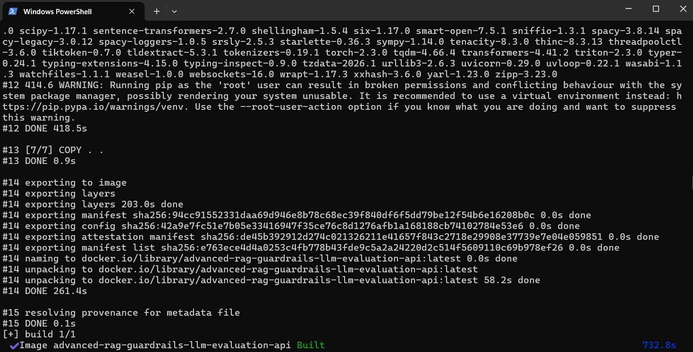
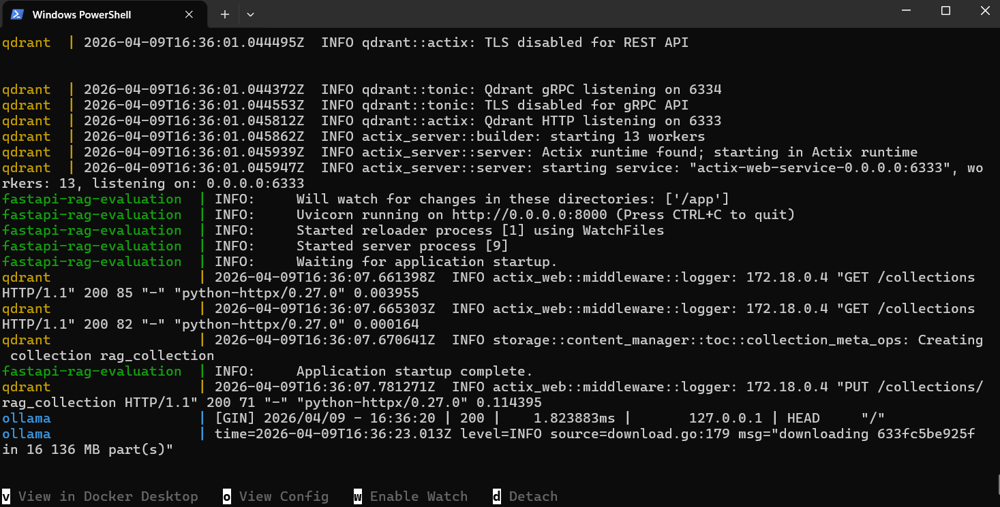
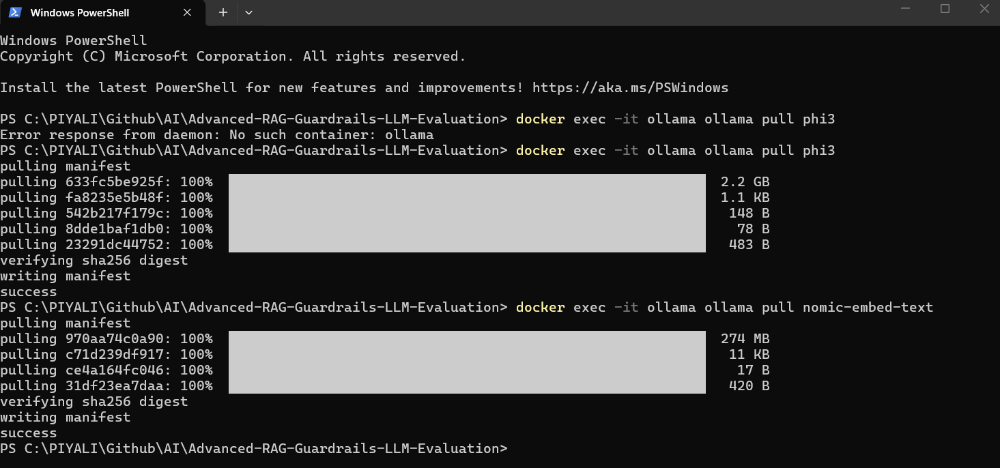
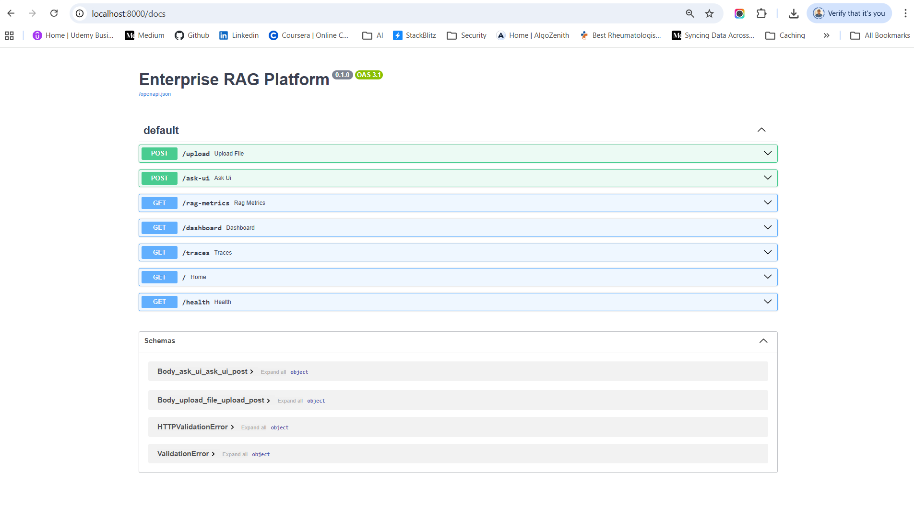
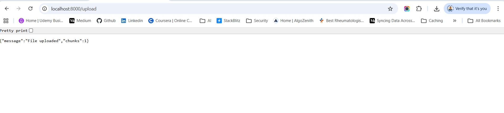
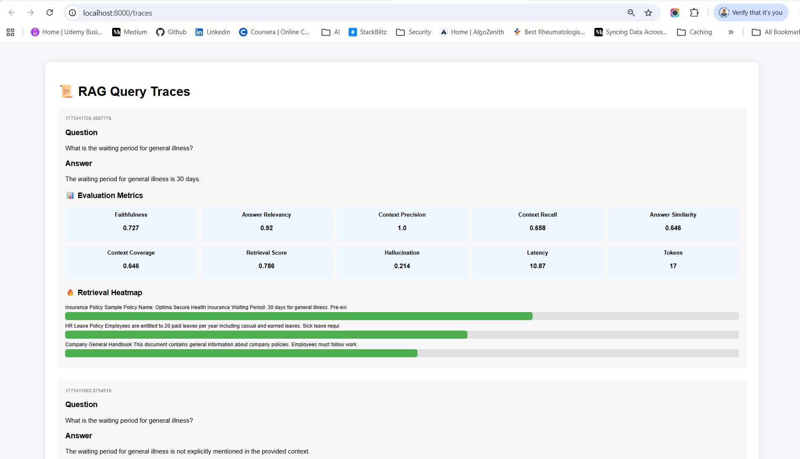
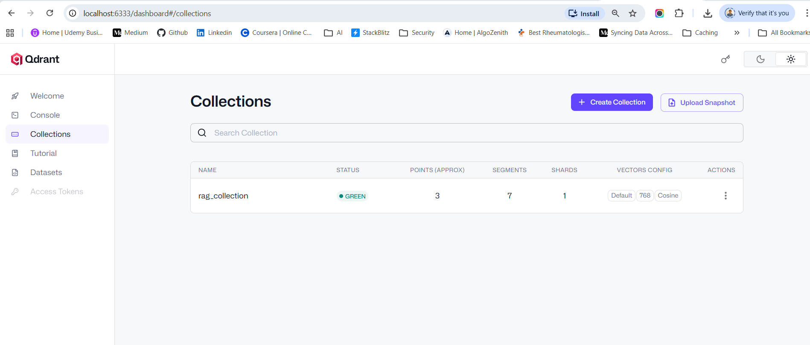

# 🚀 Enterprise RAG Platform (Guardrails + Self-Healing + Monitoring)

Built a production-grade Advance RAG system using FastAPI, Qdrant, Ollama, and LangChain, enhanced with guardrails, trust scoring, observability, and real-time alerts.

A production-grade Retrieval-Augmented Generation (RAG) system built with modern AI engineering practices:

🛡️ Advanced Guardrails (Prompt Injection Defense)
📊 Real-time Evaluation Metrics
🧠 Trust Score Engine
🔄 Self-Healing RAG (Auto Retry)
🚨 Real-time Alerts (Email / Slack)
📈 Live Monitoring Dashboard

🧠 Architecture
```
User → FastAPI → Guardrails → Retrieval (Qdrant) → LLM (Ollama)
     → Evaluation → Trust Score → Retry / Accept → Alerts + Dashboard
```

RAG evaluation measures how well a Retrieval-Augmented Generation system performs.  

**Without evaluation:**
-  AI may give wrong answers
-  documents may not be retrieved correctly
-  the system may hallucinate

👉 “How do you ensure RAG quality?”
```
We evaluate responses using faithfulness, relevancy, and hallucination metrics, then compute a trust score.

If the trust score is low or hallucination is high, we trigger guardrails to block or retry the response with more context.

We also monitor everything via dashboards and real-time alerts.
```

## 📊 ✅ Advanced RAG Metrics (2026 Standard) 

**⚙️ Tech Stack**
| Layer         | Technology             |
| ------------- | ---------------------- |
| API           | FastAPI                |
| Vector DB     | Qdrant                 |
| LLM           | Ollama (phi3)          |
| Orchestration | LangChain              |
| Monitoring    | Prometheus + LangSmith |
| Guardrails    | Custom + Presidio      |
| Alerts        | Email / Slack          |

**🧠 Core Metrics (You Already Use)**
| Metric                | Meaning                                       | Why It Matters             |
| --------------------- | --------------------------------------------- | -------------------------- |
| **Faithfulness**      | Is the answer grounded in retrieved documents | Detects hallucination risk |
| **Answer Relevancy**  | Does the answer match the question            | Ensures usefulness         |
| **Context Precision** | Are retrieved docs useful                     | Avoids noisy retrieval     |
| **Context Recall**    | Did retriever fetch all relevant docs         | Prevents missing info      |

**🔥 Advanced Metrics (You Implemented)**
| Metric                  | Meaning                                | Why It Matters             |
| ----------------------- | -------------------------------------- | -------------------------- |
| **Answer Similarity**   | Avg similarity between answer & chunks | Measures grounding depth   |
| **Context Coverage**    | How much context is used in answer     | Detects under-utilization  |
| **Retrieval Score**     | Best similarity match                  | Measures retrieval quality |
| **Hallucination Score** | % of answer not supported by context   | Critical safety signal     |

**🛡️ Guardrails Metrics**
| Metric                 | Meaning                      | Why It Matters        |
| ---------------------- | ---------------------------- | --------------------- |
| **Trust Score**        | Overall AI reliability score | Final decision signal |
| **Blocked Reason**     | Why answer was rejected      | Explainability        |
| **Injection Detected** | Prompt attack detected       | Security layer        |

| Layer            | Component                           |
| ---------------- | ----------------------------------- |
| 🛡️ Guardrails    | Input + Context + Output validation |
| 🔄 Self-Healing  | Retry with expanded context         |
| 📊 Evaluation    | RAG metrics engine                  |
| 🚨 Alerts        | Email / Slack                       |
| 📈 Observability | Dashboard + traces                  |
| 🔐 Security      | Injection detection                 |


## Run Application
1. Install Docker & Run Docker Desktop first
2. Inside application folder (RAdvanced-RAG-Guardrails-LLM-Evaluation), open gitbash or cmd to run the command following command. requirements.txt file should be on the same path.
```
docker compose down -v
docker compose build --no-cache
docker compose up
```




> The docker compose down command stops and removes the containers, networks, and the default network that were created by docker compose up.
> Restart your containers: docker compose restart

3. From your project root:
open new gitbash or cmd to run the command following command.
```
docker exec -it ollama ollama pull phi3
docker exec -it ollama ollama pull nomic-embed-text
```
Wait until both models download completely.


You can verify:
```
docker exec -it ollama ollama list
```

You should see something like:
```
llama3
nomic-embed-text
```

So 👉 AFTER containers are running, not before docker compose build. 

🧠 Why?  
🔹 docker compose build 
   -  Builds the Docker image
   -  Does NOT start the container
   -  Ollama service is not running yet

So if you try to pull before container is running → ❌ it won’t work.

4. 🌐 Open FastAPI UI
```
http://localhost:8000
```


Fast API
```
http://localhost:8000/docs
```

Upload:
- PDF
- DOCX
- CSV

It will store embeddings into Qdrant using Ollama.

Check Container Logs. Run in CMD
```
docker compose logs -f
```

5. Test flow:
   -  Upload a PDF / DOCX / CSV
   -  Submit a question
   -  Confirm answer is retrieved from document




Health check:
```
http://localhost:8000/health
```
6. 📊 Live RAG Monitoring Dashboard
```
http://localhost:8000/dashboard
```


7. 📜 RAG Query Traces
```
http://localhost:8000/traces
```


| Section             | Purpose                       |
| ------------------- | ----------------------------- |
| Question            | user input                    |
| Answer              | generated output              |
| Metrics             | 10 RAG evaluation scores      |
| Heatmap             | which chunk influenced answer |
| Latency             | response time                 |
| Token usage         | LLM cost                      |
| Hallucination score | safety check                  |

8. Ollama

Test:
```
curl http://localhost:11434/api/tags
```

9. Use Qdrant Web UI for viewing Vector Database
If your docker-compose.yml exposes port 6333, open:
```
http://localhost:6333/dashboard
```


> after run "docker compose build", one default rag_collection will be created. Don't delete it. If you upload the document, the existing rag_collection will be updated otherwise you will get 500 internet server error.

**📦 Collection: rag_collection**
```
Status: 🟢 Green
```
That means:
   -  Collection created successfully
   -  Vector indexing active
   -  No errors

**You’re seeing a stored point inside**
Qdrant → rag_collection

Let me explain exactly what each part means.

```
Point: 0081db12-7b4c-4f8b-8b12-d293331b2dc3
Payload:
{
  "page_content": "identity. 3. Respect privacy Never include persona…"
  "metadata": {}
}
Vectors:
Default vector
Length: 768
```

🧠 1️⃣ Point ID : 0081db12-7b4c-4f8b-8b12-d293331b2dc3  

This is a UUID generated automatically. Each document chunk gets:
   -  Unique ID
   -  One vector
   -  One payload

Think of it like:
```
1 chunk = 1 row in vector DB
```

## ⭐ My RAG System Is Already Advanced

My system already includes:

**🧠 Core RAG**   
✅ RAG pipeline   
✅ Qdrant vector DB  
✅ MMR Retrieval (Qdrant)  
🤖 Ollama local LLM (Ollama – phi3) 
✅ RAGAS evaluation  
🛡️ Rate Limit  
📁 Logging  

**🛡️ Guardrails** 
🔒 Input guard (prompt injection detection)  
✅ Context filtering 
✅ Output validation 
✅ Trust score + enforcement  

**🔄 Self-Healing**  
✅ Retry with more context 
✅ Trust-based answer selection  

**📊 Observability** 
✅ Dashboard (Evaluation metrics + charts)   
✅ Heatmap + Query traces  
✅ Hallucination detection 

**🚨 Alerts (What you just added)** 
✅ Email alerts   
✅ Slack alerts (optional)    
✅ Trigger engine based on metrics  

🧠 Trust Score Engine
Trust Score = 
  + Faithfulness
  + Relevancy
  + Precision
  - Hallucination

Used to:
- Accept response ✅
- Retry 🔄
- Block ❌

This is very close to enterprise-level RAG architecture.

**Added .env Support (CRITICAL 🔥)**
```
env_file:
  - .env
```
👉 This enables:
- 📧 Email alerts (EMAIL_USER, EMAIL_PASS)
- 🔔 Slack alerts
- 🔐 Secure secrets management

**📧 Your .env Must Contain**

# Email Alerts
- EMAIL_USER=your_email@gmail.com
- EMAIL_PASS=your_app_password
- ALERT_EMAIL=receiver@gmail.com

# Optional Slack
- SLACK_WEBHOOK_URL=https://hooks.slack.com/services/XXX

# Core Services
- OLLAMA_BASE_URL=http://ollama:11434
- QDRANT_URL=http://qdrant:6333

## 🧠 FULL RAG ARCHITECTURE
                        ┌──────────────────────────┐
                        │        USER (UI)         │
                        │  Angular / Browser UI    │
                        └────────────┬─────────────┘
                                     │
                                     ▼
                    ┌────────────────────────────────┐
                    │        FASTAPI (API)           │
                    │  /ask-ui  /upload  /metrics    │
                    └────────────────┬───────────────┘
                                     │
        ┌────────────────────────────┼────────────────────────────┐
        │                            │                            │
        ▼                            ▼                            ▼

┌───────────────────┐   ┌──────────────────────┐   ┌──────────────────────┐
│ 🛡️ INPUT GUARD    │   │ 🔍 RETRIEVAL ENGINE  │   │ 📊 OBSERVABILITY     │
│ - Injection check │   │ - Qdrant Vector DB   │   │ - Metrics API        │
│ - Length check    │   │ - MMR search         │   │ - Dashboard          │
└─────────┬─────────┘   └──────────┬───────────┘   └──────────┬───────────┘
          │                        │                          │
          ▼                        ▼                          ▼

┌───────────────────┐   ┌──────────────────────┐   ┌──────────────────────┐
│ 🧪 CONTEXT GUARD  │   │ 🤖 LLM (Ollama)      │   │ 📁 TRACE STORAGE     │
│ - Filter docs     │   │ - phi3 model         │   │ - In-memory + file   │
└─────────┬─────────┘   └──────────┬───────────┘   └──────────────────────┘
          │                        │
          ▼                        ▼

        ┌────────────────────────────────────────────┐
        │ 🛡️ OUTPUT GUARD                            │
        │ - Toxicity / PII filtering                 │
        └────────────────────────────────────────────┘
                              │
                              ▼

        ┌────────────────────────────────────────────┐
        │ 📊 RAG EVALUATION ENGINE                   │
        │ - Faithfulness                            │
        │ - Relevancy                               │
        │ - Hallucination                           │
        └────────────────────────────────────────────┘
                              │
                              ▼

        ┌────────────────────────────────────────────┐
        │ 🧠 TRUST SCORE ENGINE                      │
        │ - Score computation                        │
        │ - Guardrails decision                      │
        └────────────────────────────────────────────┘
                              │
                    ┌─────────┴─────────┐
                    ▼                   ▼

     ┌──────────────────────────┐   ┌────────────────────────────┐
     │ ✅ ACCEPT RESPONSE        │   │ 🔄 SELF-HEALING RAG         │
     │ Return answer            │   │ Retry with more context     │
     └──────────────────────────┘   └──────────────┬─────────────┘
                                                   ▼

                                ┌────────────────────────────┐
                                │ 🚨 ALERT ENGINE            │
                                │ - Email alerts             │
                                │ - Slack alerts             │
                                └────────────────────────────┘
```

- Multi-layer guardrails (input → context → output)
- Trust-score driven decision system
- Self-healing retry loop
- Observability-first design
- Real-time alerting for failures

## ⭐ 10 Critical RAG Metrics Used by Companies

These are commonly measured in production.

1️⃣ Faithfulness 
2️⃣ Context Precision  
3️⃣ Context Recall  
4️⃣ Answer Relevancy   
5️⃣ Retrieval Hit Rate 
6️⃣ Hallucination Rate 
7️⃣ Latency   
8️⃣ Token Cost   
9️⃣ User Satisfaction Score  
🔟 Query Success Rate   

## 🚀 Next Level (What Big AI Companies Build)

Advanced systems add:
- Reranking models (BGE / Cohere)
- Hybrid search (BM25 + vector search)
- Multi-hop retrieval
- Query rewriting
- Agentic RAG

## What application will do
**🎯 Local RAG AI System with Evaluation & Monitoring**

> My application is essentially a Local RAG AI System with Evaluation & Monitoring. It combines document search, LLM generation, and performance evaluation into one platform.

```
📤 Upload PDF / DOCX / CSV from UI → Store in Qdrant → Use for RAG
```
My system allows users to:

1️⃣ Upload documents (PDF, text, etc.)
2️⃣ Store them in a vector database
3️⃣ Ask questions about those documents
4️⃣ Generate answers using a local LLM
5️⃣ Evaluate answer quality automatically
6️⃣ Monitor performance in dashboards

This architecture is known as Retrieval-Augmented Generation (RAG) in the Artificial Intelligence domain.

Using:
   - FastAPI
   - LangChain
   - Langsmith
   - Qdrant
   - Ollama
   - RAGAS
   
| Tool       | Purpose               |
| ---------- | --------------------- |
| LangSmith  | tracing               |
| Grafana    | metrics visualization |
| Prometheus | metrics storage       |

**Your system automatically measures answer quality using metrics like:**

| Metric              | Meaning                      |
| ------------------- | ---------------------------- |
| Faithfulness        | answer grounded in documents |
| Answer Relevancy    | answer matches question      |
| Context Precision   | retrieved docs are relevant  |
| Context Recall      | retrieved docs cover answer  |
| Hallucination Score | model invented info          |


### LLM Evaluation
To add LLM Evaluation, you need an evaluation layer after the answer is generated.
```
User → FastAPI → LangChain → Retriever(Qdrant) → LLM(phi3) → Answer
```

The best approach for your system is using RAGAS, which evaluates:
- Faithfulness (answer grounded in context)
- Answer relevance
- Context precision
- Context recall

This works perfectly with LangChain and Qdrant.

```
                    User
                     │
                     ▼
                 FastAPI
                     │
                     ▼
                 LangChain
                     │
        ┌────────────┴────────────┐
        ▼                         ▼
    Retriever                 LLM Model
     Qdrant                     phi3
        │                         │
        └────────────┬────────────┘
                     ▼
              Generated Answer
                     │
                     ▼
            Evaluation Service
              (RAGAS / LangSmith)
        ┌─────────┬─────────┬─────────┐
        ▼         ▼         ▼
  Faithfulness  Relevance  Precision
                     │
                     ▼
              Monitoring DB
```

For debugging RAG pipelines use: **LangSmith**

It shows:
- retrieval chunks
- prompts
- token usage
- latency
- evaluation

**🚀 10 RAG Metrics**

Your system will now compute:
- Faithfulness
- Answer relevancy
- Context precision
- Context recall
- Answer similarity
- Context coverage
- Retrieval score
- Hallucination score
- Latency
- Token usage


### Example Output

User asks:
```
What is insurance claim waiting period?
```

Response:
```
Answer:
Waiting period for claim is 30 days.
```

Evaluation:
```
Faithfulness: 0.94
Answer Relevance: 0.91
Context Precision: 0.88
```

Meaning:
| Metric            | Meaning                          |
| ----------------- | -------------------------------- |
| Faithfulness      | Answer matches documents         |
| Relevance         | Answer matches question          |
| Context Precision | Retriever fetched correct chunks |

### Enterprise Production Version

In real systems evaluation results are stored.

Add logging:
```
RAG Evaluation DB
```

Example schema:
| question | answer | faithfulness | relevance | latency |
| -------- | ------ | ------------ | --------- | ------- |


Used for:
- model improvement
- prompt tuning
- retrieval tuning

### RAG pipelines (Highly Recommended)

For debugging RAG pipelines use:
- LangSmith

It shows:
- retrieval chunks
- prompts
- token usage
- latency
- evaluation

✅ Best practice for your project

Add 3 things:

1️⃣ RAGAS evaluation   
2️⃣ Log evaluation metrics   
3️⃣ Monitor with LangSmith   

### ✅ Packages to Add for LLM Evaluation

Add these:
```
ragas==0.1.10
datasets==2.19.1
tiktoken==0.7.0
```

Why these are needed
| Package                   | Purpose                      |
| ------------------------- | ---------------------------- |
| **RAGAS**                 | Evaluate RAG pipelines       |
| **Hugging Face Datasets** | Create evaluation datasets   |
| **tiktoken**              | Tokenization used internally |


### ⚠️ Important Note (Ollama Users)

Since you are using:
- Ollama
- LangChain

ragas may also need an **LLM evaluator**. If you want to evaluate using the same local model (phi3), you may later add:
```
langchain-openai
```
But not required initially.

### 🚀 Optional (Enterprise Monitoring)

If you want production-grade evaluation, also add:
```
langsmith
```
This integrates with LangSmith to trace:
- prompts
- retrieved documents
- LLM latency
- evaluation scores

### almost every beginner RAG system has this issue
Your RAG system is already well structured, but there are 2 important issues that will affect:
- Retrieval quality
- LLM answer accuracy
- RAG evaluation scores (Faithfulness / Relevance)

These problems appear in most beginner RAG systems.

## Example Output

When user asks:
```
What is the insurance claim waiting period?
```

Response:
```
Answer:
The waiting period is 30 days.
```

Evaluation:
```
faithfulness: 0.94
answer_relevancy: 0.91
context_precision: 0.88
```

### 📁 Project Structure
```
Rag-LLM-Evaluation/
│
├── app/                      ← Python package
│   ├── __init__.py           ✅ Makes "app" a module
│   ├── main.py               ← FastAPI entrypoint
│   ├── Dockerfile            ← App container build
│   ├── requirements.txt      ← Python dependencies
│   │
│   ├── templates/
|   |   |── dashboard.html    ← Live RAG Monitoring Dashboard
|   |   |── traces.html       ← RAG Query Traces
│   │   └── upload.html       ← RAG Document Assistant
│   │
│   └── uploaded_docs/        ← Stored documents
│
├── Dockerfile                ← (Optional root build)
├── docker-compose.yml        ← Multi-service orchestration
```

> With __init__.py: Python recognizes app as a module.

You should now have:
```
app/
├── __init__.py   ✅
├── main.py       ✅
```

**🔹Storage Layer**
```
app/uploaded_docs/
```
Stores raw files before processing.    
In production, this would usually be: S3, Azure Blob, GCS, Network storage

## Qdrant collections - 📊 What These Numbers Mean

✅ 21 → Points (Vectors)
-----------------------------------------------------------
You currently have 21 vector embeddings stored.

That means:
   -  Your uploaded document was chunked
   -  Each chunk converted into embedding
   -  Stored in Qdrant

Example:
   -  Prompt_Engineering PDF
   -  Split into 21 chunks
   -  21 embeddings stored

So your ingestion pipeline is working 💪

✅ 7 → Segments
-----------------------------------------------------------
Qdrant internally stores vectors in segments for performance optimization.

You don’t need to worry about this — it's automatic indexing structure.


✅ 1 → Shard
-----------------------------------------------------------
Shard = horizontal partition of data.

Right now:
   -  You have 1 shard
   -  Perfect for local development

In production:
   -  You might use multiple shards for scaling

✅ Default → Vector Name
-----------------------------------------------------------
You are using default vector field.

Good for simple RAG setup.

✅ 768 → Vector Dimension
-----------------------------------------------------------
This is very important.

Your embedding model (nomic-embed-text) produces:

768-dimensional vectors

Mathematically:
```
v∈R768
```

That means each chunk is converted into a 768-number vector.

If this dimension mismatches → system crashes.

So this confirms:

✔ nomic-embed-text is working   
✔ Qdrant collection matches embedding size  


### 🔥 Quick Debug Command

Run this to see real error:
```
docker compose logs api
```
Or enter container:
```
docker compose run api bash
```
Then try:
```
python -c "import main"
```
If it fails → file path issue.

### 🔥 Architecture
You have built a RAG-based Enterprise Document QA System using:
   -  FastAPI
   -  Ollama (LLM + Embeddings)
   -  Qdrant (Vector DB)
   -  LangChain
   -  Jinja2 UI
   -  Docker Compose

🏗️ Sequence Diagram — Upload Flow
----------------------------------------------------------
Purpose: Upload document → convert to embeddings → store in vector database
```
User
 │
 │ Upload PDF
 ▼
Upload Page (upload.html)
 │
 │ POST /upload
 ▼
FastAPI Server
 │
 │ Read document
 ▼
Document Loader
 │
 │ Split text into chunks
 ▼
Text Splitter
 │
 │ Convert text → embeddings
 ▼
Embedding Model
(nomic-embed-text)
 │
 │ Store vectors
 ▼
Qdrant Vector Database
 │
 │ Success response
 ▼
FastAPI
 │
 ▼
User UI updated
```

What Happens Internally
```
Document
   ↓
Chunks
   ↓
Embeddings
   ↓
Vector DB storage
```

Example stored vector:
```
Chunk: "Loan eligibility requires income above 50k"
Vector: [0.231, 0.992, 0.118, ...]
```

🏗️ Sequence Diagram — Question Flow (RAG)
----------------------------------------------------------
Purpose: User asks question → retrieve context → generate answer
```
User
 │
 │ Ask Question
 ▼
upload.html
 │
 │ POST /chat
 ▼
FastAPI
 │
 │ Convert question → embedding
 ▼
Embedding Model
 │
 │ Similarity search
 ▼
Qdrant Vector DB
 │
 │ Return top K chunks
 ▼
Retriever
 │
 │ Build prompt
 ▼
LLM
(phi3 / llama3)
 │
 │ Generate answer
 ▼
FastAPI
 │
 │ Save trace
 ▼
Response to User
```

🏗️ Sequence Diagram — RAG Evaluation Flow
----------------------------------------------------------
My system automatically evaluates answer quality.
```
User Question
      │
      ▼
RAG Pipeline
      │
      ├── Retrieved Context
      ├── Generated Answer
      │
      ▼
Evaluation Engine
      │
      ├── Faithfulness
      ├── Answer Relevancy
      ├── Context Precision
      ├── Context Recall
      ├── Answer Similarity
      ├── Hallucination Score
      │
      ▼
Metrics Generated
      │
      ▼
Dashboard + Traces
```

📊 Metrics Calculation Flow
----------------------------------------------------------
```
Question
   │
   ▼
Ground Truth (if available)
   │
   ▼
Compare with LLM Answer
   │
   ├── similarity score
   ├── hallucination detection
   └── context alignment
```

Example metrics:
```
Faithfulness: 0.91
Answer Relevancy: 0.88
Context Precision: 0.86
Latency: 1.2s
Tokens: 120
```

🧱 Component Architecture
----------------------------------------------------------
```
                ┌───────────────────────────┐
                │        Frontend UI        │
                │                           │
                │ upload.html               │
                │ dashboard.html            │
                │ traces.html               │
                └─────────────┬─────────────┘
                              │
                              ▼
                ┌───────────────────────────┐
                │        FastAPI Layer      │
                │                           │
                │ /upload                   │
                │ /chat                     │
                │ /rag-metrics              │
                │ /traces                   │
                └─────────────┬─────────────┘
                              │
                              ▼
              ┌────────────────────────────────┐
              │        RAG Service Layer       │
              │                                │
              │ Document Loader                │
              │ Text Splitter                  │
              │ Retriever                      │
              │ Prompt Builder                 │
              └─────────────┬──────────────────┘
                            │
        ┌───────────────────┴────────────────────┐
        ▼                                        ▼
┌──────────────────┐                    ┌──────────────────┐
│  Embedding Model │                    │   LLM Generator  │
│                  │                    │                  │
│ nomic-embed-text │                    │ phi3 / llama3    │
└──────────┬───────┘                    └──────────┬───────┘
           │                                       │
           ▼                                       ▼
      ┌───────────────┐                    ┌───────────────┐
      │ Vector Store  │                    │ Generated     │
      │               │                    │ Answer        │
      │ Qdrant        │                    └───────┬───────┘
      └───────┬───────┘                            │
              │                                    ▼
              │                         ┌──────────────────┐
              │                         │ Evaluation Engine │
              │                         │                  │
              │                         │ Faithfulness     │
              │                         │ Relevancy        │
              │                         │ Hallucination    │
              │                         │ Latency & Tokens │
              │                         └──────────┬───────┘
              │                                    │
              ▼                                    ▼
      ┌───────────────┐                  ┌──────────────────┐
      │ Retrieval     │                  │ Monitoring Layer │
      │ Context       │                  │                  │
      │ Top-K Chunks  │                  │ Dashboard        │
      └───────────────┘                  │ Query Traces     │
                                         └──────────────────┘
```
**1️⃣ Frontend Layer**

UI templates:
```
upload.html
dashboard.html
traces.html
```

Functions:
- upload documents
- ask questions
- view evaluation metrics
- inspect traces

**2️⃣ API Layer**

Handled by FastAPI.

Main endpoints:
```
POST /upload
POST /chat
GET  /rag-metrics
GET  /traces
```
Responsibilities:
- handle HTTP requests
- call backend services
- return JSON / HTML responses

**3️⃣ RAG Service Layer**

Core orchestration logic.

Pipeline:
```
Question
   │
   ▼
Embedding
   │
   ▼
Vector Search
   │
   ▼
Context Retrieval
   │
   ▼
Prompt Construction
   │
   ▼
LLM Generation
```
This layer connects everything.

**4️⃣ Embedding Component**

Embedding model:
```
nomic-embed-text
```
Runs through Ollama.

Purpose:
```
text → vector representation
```
Example:
```
"What is loan eligibility?"

↓

[0.129, 0.883, 0.221, ...]
```

**5️⃣ Vector Database**

Handled by Qdrant.

Purpose:
- semantic search
- nearest neighbor retrieval

Example retrieval:
```
Query vector
     │
     ▼
Top 5 similar document chunks
```

**6️⃣ LLM Generator**

Runs via Ollama.

Possible models:
```
phi3
llama3.2
gemma
```
Purpose:
```
Context + Question → Answer
```

**7️⃣ Evaluation Engine**

Calculates RAG quality metrics.

Example metrics:
| Metric              | Meaning                    |
| ------------------- | -------------------------- |
| Faithfulness        | answer grounded in context |
| Answer Relevancy    | answer matches question    |
| Context Precision   | retrieved chunks relevant  |
| Context Recall      | retrieved chunks complete  |
| Hallucination Score | fabricated information     |
| Latency             | response time              |
| Tokens              | LLM cost                   |

**8️⃣ Monitoring Layer**

Two UI modules:

📊 Dashboard

Shows:
```
RAG metrics
latency
token usage
charts
```

🔎 Trace Viewer

Displays:
```
question
retrieved chunks
answer
metrics
timestamp
```
Useful for debugging.


## 🐳 Deployment Architecture (Docker)
```
┌────────────────────────────────────────┐
│              Docker Host               │
│                                        │
│  ┌───────────────┐                     │
│  │  app container │  FastAPI           │
│  └───────────────┘                     │
│         │                              │
│         │ internal docker network      │
│         ▼                              │
│  ┌───────────────┐                     │
│  │ qdrant        │                     │
│  └───────────────┘                     │
│         │                              │
│         ▼                              │
│  ┌───────────────┐                     │
│  │ ollama        │                     │
│  └───────────────┘                     │
└────────────────────────────────────────┘
```

**🏛️ Architecture Summary (Professional Description)**

My system is:

> A Local AI system that can read documents, answer questions, and evaluate how good the answers are.

You could say:
   -  Presentation Layer: Jinja2 UI
   -  Application Layer: FastAPI
   -  Retrieval Layer: LangChain RAG pipeline
   -  Data Layer: Qdrant vector database
   -  AI Layer: Ollama 
      - Embedding Model : nomic-embed-text
      - LLM Model : phi3(used) / llama3.2 / gemma
   -  Infrastructure Layer: Docker Compose
      Services typically include:
      - fastapi
      - qdrant
      - ollama