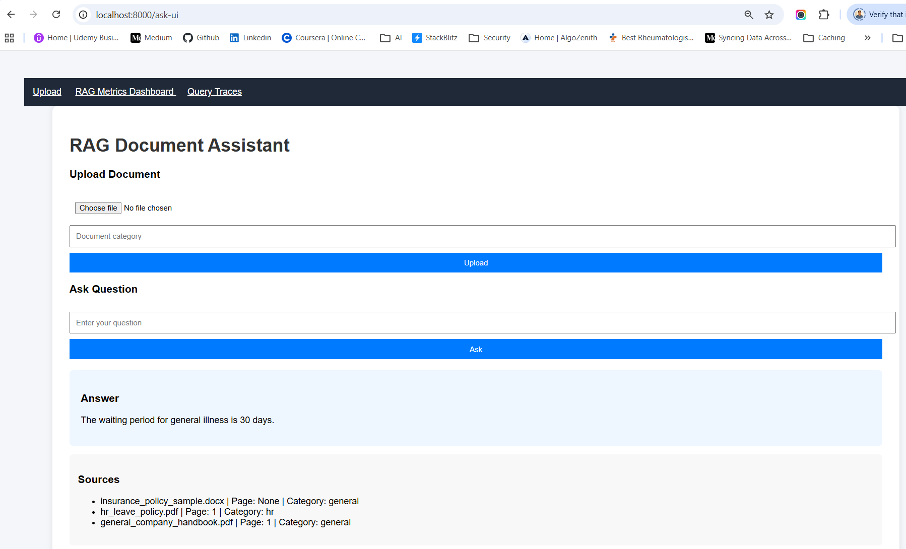

## Ask Question : What is the waiting period for general illness?



### ✅ With these files you can test:

- Document ingestion
- Chunking
- Embedding
- Vector search
- Retrieval
- LLM generation
- RAG evaluation (faithfulness, relevance)

### How to Upload in Your UI

Upload with category:

| File                         | Category  |
| ---------------------------- | --------- |
| general_company_handbook.pdf | general   |
| insurance_policy_sample.docx | insurance |
| bank_loan_products.csv       | bank      |
| hr_leave_policy.pdf          | hr        |

This will help test metadata filtering in your RAG system.

### Suggested Test Questions for Your RAG System
```
General
What are the company office working hours?

Expected answer:

Office hours are 9:00 AM to 6:00 PM Monday to Friday.


Insurance
What is the waiting period for general illness?

Expected answer:

The waiting period for general illness is 30 days.
Bank
What is the interest rate for home loan?

Expected answer:

Home loan interest rate is 8.5%.
HR
How many paid leaves are allowed per year?

Expected answer:

Employees are entitled to 20 paid leaves per year.
```

### What This Dataset Helps You Test

Your RAG pipeline:
```
Upload → Chunk → Embedding → Vector Search → Retrieval → LLM → Evaluation
```

You can verify:
- document ingestion
- chunking
- embeddings
- retrieval accuracy
- hallucination detection
- RAG evaluation metrics (faithfulness / relevance)

### Enterprise RAG Evaluation Architecture
```
                Documents
                   │
                   ▼
             Embedding Model
                   │
                   ▼
                Qdrant
                   │
                   ▼
                Retriever
                   │
                   ▼
                   LLM
                   │
                   ▼
                Answer
                   │
         ┌─────────┴──────────┐
         │                    │
         ▼                    ▼
      User Logs          Context Logs
         │
         ▼
    Evaluation Dataset
         │
         ▼
        RAGAS
         │
         ▼
 Metrics Monitoring System
         │
         ▼
      Grafana Dashboard
```

**Monitoring stack often uses:**

| Tool       | Purpose               |
| ---------- | --------------------- |
| LangSmith  | tracing               |
| Grafana    | metrics visualization |
| Prometheus | metrics storage       |


you already have RAG + RAGAS + Ollama + Qdrant working, so we can add 3 powerful debugging tools to your system without any paid APIs. 🚀

We’ll add:

1️⃣ Retrieval Heatmap → see which chunk influenced the answer 
2️⃣ Chunk Influence Viewer → inspect retrieved document pieces   
3️⃣ Query Trace Explorer → see question → retrieved docs → answer → scores   

All 100% local + free.

## 1️⃣ RAG Hallucination Detector (FREE)

Goal: detect when the answer is not supported by retrieved context.

You already partially have this via RAGAS metric faithfulness.

How it works

It compares:
```
Answer vs Context
```
If the answer contains information not present in context → hallucination.

Implementation

Add this check after evaluation:
```
if evaluation["faithfulness"] < 0.6:
    hallucination_warning = "⚠️ Possible hallucination detected"
else:
    hallucination_warning = "✅ Answer grounded in documents"
```
Return it to UI:
```
return templates.TemplateResponse(
    "upload.html",
    {
        "request": request,
        "answer": answer,
        "evaluation": evaluation,
        "hallucination": hallucination_warning,
        "sources": sources
    }
)
```
UI example:
```
Faithfulness Score: 0.42
⚠️ Possible hallucination detected
```

## 2️⃣ Retrieval Heatmap Debugging (FREE)

Goal: see which chunk influenced the answer most.

Use Qdrant similarity scores.

Implementation

Replace your retrieval debug with:
```
docs_with_scores = vector_store.similarity_search_with_score(question, k=4)

retrieval_debug = []

for doc, score in docs_with_scores:

    retrieval_debug.append({
        "file": doc.metadata.get("file_name"),
        "page": doc.metadata.get("page"),
        "score": round(score, 3),
        "preview": doc.page_content[:200]
    })
```

Pass to UI:
```
"retrieval_debug": retrieval_debug
```

Example Output
```
Retrieval Heatmap

Score 0.91 → hr_leave_policy.pdf page 1
Score 0.84 → general_company_handbook.pdf page 3
Score 0.72 → insurance_policy_sample.docx
```
You instantly know why the answer was generated.

## 3️⃣ Auto RAG Evaluation Dashboard (FREE)

Goal: visualize RAG quality metrics over time.

You already log:
```
rag_logs.jsonl
```
We can build a dashboard endpoint.

Add new route
```
@app.get("/rag-dashboard")
async def rag_dashboard():

    records = []

    if os.path.exists(RAG_LOG_FILE):

        with open(RAG_LOG_FILE) as f:
            for line in f:
                records.append(json.loads(line))

    return {
        "total_queries": len(records),
        "recent_questions": records[-10:]
    }
```

This lets you track:
```
Total queries
Questions asked
Answers generated
Contexts used
```