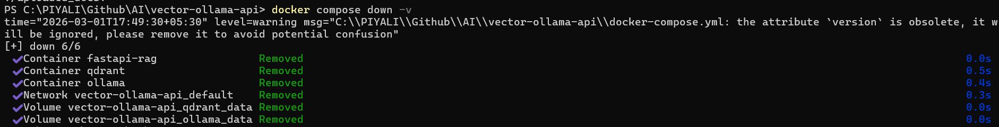
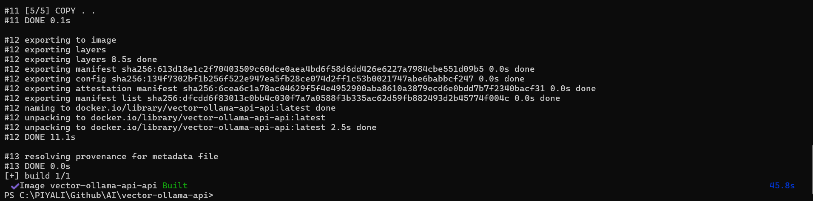
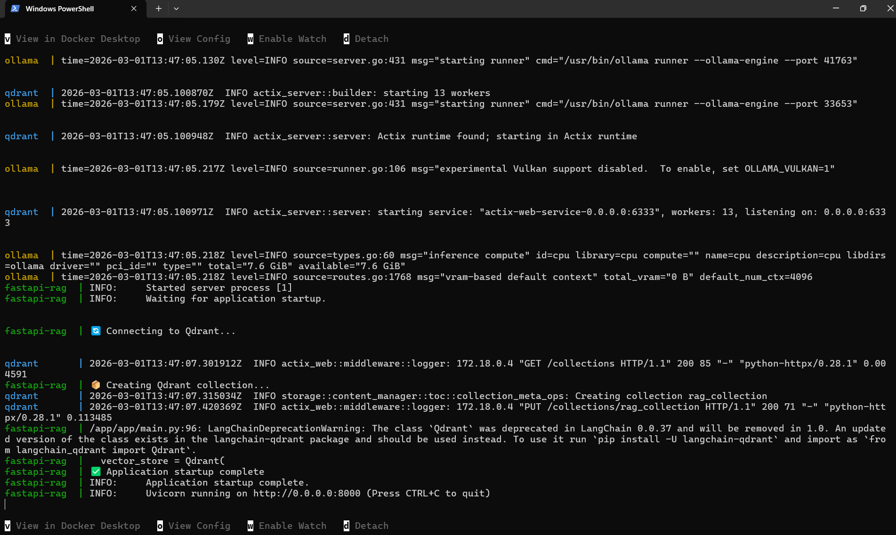
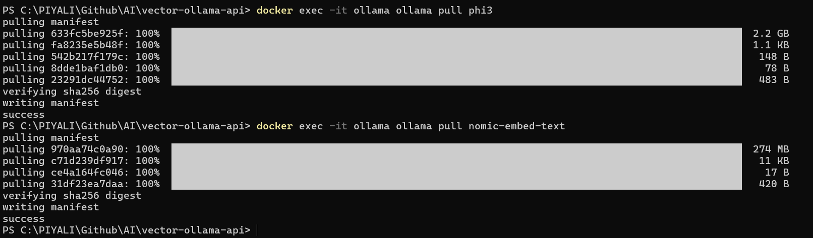
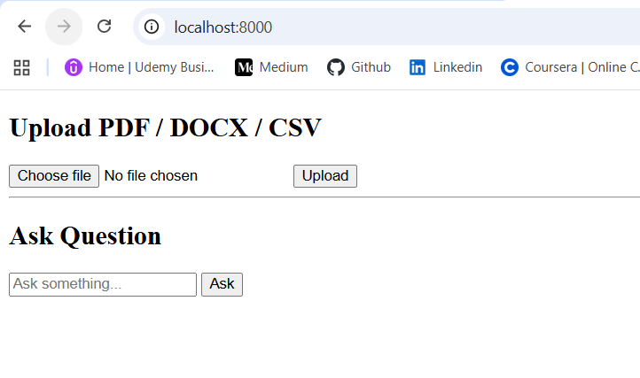
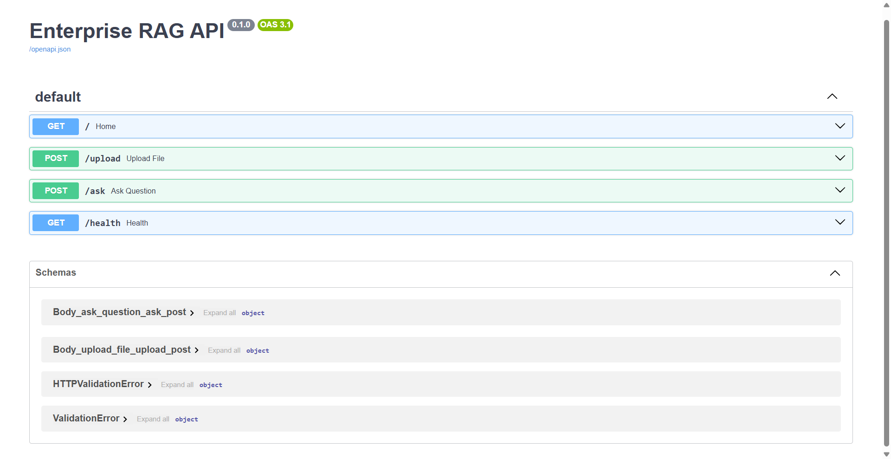
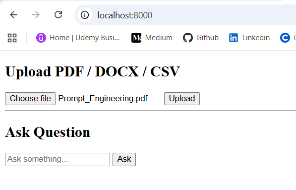
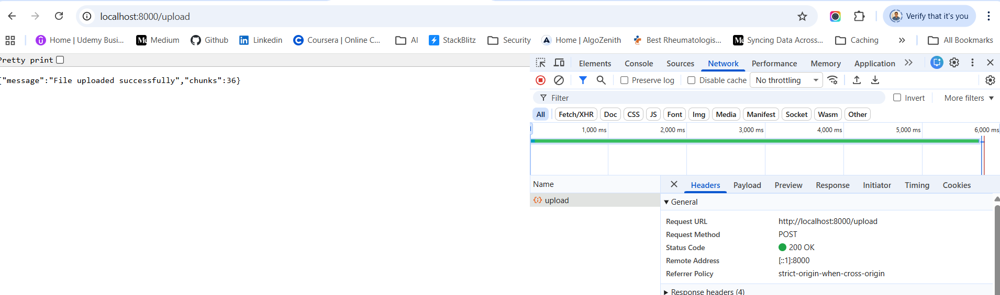
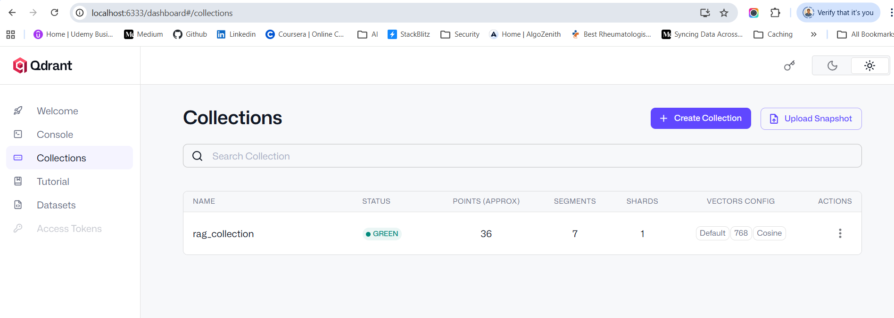
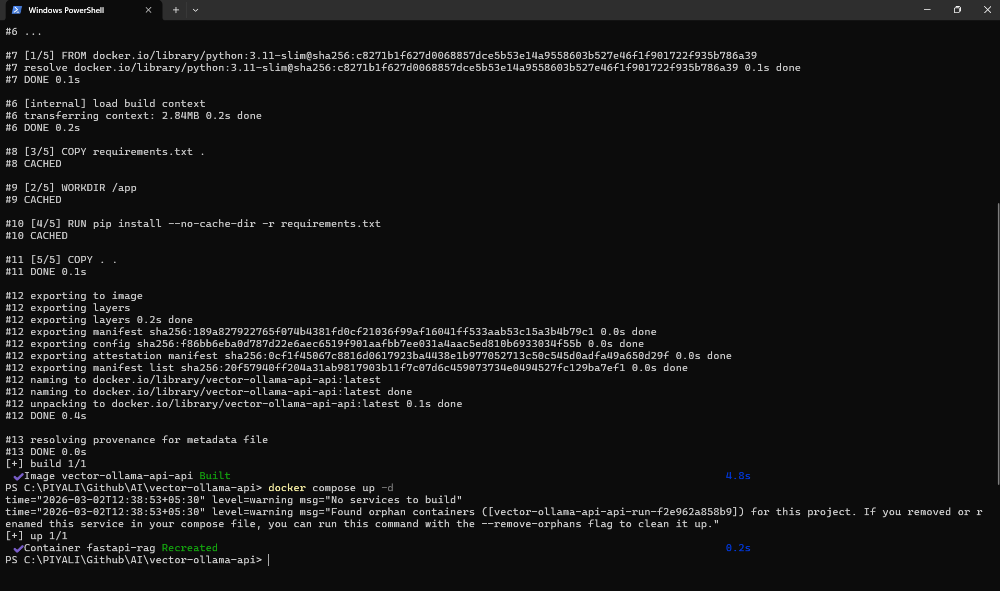

# FastAPI + Ollama + Qdrant + RAG + Upload UI (Dockerized)

## What application will do
**🎯 A Dockerized Retrieval-Augmented Generation (RAG) Document Intelligence System built using FastAPI, Ollama, and Qdrant.**

> "I built a Dockerized RAG-based document intelligence platform using FastAPI, Ollama for LLM and embeddings, and Qdrant as a vector database, with a simple upload UI for interacting with enterprise documents."

```
📤 Upload PDF / DOCX / CSV from UI → Store in Qdrant → Use for RAG
```

We’ll add:
   -  HTML Upload UI
   -  /upload API endpoint
   -  Document parsing
   -  Chunking
   -  Embedding with Ollama
   -  Store in Qdrant
   -  Keep existing /ask endpoint

Using:
   -  FastAPI
   -  Ollama
   -  Qdrant
   -  LangChain

### 📁 Project Structure
```
vector-ollama-api/
│
├── app/                      ← Python package
│   ├── __init__.py           ✅ Makes "app" a module
│   ├── main.py               ← FastAPI entrypoint
│   ├── Dockerfile            ← App container build
│   ├── requirements.txt      ← Python dependencies
│   │
│   ├── templates/
│   │   └── upload.html       ← UI template
│   │
│   └── uploaded_docs/        ← Stored documents
│
├── Dockerfile                ← (Optional root build)
├── docker-compose.yml        ← Multi-service orchestration
```

> With __init__.py: Python recognizes app as a module.

You should now have:
```
app/
├── __init__.py   ✅
├── main.py       ✅
```

**🔹Storage Layer**
```
app/uploaded_docs/
```
Stores raw files before processing.    
In production, this would usually be: S3, Azure Blob, GCS, Network storage

## Run Application
1. Run Docker Desktop first
2. Inside application folder (vector-ollama-api), open gitbash or cmd to run the command following command. requirements.txt file should be on the same path.
```
docker compose down -v
docker compose build --no-cache
docker compose up
```




> The docker compose down command stops and removes the containers, networks, and the default network that were created by docker compose up.
> Restart your containers: docker compose restart

3. From your project root:

```
docker exec -it ollama ollama pull phi3
docker exec -it ollama ollama pull nomic-embed-text
```
Wait until both models download completely.


You can verify:
```
docker exec -it ollama ollama list
```

You should see something like:
```
phi3
nomic-embed-text
```

So 👉 AFTER containers are running, not before docker compose build. 

🧠 Why?  
🔹 docker compose build 
   -  Builds the Docker image
   -  Does NOT start the container
   -  Ollama service is not running yet

So if you try to pull before container is running → ❌ it won’t work.

4. 🌐 Open UI
```
http://localhost:8000
```


Test API
```
http://localhost:8000/docs
```

Upload:
- PDF
- DOCX
- CSV

It will store embeddings into Qdrant using Ollama.

Check Container Logs. Run in CMD
```
docker compose logs -f
```

5. Test flow:
   -  Upload a PDF / DOCX / CSV
   -  Submit a question
   -  Confirm answer is retrieved from document




Health check:
```
http://localhost:8000/health
```

6. Use Qdrant Web UI for viewing Vector Database
If your docker-compose.yml exposes port 6333, open:
```
http://localhost:6333/dashboard
```


> after run "docker compose build", one default rag_collection will be created. Don't delete it. If you upload the document, the existing rag_collection will be updated otherwise you will get 500 internet server error.

**📦 Collection: rag_collection**
```
Status: 🟢 Green
```
That means:
   -  Collection created successfully
   -  Vector indexing active
   -  No errors

**You’re seeing a stored point inside**
Qdrant → rag_collection

Let me explain exactly what each part means.

```
Point: 0081db12-7b4c-4f8b-8b12-d293331b2dc3
Payload:
{
  "page_content": "identity. 3. Respect privacy Never include persona…"
  "metadata": {}
}
Vectors:
Default vector
Length: 768
```

🧠 1️⃣ Point ID : 0081db12-7b4c-4f8b-8b12-d293331b2dc3  

This is a UUID generated automatically. Each document chunk gets:
   -  Unique ID
   -  One vector
   -  One payload

Think of it like:
```
1 chunk = 1 row in vector DB
```

## Yesterday after shut down laptop, Do i have to run all commands today again ?

✅ Case 1 — You Only Stopped Containers
-----------------------------------------------------------
If yesterday you did:
```
docker compose down
```
or you just closed Docker Desktop

👉 Today you only need:
```
docker compose up -d
```
That’s it ✅

You DO NOT need:
   -  ❌ docker compose build
   -  ❌ ollama pull phi3
   -  ❌ ollama pull nomic-embed-text

Because:
   -  Images are already built
   -  Models are already downloaded
   -  Qdrant data is stored in volume

❌ Case 2 — If You Ran docker compose down -v
-----------------------------------------------------------
If yesterday you ran:
```
docker compose down -v
```
The -v deletes volumes.

That means:
   -  ❌ Qdrant data deleted
   -  ❌ Ollama models deleted

Then today you must:
```
docker compose up -d
docker exec -it ollama ollama pull phi3
docker exec -it ollama ollama pull nomic-embed-text
```

❌ Case 3 — If You Modified Dockerfile
-----------------------------------------------------------
If you changed:
   -  Dockerfile
   -  requirements.txt
   -  base image

Then you must:
```
docker compose build
docker compose up -d
```


But still no need to re-pull models unless volume was deleted.


## Qdrant collections - 📊 What These Numbers Mean

✅ 21 → Points (Vectors)
-----------------------------------------------------------
You currently have 21 vector embeddings stored.

That means:
   -  Your uploaded document was chunked
   -  Each chunk converted into embedding
   -  Stored in Qdrant

Example:
   -  Prompt_Engineering PDF
   -  Split into 21 chunks
   -  21 embeddings stored

So your ingestion pipeline is working 💪

✅ 7 → Segments
-----------------------------------------------------------
Qdrant internally stores vectors in segments for performance optimization.

You don’t need to worry about this — it's automatic indexing structure.


✅ 1 → Shard
-----------------------------------------------------------
Shard = horizontal partition of data.

Right now:
   -  You have 1 shard
   -  Perfect for local development

In production:
   -  You might use multiple shards for scaling

✅ Default → Vector Name
-----------------------------------------------------------
You are using default vector field.

Good for simple RAG setup.

✅ 768 → Vector Dimension
-----------------------------------------------------------
This is very important.

Your embedding model (nomic-embed-text) produces:

768-dimensional vectors

Mathematically:
```
v∈R768
```

That means each chunk is converted into a 768-number vector.

If this dimension mismatches → system crashes.

So this confirms:

✔ nomic-embed-text is working   
✔ Qdrant collection matches embedding size  


### 🔥 Quick Debug Command

Run this to see real error:
```
docker compose logs api
```
Or enter container:
```
docker compose run api bash
```
Then try:
```
python -c "import main"
```
If it fails → file path issue.

### We will use:

✅ Ollama embedding model (small size) → nomic-embed-text (~137MB)
✅ Optional small LLM → phi3:mini (lightweight)
✅ Qdrant as vector DB
✅ Dockerized setup

This is lightweight and perfect for local development 💻

✅ FastAPI
✅ LangChain
✅ Qdrant
✅ Upload PDF / DOCX / CSV
✅ Store in Vector DB
✅ Dockerized

### 🔥 Architecture
You have built a RAG-based Enterprise Document QA System using:
   -  FastAPI
   -  Ollama (LLM + Embeddings)
   -  Qdrant (Vector DB)
   -  LangChain
   -  Jinja2 UI
   -  Docker Compose

🏗️ Sequence Diagram — Upload Flow
----------------------------------------------------------
```
User
  │
  │ Upload File
  ▼
FastAPI (/upload)
  │
  │ Save file
  │ Extract text
  │ Chunk text
  ▼
Ollama (Embedding model)
  │ Generate vectors
  ▼
Qdrant
  │ Store vectors + metadata
  ▼
FastAPI
  │ Return success message
  ▼
User sees "Uploaded Successfully"
```

🏗️ Sequence Diagram — Question Flow (RAG)
----------------------------------------------------------
```
User
  │
  │ Ask Question
  ▼
FastAPI (/ask-ui)
  │
  │ Embed question
  ▼
Ollama (Embedding model)
  │
  ▼
Qdrant
  │ Similarity search (Top K chunks)
  ▼
FastAPI
  │ Build prompt with retrieved context
  ▼
Ollama (LLM - phi3)
  │ Generate grounded answer
  ▼
FastAPI
  │ Return answer to UI
  ▼
User sees answer
```

🧱 Component Architecture
----------------------------------------------------------
```
┌─────────────────────────────────────────────────────────────┐
│                         USER                                │
└─────────────────────────────────────────────────────────────┘
                              │
                              ▼
┌─────────────────────────────────────────────────────────────┐
│                    Presentation Layer                       │
│  - upload.html (Jinja2)                                     │
│  - Upload Form                                               │
│  - Ask Question Form                                         │
└─────────────────────────────────────────────────────────────┘
                              │
                              ▼
┌─────────────────────────────────────────────────────────────┐
│                     FastAPI Backend                         │
│                                                             │
│  Routes:                                                    │
│  - GET /                                                    │
│  - POST /upload                                             │
│  - POST /ask-ui                                             │
│                                                             │
│  Startup:                                                   │
│  - Connect Qdrant                                           │
│  - Build RAG chain                                          │
└─────────────────────────────────────────────────────────────┘
                              │
                              ▼
┌─────────────────────────────────────────────────────────────┐
│                     Document Pipeline                       │
│                                                             │
│  1. Extract Text (PDF/DOCX/CSV)                             │
│  2. Chunk (RecursiveCharacterTextSplitter)                  │
│  3. Add Metadata                                            │
│  4. Generate Embeddings (Ollama)                            │
│  5. Store in Qdrant                                         │
└─────────────────────────────────────────────────────────────┘
                              │
                              ▼
┌─────────────────────────────────────────────────────────────┐
│                     Qdrant (Vector DB)                      │
│                                                             │
│  Collection: rag_collection                                 │
│  - 768-dim vectors                                          │
│  - Cosine similarity                                        │
│  - Metadata storage                                         │
└─────────────────────────────────────────────────────────────┘
                              │
                              ▼
┌─────────────────────────────────────────────────────────────┐
│                        Ollama                               │
│                                                             │
│  - nomic-embed-text (Embeddings)                            │
│  - phi3 (LLM)                                               │
└─────────────────────────────────────────────────────────────┘
```
**1️⃣ Frontend Layer (Presentation Layer)**
   -  Simple HTML UI (upload.html)
   -  Served via FastAPI (GET /)
   -  Two forms:
      -  Upload documents → /upload
      -  Ask question → /ask-ui

📌 Purpose:
   -  Upload enterprise documents
   -  Ask natural language questions

**2️⃣ API Layer – FastAPI**

This is your main backend.

Main endpoints:   
| Endpoint  | Purpose                    |
| --------- | -------------------------- |
| `/`       | Loads UI                   |
| `/upload` | Upload + process documents |
| `/ask-ui` | Ask question from UI       |
| `/health` | Health check               |

📌 Responsibilities:
   -  File handling
   -  Text extraction
   -  Calling embeddings
   -  Calling retrieval chain
   -  Returning HTML response

**3️⃣ Document Processing Layer**

When user uploads a file:
```
PDF/DOCX/CSV
    ↓
Text Extraction
    ↓
Chunking (RecursiveCharacterTextSplitter)
    ↓
Metadata Enrichment
```
Metadata includes:
   -  file_name
   -  page
   -  category
   -  uploaded_at
   -  doc_id

📌 Purpose: Prepare documents for vector indexing.

**4️⃣ Embedding Layer (Ollama)**

You use:
   -  Model: nomic-embed-text
   -  Via: OllamaEmbeddings

Flow:
```
Text Chunk
    ↓
Embedding Vector (768 dimensions)
```
📌 Converts text into vector representations.

✅ nomic-embed-text : nomic-embed-text is an embedding model used to convert text into vector embeddings — which you can then store inside a vector database like Qdrant.  
It is commonly used with Ollama for local embedding generation.

nomic-embed-text ❌ is NOT a chat model   
nomic-embed-text ✅ is ONLY for embeddings   

**5️⃣ Vector Database Layer – Qdrant**

Collection:
```
rag_collection
```

Configuration:
   -  Vector size: 768
   -  Distance: Cosine similarity

📌 Responsibilities:
   -  Store embeddings
   -  Perform similarity search
   -  Return top-k relevant chunks

**6️⃣ RAG Retrieval Layer (LangChain)**

You build:
```
retriever = vector_store.as_retriever(k=4)
document_chain = create_stuff_documents_chain(...)
retrieval_chain = create_retrieval_chain(...)
```
Flow when asking question:
```
User Question
    ↓
Convert to embedding
    ↓
Search Qdrant (top 4 chunks)
    ↓
Inject chunks into prompt
    ↓
Send to LLM
    ↓
Generate grounded answer
```
This is classic Retrieval-Augmented Generation (RAG).

**7️⃣ LLM Layer – Ollama (phi3)**

Model: phi3

Used for:
   -  Generating final answer
   -  Using retrieved document context

Prompt Template:
```
Use the context to answer strictly from provided documents.

Context:
{context}

Question:
{input}

Answer:
```
📌 Prevents hallucination.

🐳 Deployment Architecture (Docker)

Your services:
```
docker-compose.yml
```

Likely includes: fastapi, qdrant, ollama

Communication:
```
FastAPI → http://qdrant:6333
FastAPI → http://ollama:11434
```
This is internal Docker networking.

## 🔄 Full Data Flow

**📥 Upload Flow**
```
User uploads file
        ↓
FastAPI saves file
        ↓
Extract text
        ↓
Split into chunks
        ↓
Generate embeddings (Ollama)
        ↓
Store in Qdrant
```

**❓ Question Flow**
```
User asks question
        ↓
FastAPI
        ↓
Embed question
        ↓
Search Qdrant (top 4 chunks)
        ↓
Inject context into prompt
        ↓
Call LLM (phi3)
        ↓
Return answer to UI
```

🐳 Deployment Architecture (Docker)
----------------------------------------------------
```
┌────────────────────────────────────────┐
│              Docker Host               │
│                                        │
│  ┌───────────────┐                     │
│  │  app container │  FastAPI           │
│  └───────────────┘                     │
│         │                               │
│         │ internal docker network       │
│         ▼                               │
│  ┌───────────────┐                     │
│  │ qdrant        │                     │
│  └───────────────┘                     │
│         │                               │
│         ▼                               │
│  ┌───────────────┐                     │
│  │ ollama        │                     │
│  └───────────────┘                     │
└────────────────────────────────────────┘
```

**🏛️ Architecture Summary (Professional Description)**

Your system is:

> A containerized Retrieval-Augmented Generation (RAG) architecture where FastAPI orchestrates document ingestion and question answering, Qdrant handles semantic vector storage and retrieval, and Ollama provides local embedding and LLM inference.

You could say:
   -  Presentation Layer: Jinja2 UI
   -  Application Layer: FastAPI
   -  Retrieval Layer: LangChain RAG pipeline
   -  Data Layer: Qdrant vector database
   -  AI Layer: Ollama (Embeddings + LLM)
   -  Infrastructure Layer: Docker Compose