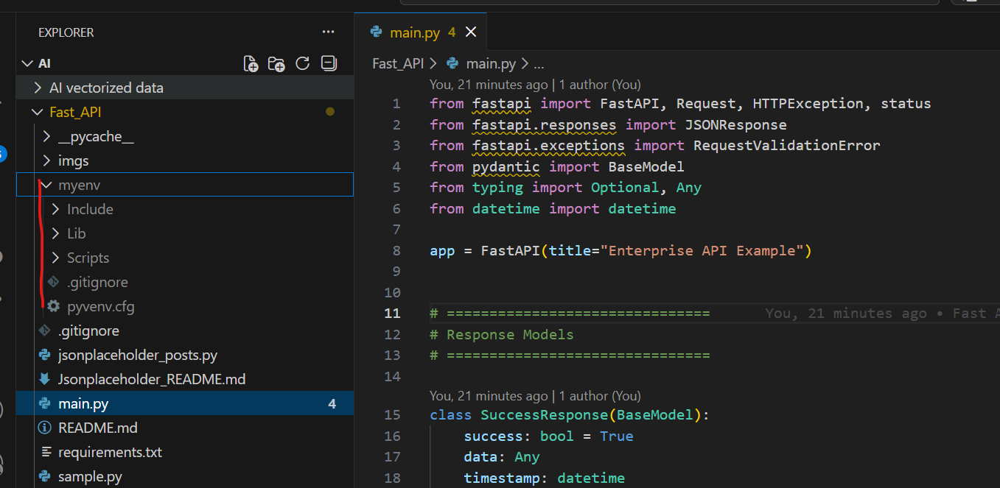
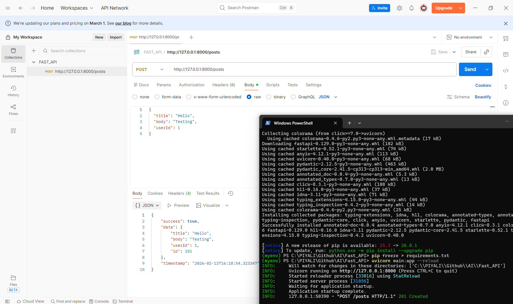
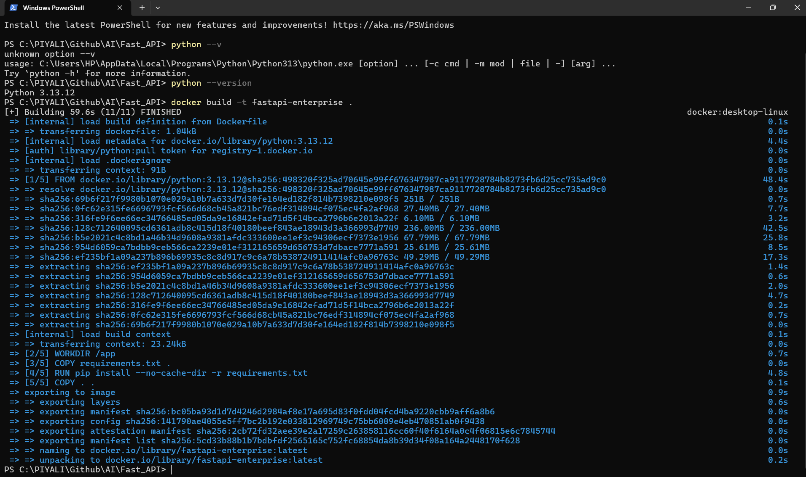

# FAST API

https://fastapi.tiangolo.com/
```
FastAPI automatically documents OpenAPI schema.
To customize error responses, we use responses={} parameter.
This updates OpenAPI spec and Swagger UI dynamically.
```
| Request     | Result                 |
| ----------- | ---------------------- |
| GET /       | 404 (no route defined) |
| GET /docs   | Swagger UI             |
| POST /posts | Works                  |

✅ Postman acts as the client.  
✅ FastAPI acts as the backend API server.


## 🔥 Postman Triggers FastAPI - How This Works Internally
    -   Postman sends HTTP request
    -   FastAPI receives request
    -   FastAPI validates data (Pydantic)
    -   Your function runs
    -   JSON response is returned to Postman

# 👨‍💻 After CLoning Repo

They should do:
```
python -m venv myenv
myenv\Scripts\activate   # Windows
pip install -r requirements.txt
```

Boom 💥 Same environment recreated.



# Run Fast API
Open terminal or CMD:
```
uvicorn main:app --reload
```

You will see:
```
Uvicorn running on http://127.0.0.1:8000
```

So available endpoint is:
```
POST http://127.0.0.1:8000/posts
```
add the endpoint in POSTMAN and click on Send button    



SWAGGER - Open this in browser:
```
http://127.0.0.1:8000/docs
```


## 🧠 What is a Virtual Environment?

A virtual environment (venv) is an isolated Python environment where you can:

Install project-specific packages

Avoid version conflicts

Keep global Python clean

Maintain different dependencies for different projects
```
Example:
Project A → FastAPI 0.95
Project B → FastAPI 0.110
Both can run safely using separate venvs.
```

### 🤔 Why should virtual environments NOT be pushed?

Because:

**1️⃣ They are machine-specific**

Your myenv contains:
    -   Installed packages
    -   OS-specific binaries
    -   Python executable files
    -   
If someone clones your repo:
    -   It may break on Mac/Linux if created on Windows
    -   It may contain unnecessary 1000+ files

**2️⃣ It makes the repo HUGE**

A virtual environment can be:
    -   100MB+
    -   Thousands of files

Bad practice to push.

# Create Fast API endpoint to trigger from POSTMAN
### ✅ Step 1: Check Python Installation

Open terminal / CMD:

python --version


OR

python3 --version


If not installed → Download from:
👉 https://www.python.org/downloads/

⚠️ During installation (Windows), check:
✔️ “Add Python to PATH”

### ✅ Step 2: Create a Virtual Environment

Go to your project folder:

cd FAST_API


Create venv:

🔹 Windows
python -m venv myenv

🔹 macOS / Linux
python3 -m venv myenv


This creates a folder:

FAST_API/
   ├── myenv/

### ✅ Step 3: Activate Virtual Environment
🪟 Windows (CMD)
```
myenv\Scripts\activate
```

🪟 Windows (PowerShell)
```
myenv\Scripts\Activate.ps1
```

🍎 macOS / Linux
```
source venv/bin/activate
```

if getting any error like "running scripts is disabled on this system", This error happens in Windows PowerShell because script execution is blocked by default for security reasons.
```
Set-ExecutionPolicy RemoteSigned -Scope CurrentUser
myenv\Scripts\activate
```


If successful, you’ll see:
```
(myenv) C:\my_project>
```

### ✅ Step 4: Install Packages

Now install packages inside myenv:
```
pip install fastapi uvicorn pydantic
```

Check installed packages:
```
pip list
```

### ✅ Step 5: Freeze Requirements

Save dependencies:
```
pip freeze > requirements.txt
```

Later install from file:
```
pip install -r requirements.txt
```

✅ Step 6: Deactivate Virtual Environment
```
deactivate
```

## 🐳 Using Virtual Environment with FastAPI (Example)
```
python -m venv myenv
myenv\Scripts\activate
pip install fastapi uvicorn pydantic
```

## 📦 What Each Package Does
| Package  | Purpose                          |
| -------- | -------------------------------- |
| fastapi  | Web framework                    |
| uvicorn  | ASGI server to run FastAPI       |
| pydantic | Data validation & request models |


⚡ Alternative Tools (Advanced)

Instead of venv, you can use:
| Tool       | Purpose                           |
| ---------- | --------------------------------- |
| virtualenv | Advanced version of venv          |
| pipenv     | Combines pip + venv               |
| poetry     | Dependency + packaging management |
| conda      | For data science                  |

# 🚀 Postman  →  FastAPI (Python)  →  Response
```
Create main.py:

from fastapi import FastAPI
from pydantic import BaseModel

app = FastAPI()

class PostData(BaseModel):
    title: str
    body: str
    userId: int

@app.post("/posts")
def create_post(data: PostData):
    return {
        "message": "Post received successfully",
        "data": data
    }
```

In terminal:
```
uvicorn main:app --reload
```

You will see:
```
Uvicorn running on http://127.0.0.1:8000
```

So available endpoint is:
```
POST http://127.0.0.1:8000/posts
```

**✅ Option 1 — Use Postman**
```
Method: POST
URL: http://127.0.0.1:8000/posts

Body → raw → JSON:

{
  "title": "Hello",
  "body": "Testing",
  "userId": 1
}
```

**✅ Option 2 — Use FastAPI Auto Docs (Best Way)**

Open this in browser:
```
http://127.0.0.1:8000/docs
```

You’ll see Swagger UI 🎉

Click:
    -   POST /posts
    -   Click "Try it out"
    -   Add JSON
    -   Click Execute

## 🧠 What You Now Have (Enterprise Features)

✅ Standard response contract   
✅ Business exception handling  
✅ Validation error formatting  
✅ Internal error handling  
✅ Proper HTTP status codes 
✅ Swagger documentation    

This is production-ready structure.

**✅ Enterprise Standard Error Format**

A common production-ready structure looks like this:
```
{
  "success": false,
  "error": {
    "code": "INVALID_USER_ID",
    "message": "User ID must be greater than 0",
    "details": null
  },
  "timestamp": "2026-02-12T10:30:00Z",
  "path": "/posts"
}
```

**Why?**
    -   success → frontend can easily check
    -   code → machine-readable error
    -   message → human-readable
    -   details → optional debug info
    -   timestamp → logging
    -   path → which API failed
    -   This is clean, consistent, scalable.

## 🎯 For Your Use Case (FastAPI + LangChain + Docker)

You will use Postman to:
    -   Send prompt
    -   Hit FastAPI endpoint
    -   FastAPI calls LangChain
    -   LangChain calls Ollama
    -   Get response back

## ✅ Correct Way to Handle Dependencies

Instead of pushing myenv, you should push:

📄 requirements.txt

Run this:
```
pip freeze > requirements.txt
```

Then commit:
```
git add requirements.txt
git commit -m "Add requirements file"
git push
```

## 🚀 Updated Complete Flow Diagram
```
┌────────────────────────┐
│        Postman         │
│  (Client / API Tester) │
└───────────┬────────────┘
            │
            │  POST /posts
            │  JSON Body
            │
            ▼
┌────────────────────────┐
│     FastAPI Server     │
│  (Running via Uvicorn) │
└───────────┬────────────┘
            │
            │ 1️⃣ Pydantic Validation
            │   (PostRequest Model)
            │
            ├───────────────┐
            │               │
            │               ▼
            │      ❌ Validation Error?
            │         (Missing field / wrong type)
            │
            │               │
            │               ▼
            │      RequestValidationError
            │               │
            │               ▼
            │     validation_exception_handler
            │               │
            │               ▼
            │        422 ErrorResponse
            │
            │
            ▼
 2️⃣ Business Logic Execution
        create_post()

            │
            ├───────────────┐
            │               │
            │               ▼
            │    ❌ userId <= 0 ?
            │
            │               │
            │               ▼
            │      BusinessException
            │               │
            │               ▼
            │  business_exception_handler
            │               │
            │               ▼
            │         400 ErrorResponse
            │
            │
            ▼
 3️⃣ Success Response Generated
            │
            ▼
  201 Created (SuccessResponse)
            │
            ▼
┌────────────────────────┐
│        Postman         │
│   Structured Response  │
└────────────────────────┘
```

## 🔥 Enterprise Error Handling Flow (Detailed View)
✅ Case 1: Success

Input
```
{
  "title": "Test",
  "body": "FastAPI Enterprise",
  "userId": 1
}
```

Flow
```
Postman
   ↓
FastAPI
   ↓
Pydantic validation ✔
   ↓
Business logic ✔
   ↓
201 Created
```

Response
```
{
  "success": true,
  "data": {
    "title": "Test",
    "body": "FastAPI Enterprise",
    "userId": 1,
    "id": 101
  },
  "timestamp": "2026-02-14T10:00:00"
}
```

**❌ Case 2: Validation Error (422)**

If userId is missing or wrong type:
```
Postman
   ↓
FastAPI
   ↓
Pydantic Validation ❌
   ↓
RequestValidationError
   ↓
validation_exception_handler
   ↓
422 Structured Error
```

Response:
```
{
  "success": false,
  "error": {
    "code": "VALIDATION_ERROR",
    "message": "Invalid request payload",
    "details": [...]
  },
  "timestamp": "...",
  "path": "/posts"
}
```

**❌ Case 3: Business Rule Error (400)**

If:
```
"userId": 0
```

Flow:
```
create_post()
   ↓
BusinessException Raised
   ↓
business_exception_handler
   ↓
400 Structured Error
```

Response:
```
{
  "success": false,
  "error": {
    "code": "INVALID_USER_ID",
    "message": "User ID must be greater than 0",
    "details": null
  },
  "timestamp": "...",
  "path": "/posts"
}
```

**❌ Case 4: Unexpected Server Error (500)**

If any unhandled exception occurs:
```
Exception
   ↓
global_exception_handler
   ↓
500 INTERNAL_SERVER_ERROR
```

# Build DOCKER Image
Make sure you are inside Fast_API folder:
```
cd Fast_API
```

Then:
```
docker build -t fastapi-enterprise .
```
⚠ The . is important (current folder context).




# ▶ Run Docker Image inside Container 
```
docker run -p 8000:8000 fastapi-enterprise
```

**🌐 Test**

Open in browser:
```
http://localhost:8000
```

Swagger:
```
http://localhost:8000/docs
```

Test with Postman:
```
POST http://localhost:8000/posts
```