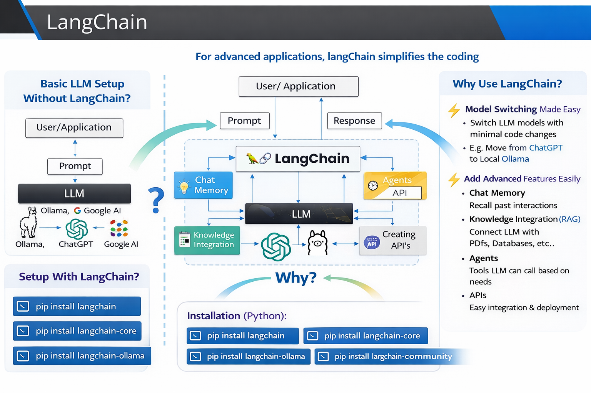
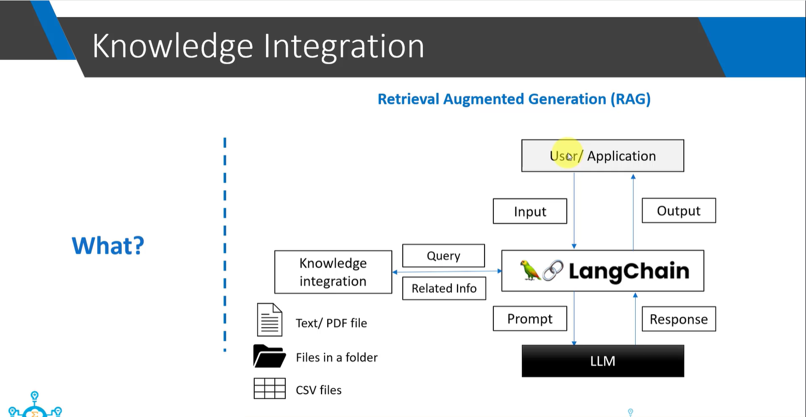

# What is LangChain?

LangChain is a framework for building applications using LLMs. It acts as a middle layer between User/Application and the LLM. It simplifies development of advanced LLM-based applications.    
LangChain is used to build scalable, flexible, and advanced LLM applications with easy model switching and feature integration.

## Basic LLM Setup (Without LangChain)



```
User → Prompt → LLM (Ollama / OpenAI / Google AI) → Response
```

    -   Direct communication with LLM
    -   Works fine for simple prompt-response systems
    -   Not scalable for advanced features

## Setup With LangChain
```
User → LangChain → LLM → LangChain → User
```
LangChain sits in the middle

It can:
    -   Modify prompt
    -   Process output
    -   Add additional logic
    -   Connect external tools

## ⭐ Why We Use LangChain (Main Reasons)
**✅ 1. Easy Model Switching (Very Important)**

LangChain makes it easy to switch models with minimal code change.

Example:
    -   From OpenAI GPT → Local Ollama (LLaMA 3.1)
    -   From OpenAI → Google Generative AI
    -   From Cloud model → Local model

👉 Usually requires just one line change    
👉 No need to rewrite full application  

This makes applications flexible and scalable.

**✅ 2. Easy Integration of Advanced Features**

LangChain simplifies adding:

🔹 Chat Memory
    -   Maintains conversation history
    -   Enables chatbot behavior

🔹 Knowledge Integration (RAG)
    -   Retrieval-Augmented Generation
    -   Connects LLM to:
        -   PDFs
        -   Databases
        -   Company documents
        -   Vector databases

🔹 Agents
    -   LLM can call tools
    -   Tools return results
    -   LLM decides next action

Example:
    -   Call weather API
    -   Query database
    -   Run calculator
    -   Execute search

🔹 API Creation
    -   Easy integration with FastAPI / backend systems


**🎯 Two Advanced Features Covered**

The instructor focuses on:
1. RAG (Retrieval-Augmented Generation)
    -   Adds external knowledge
    -   Solves LLM knowledge limitation
2. Agents
    -   LLM uses tools
    -   Tool output influences final response

These are the most common real-world LLM applications.

**🛠 Install required packages:**
```
pip install langchain
pip install langchain-core
pip install langchain-ollama
pip install langchain-community
```

After installing, you can start building:
    -   Simple prompt apps
    -   RAG systems
    -   Agent-based systems

### Knowledge Integration (RAG)

Now we want to do knowledge integration where we will give text files, PDF files or CSV files, or we may want to put all the relevant files in a folder. And then based on our input, we want to send a query and fetch only relevant documents or relevant part of the documents from this knowledge and give it back as part of prompt to the LLM. So instead of sending the whole PDF file or the entire text
or the entire data, we want to identify only relevant parts from this knowledge and send only that relevant part to the LLM so that it can answer the user query.



**Why are we not sending the entire PDF file?**

There are two reasons for that.

    -   One is most models have a context window. That is you can only send certain amount of tokens in one prompt. So if you have a big PDF file, that will not be allowed in the prompt. You will not be able to send the entire PDF file.
    -   Second reason is that if you send a lot of information in the prompt, it becomes difficult for the LLM model to pick out relevant parts from it. It might give importance to non-important parts of the document, and you may not get the desired response from LLM. 

For this reason, in a rag system, we first fetch the relevant parts from our knowledge source and send that relevant part only to the LLM.

## 🚀 Why Do We Need LangSmith When We Already Have LangChain?

https://docs.langchain.com/langsmith/home

🔹 First Understand the Difference
    -   LangChain → Framework to build LLM applications
    -   LangSmith → Platform to debug, monitor, and evaluate LLM applications

👉 Simple analogy:
    -   LangChain = Builder
    -   LangSmith = Inspector + Monitor + Evaluator

1️⃣ Debugging Complex Chains
-----------------------------------------------------------
When you build:
```
User → PromptTemplate → LLM → Retriever → Tool → Final Output
```

If output is wrong:
    -   Is prompt wrong?
    -   Retriever failed?
    -   LLM hallucinated?
    -   Tool returned bad data?

👉 LangChain alone does NOT give deep tracing.

✅ LangSmith provides:
    -   Step-by-step execution trace
    -   Input/output at every node
    -   Token usage
    -   Latency tracking

2️⃣ Observability (Production Monitoring)
-----------------------------------------------------------
In production (e.g., your FastAPI API):

You need:
    -   How many users?
    -   Token consumption?
    -   Response time?
    -   Failure rate?
    -   Which prompts are underperforming?

LangChain ❌ does not provide monitoring dashboard  
LangSmith ✅ provides production observability dashboard    

3️⃣ Evaluation & Testing (Very Important for RAG)
-----------------------------------------------------------
You’re working with RAG concepts. Now imagine:

You changed:
    -   Chunk size
    -   Embedding model
    -   Retriever strategy
    -   Prompt template

How do you know which version is better?

LangSmith allows:
    -   Dataset-based evaluation
    -   Run experiments
    -   Compare chain versions
    -   Score outputs (accuracy, relevance, faithfulness)

Without LangSmith → Manual testing  
With LangSmith → Scientific evaluation  

4️⃣ Prompt Versioning
-----------------------------------------------------------
In real projects:
    -   Prompt v1
    -   Prompt v2
    -   Prompt with system message
    -   Few-shot prompt

LangSmith helps:
    -   Track prompt versions
    -   Compare outputs
    -   Rollback bad versions
    -   LangChain alone cannot manage prompt experiments.

5️⃣ Team Collaboration (Enterprise Need)
-----------------------------------------------------------
If 5 developers work on same LLM system:

You need:
    -   Shared logs
    -   Shared traces
    -   Dataset management
    -   Experiment history

LangSmith supports team-level collaboration.

| Feature              | LangChain | LangSmith    |
| -------------------- | --------- | ------------ |
| Build chains         | ✅        | ❌          |
| Prompt templates     | ✅        | ❌          |
| RAG pipelines        | ✅        | ❌          |
| Execution tracing    | Limited   | ✅ Advanced  |
| Monitoring dashboard | ❌        | ✅          |
| Evaluation framework | ❌        | ✅          |
| Production analytics | ❌        | ✅          |

#### 🔥 Real-World Example (Your FastAPI Setup)

Your flow:
```
Postman → FastAPI → LangChain → Ollama
```

Without LangSmith:
    -   If response wrong → you print() debug
    -   Hard to track token usage
    -   No experiment comparison

With LangSmith:
    -   Full trace of each request
    -   Token cost per request
    -   Prompt comparison
    -   Performance monitoring

You don’t need it if:
    -   Just learning LangChain
    -   Small personal project
    -   No production deployment
    -   No evaluation requirement

You MUST Use LangSmith
    -   Production LLM app
    -   RAG system
    -   Enterprise AI system
    -   Multi-user API
    -   Cost monitoring needed
    -   A/B prompt testing