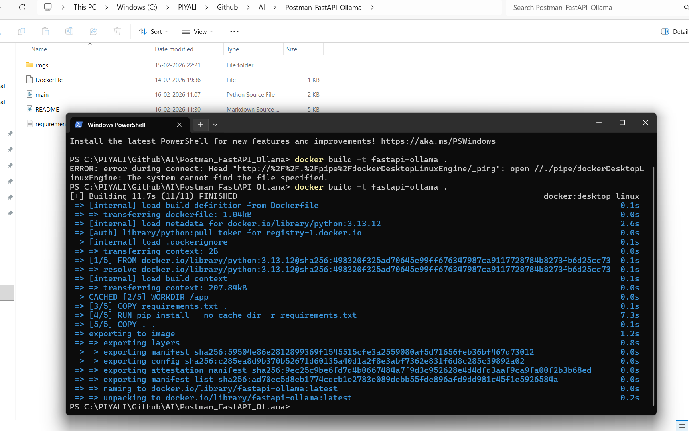
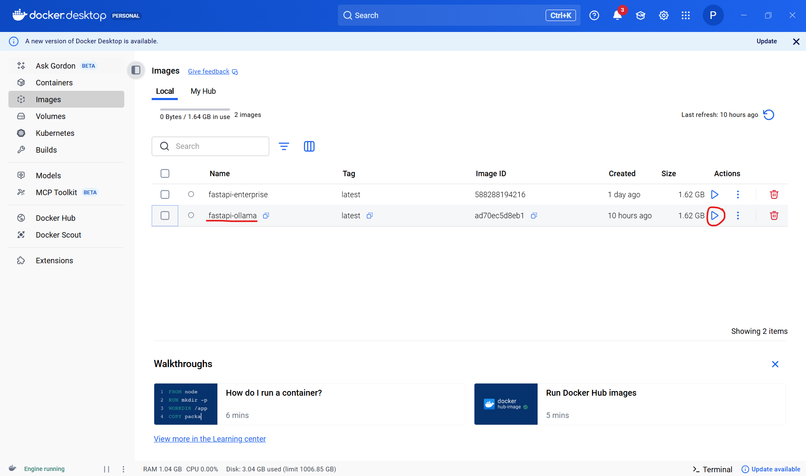
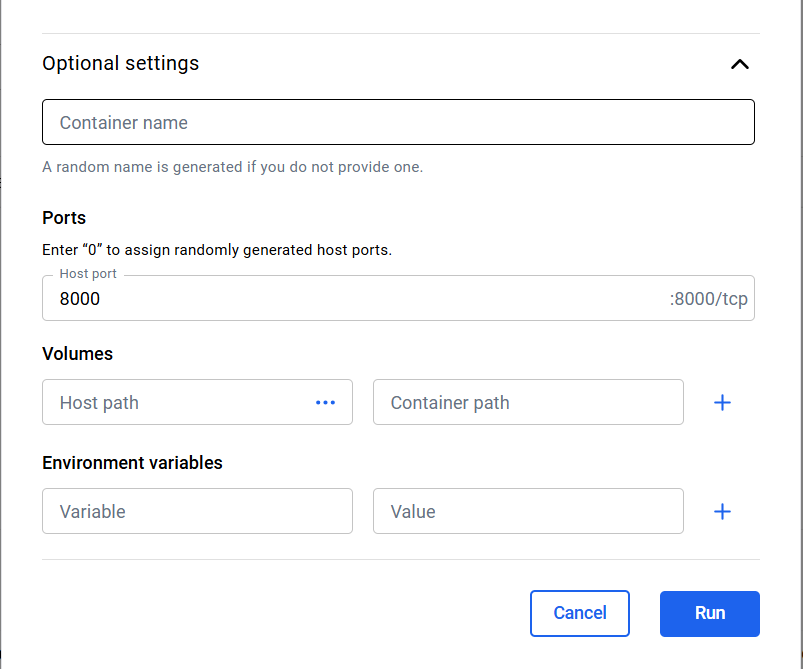
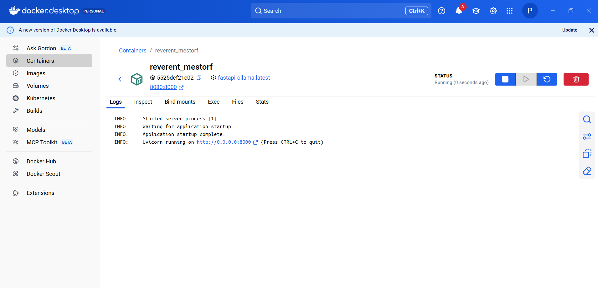
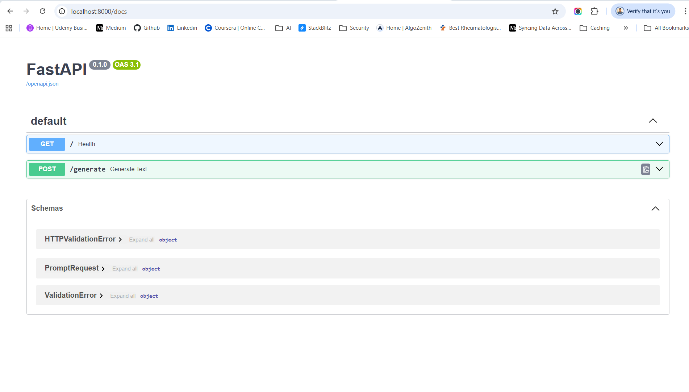
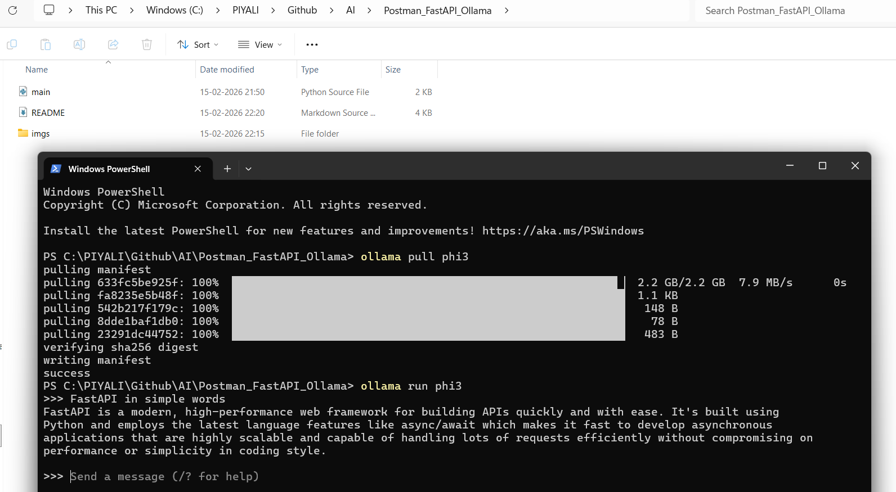
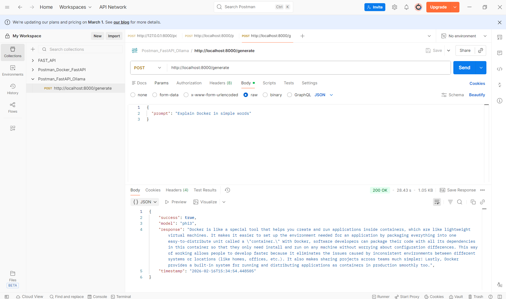

# Postman  → FastAPI (Docker) -> Ollama

Now we build the clean working pipeline using phi3 (lightweight model).
```
Postman → FastAPI (Docker) → Ollama → Response

Postman
   ↓
Docker (FastAPI :8000)
   ↓
Ollama (Host :11434)
   ↓
Response

```

## Run FAST API using Docker

1. Open Docker desktop. Then Download Ollama from:
```
👉 https://ollama.com
```
Then pull a model:
```
ollama pull phi3
```
2. Open cmd inside "Postman_FastAPI_Ollama" folder   
3. Run the docker command in cmd to Build Docker Image
```
docker build -t fastapi-ollama .
```

This creates an image named fastapi-ollama.


4. Now you must run a Docker container from the already build Docker Image (fastapi-ollama).
Run the container (this actually starts FastAPI) using CMD
```
docker run -p 8000:8000 fastapi-ollama
```
OR  
Inside Docker Desktop, Click the ▶️ Run button next to fastapi-ollama. Click Optional settings.  

| Setting        | Value |
| -------------- | ----- |
| Host Port      | 8000  |
| Container Port | 8000  |


It will open a popup.



**If Verify It Is Running**     
Run this command:
```
docker ps
```
You should see something like:
```
CONTAINER ID   IMAGE                PORTS
xxxxx          fastapi-enterprise   0.0.0.0:8000->8000/tcp
```
**Now FastAPI is running inside Docker.**    


```
Your Code (main.py)
        ↓
Docker Build → Image
        ↓
Docker Run → Container
        ↓
FastAPI running on :8000
```
5. Open:
```
http://localhost:8000/docs
```


6. Make sure Ollama is running
```
ollama run phi3
```


7. Trigger from Postman
```
POST
http://localhost:8000/generate
```
Body → raw → JSON
```
{
  "prompt": "Explain Docker in simple words"
}
```
Response
```
{
    "success": true,
    "model": "phi3",
    "response": "Docker is like a special tool that helps you create and run applications inside containers, which are like lightweight virtual machines. It makes it easier to set up the environment needed for an application by packaging everything into one easy-to-distribute unit called a \"container.\" With Docker, software developers can package their code with all its dependencies in this container so that they only need install and run on any machine without worrying about configuration differences. This way of working allows people to develop faster because it eliminates the issues caused by inconsistent environments between different systems or locations (like homes, offices, etc.). It also makes sharing projects across teams much simpler! Lastly, Docker provides a built-in system for running and distributing applications as containers in production smoothly too.",
    "timestamp": "2026-02-16T15:34:54.448505"
}
```


**✅ Expected Flow**

   -  Postman sends request to /generate
   -  FastAPI receives prompt
   -  FastAPI calls Ollama (phi3)
   -  Ollama generates answer
   -  FastAPI returns JSON response
   -  Postman displays answer


## 🧠 Real-Time Architecture (With LangChain & Ollama Example)
If you extend this to AI:
```
Postman
   │
   ▼
FastAPI Endpoint
   │
   ▼
LangChain
   │
   ▼
Ollama Model
   │
   ▼
Response → Postman
```
This is what happens when you do: 
```
Postman → FastAPI → LangChain → Ollama
```

1️⃣ API backend (FastAPI) 
2️⃣ Testing layer (Postman)   
3️⃣ AI model layer (Ollama)   
4️⃣ Possibly Docker containerization

## 🧠 What Happened Internally
1️⃣ Postman sends request
2️⃣ Docker forwards port
3️⃣ Uvicorn receives request
4️⃣ FastAPI matches route
5️⃣ Pydantic validates body
6️⃣ Your function executes
7️⃣ FastAPI calls Ollama
8️⃣ Ollama runs model
9️⃣ Response returned
🔟 Postman displays output

## 🚀 Full Flow: Postman → Docker → FastAPI → Ollama → Response
**🟢 Step 1: You Click "Send" in Postman**

Postman sends this HTTP request:
```
{
  "prompt": "Explain Docker in simple words"
}
```

To:
```
http://localhost:8000/generate
```

**🟢 Step 2: Request Reaches Your Local Machine**

Because Docker mapping shows:
```
8000:8000
```

Meaning:
```
Your PC Port 8000  →  Container Port 8000
```
So request enters Docker container.

**🟢 Step 3: Uvicorn Receives the Request**

Inside container:
```
uvicorn main:app --host 0.0.0.0 --port 8000
```

Uvicorn does:
    -   Accept HTTP request
    -   Pass it to FastAPI app
    -   Match route /generate

**🟢 Step 4: FastAPI Matches Endpoint**

FastAPI finds:
```
@app.post("/generate")
```

It then:
1. Reads JSON body
2. Validates using:
```
class PromptRequest(BaseModel):
    prompt: str
```

If valid → move forward     
If invalid → returns 422 error      

**🟢 Step 5: Your Function Executes**

This runs:
```
def generate_text(request: PromptRequest):
```

Now:
```
request.prompt = "Explain Docker in simple words"
```

**🟢 Step 6: FastAPI Calls Ollama**

Your code:
```
ollama_url = "http://host.docker.internal:11434/api/generate"
```

FastAPI (inside Docker) sends POST request to:
```
Ollama running on your host machine
```

Payload:
```
{
  "model": "phi3",
  "prompt": "Explain Docker in simple words",
  "stream": false
}
```

**🟢 Step 7: Ollama Processes the Prompt**

Internally Ollama:
1. Loads model phi3
2. Tokenizes prompt
3. Runs transformer inference
4. Generates output text
5. Returns JSON response

Example:
```
{
  "response": "Docker is a tool that packages applications..."
}
```

**🟢 Step 8: FastAPI Receives Ollama Response**

Your code:
```
result = response.json()
```

Extracts:
```
result.get("response")
```

**🟢 Step 9: FastAPI Builds Final Response**

Returns:
```
{
  "success": true,
  "model": "phi3",
  "response": "Docker is a tool...",
  "timestamp": "2026-02-16T..."
}
```

**🟢 Step 10: Response Goes Back**

Flow back:
```
Ollama → FastAPI → Uvicorn → Docker → Your PC → Postman
```
Postman shows result.


## Update PromptRequest Model
```
from pydantic import BaseModel, Field
from typing import Optional

class PromptRequest(BaseModel):
    prompt: str
    system: Optional[str] = "You are a helpful AI assistant."
    temperature: Optional[float] = Field(default=0.7, ge=0.0, le=2.0)
    top_p: Optional[float] = Field(default=0.9, ge=0.0, le=1.0)
    top_k: Optional[int] = Field(default=40, ge=1)
```

✅ What This Does
   -  Optional → user can omit fields
   -  Field → adds validation
   -  ge / le → prevents invalid values