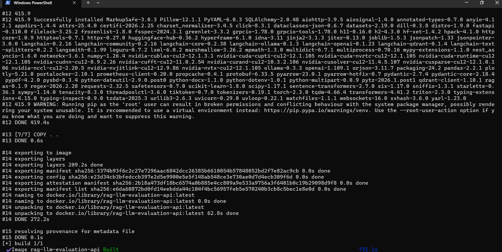
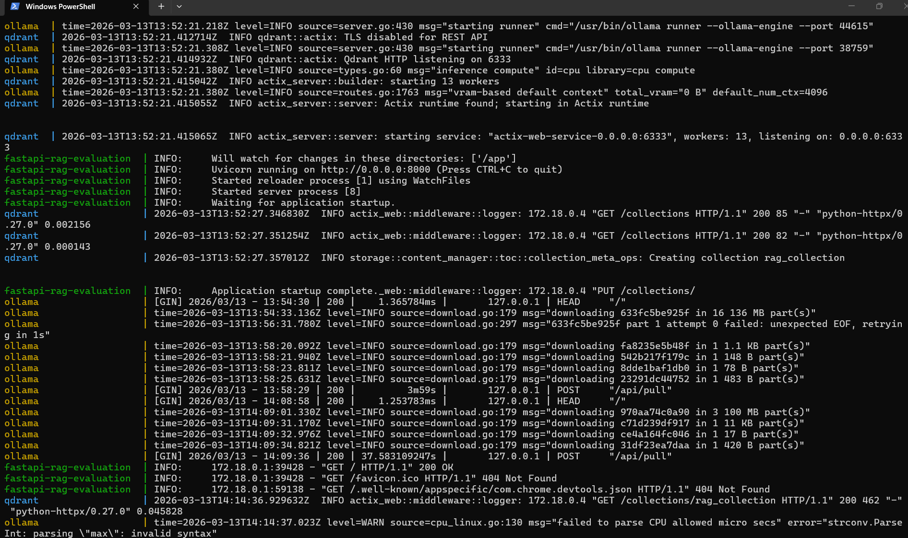
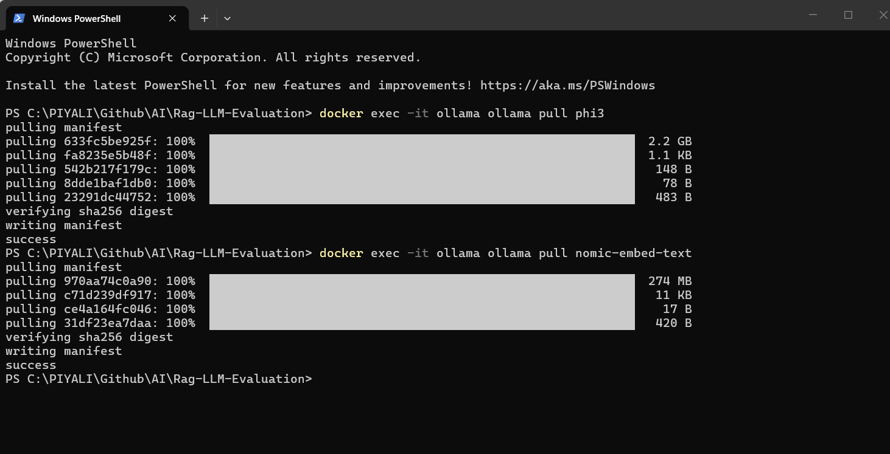
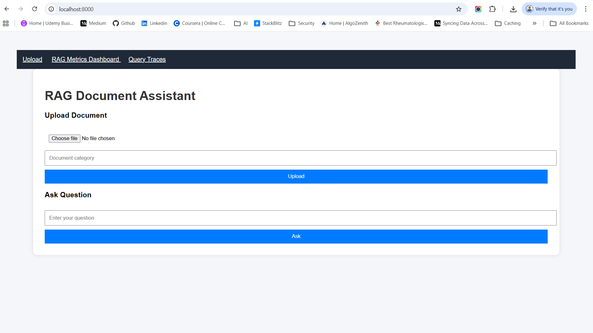
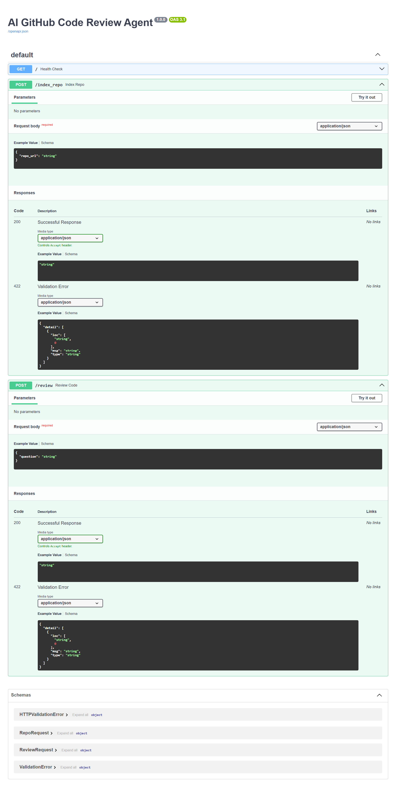
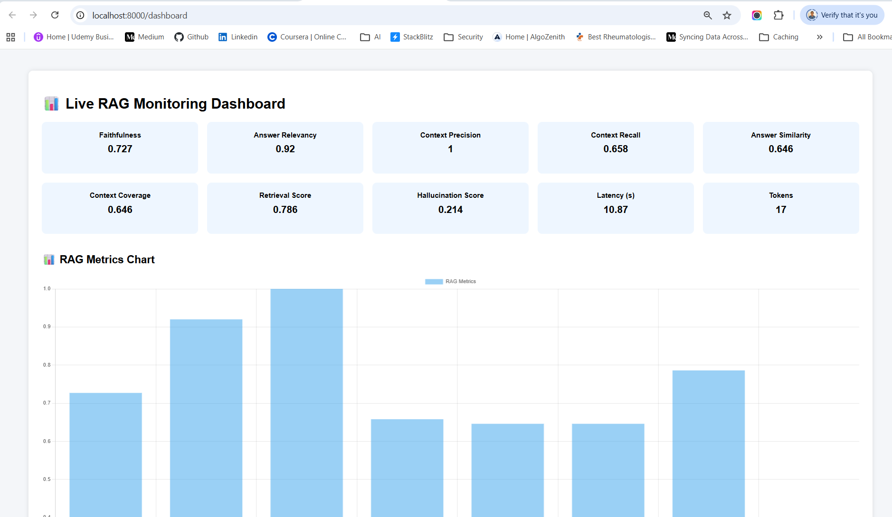
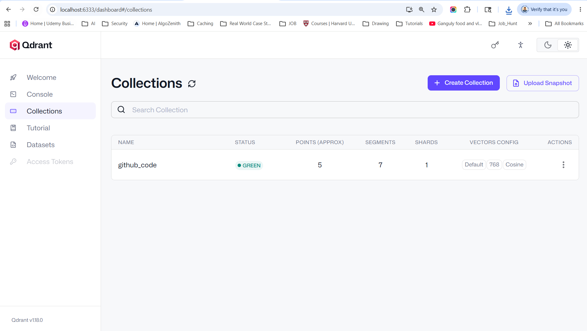

# RAG Based Code Review Agent

You are building:
```
AI code review agent
```
This is one of the MOST parser-sensitive RAG applications.

Because review quality depends heavily on:
- semantic retrieval
- correct context
- function completeness

RAG evaluation measures how well a Retrieval-Augmented Generation system performs.  

This agent will:
- Clone a GitHub repo
- Load code files
- Chunk the code
- Create embeddings
- Store in Qdrant
- Retrieve relevant code
- Use LLM to review code

| Layer       | Tool                     |
| ----------- | ------------------------ |
| API         | FastAPI                  |
| Agent       | LangChain / Autogen      |
| LLM         | OpenAI / Ollama / Claude |
| Embedding   | Nomic / Ada-003          |
| Vector DB   | Qdrant                   |
| Repo access | GitHub API               |
| UI          | Streamlit / Jinja2       |

Project structure:
```
app/
│
├── loaders/
│   └── github_loader.py
│
├── rag/
│   ├── embedder.py
│   ├── retriever.py
│   └── vector_store.py
│
├── agents/
│   └── reviewer_agent.py
│
├── api/
│   └── main.py
```

## Run Application
1. Install Docker & Run Docker Desktop first
2. Inside application folder (Rag-LLM-Evaluation), open gitbash or cmd to run the command following command. requirements.txt file should be on the same path.
```
docker compose down -v
docker compose build --no-cache
docker compose up
```




> The docker compose down command stops and removes the containers, networks, and the default network that were created by docker compose up.
> Restart your containers: docker compose restart

3. From your project root:
open new gitbash or cmd to run the command following command.
```
docker exec -it ollama ollama pull phi3
docker exec -it ollama ollama pull nomic-embed-text
```
Wait until both models download completely.


You can verify:
```
docker exec -it ollama ollama list
```

You should see something like:
```
llama3
nomic-embed-text
```

So 👉 AFTER containers are running, not before docker compose build. 

🧠 Why?  
🔹 docker compose build 
   -  Builds the Docker image
   -  Does NOT start the container
   -  Ollama service is not running yet

So if you try to pull before container is running → ❌ it won’t work.

4. 🌐 Open FastAPI UI
```
http://localhost:8000
```


Fast API
```
http://localhost:8000/docs
```


It will store embeddings into Qdrant using Ollama.

Check Container Logs. Run in CMD
```
docker compose logs -f
```

5. Health check:
```
http://localhost:8000/health
```
6. 📊 Live RAG Monitoring Dashboard
```
http://localhost:8000/dashboard
```


7. 📜 RAG Query Traces
```
http://localhost:8000/traces
```


| Section             | Purpose                       |
| ------------------- | ----------------------------- |
| Question            | user input                    |
| Answer              | generated output              |
| Metrics             | 10 RAG evaluation scores      |
| Heatmap             | which chunk influenced answer |
| Latency             | response time                 |
| Token usage         | LLM cost                      |
| Hallucination score | safety check                  |

8. Ollama API

Test:
```
curl http://localhost:11434/api/tags
```

9. Use Qdrant Web UI for viewing Vector Database (Qdrant Dashboard)
If your docker-compose.yml exposes port 6333, open:
```
http://localhost:6333/dashboard
```


> after run "docker compose build", one default rag_collection will be created. Don't delete it. If you upload the document, the existing rag_collection will be updated otherwise you will get 500 internet server error.

**📦 Collection: rag_collection**
```
Status: 🟢 Green
```
That means:
   -  Collection created successfully
   -  Vector indexing active
   -  No errors

**You’re seeing a stored point inside**
Qdrant → rag_collection

Let me explain exactly what each part means.

```
Point: 0081db12-7b4c-4f8b-8b12-d293331b2dc3
Payload:
{
  "page_content": "identity. 3. Respect privacy Never include persona…"
  "metadata": {}
}
Vectors:
Default vector
Length: 768
```

🧠 1️⃣ Point ID : 0081db12-7b4c-4f8b-8b12-d293331b2dc3  

This is a UUID generated automatically. Each document chunk gets:
   -  Unique ID
   -  One vector
   -  One payload

Think of it like:
```
1 chunk = 1 row in vector DB
```

## ⭐ Requirements

If you build a RAG-based GitHub Code Review Agent, the requirements.txt should include packages for:

1️⃣ GitHub repo access
2️⃣ Document loading & chunking
3️⃣ Embeddings
4️⃣ Vector database
5️⃣ LLM interaction
6️⃣ Agent orchestration (optional)
7️⃣ API layer (optional)

## 🏗️ Final Architecture
```
GitHub Repo
    │
    ▼
Language-Aware Parser
(Python AST + Tree-sitter)
    │
    ▼
Semantic Code Chunking
    │
    ▼
Embeddings
(nomic-embed-text)
    │
    ▼
Qdrant
    │
    ▼
Retriever
    │
    ▼
Phi3 Reviewer
    │
    ▼
FastAPI
```

## 🐳 Deployment Architecture (Docker)
```
┌────────────────────────────────────────┐
│              Docker Host               │
│                                        │
│  ┌───────────────┐                     │
│  │  app container │  FastAPI           │
│  └───────────────┘                     │
│         │                              │
│         │ internal docker network      │
│         ▼                              │
│  ┌───────────────┐                     │
│  │ qdrant        │                     │
│  └───────────────┘                     │
│         │                              │
│         ▼                              │
│  ┌───────────────┐                     │
│  │ ollama        │                     │
│  └───────────────┘                     │
└────────────────────────────────────────┘
```

## LLM Model
Your current model:
```
phi3
```
is small.

For code review, better local models are:

| Model          | Better For             |
| -------------- | ---------------------- |
| deepseek-coder | code review            |
| codellama      | code understanding     |
| qwen2.5-coder  | strongest local coding |
| starcoder2     | repo reasoning         |

You can still keep Phi3 for lightweight workflows.

## Embedding Models

For high-performance RAG in 2026, mxbai-embed-large and BGE-M3 are top contenders for accuracy, with Snowflake Arctic-Embed excelling in production efficiency. Nomic-embed-text is a top choice for long-context tasks (8192 tokens) over the standard 512-token limit.

**Here is a breakdown of the models:**
- **mxbai-embed-large:** Generally considered a state-of-the-art model for overall semantic search quality, offering high-dimensional, rich representations.
- **BGE-M3 (BAAI):** Distinguished by its multi-functionality, supporting multilingual, multi-granularity (dense/sparse), and multi-functionality retrieval. It is a very high-performance choice but can be slower.
- **Snowflake-arctic-embed:** Optimized for production RAG, providing high accuracy (NDCG@10 of 55.98) with a strong performance-to-size ratio.
- **Nomic-embed-text:** A top performer for long-context tasks (8192 tokens), outperforming smaller models and offering open-source training data and reproducibility.BGE-Large-v1.5: A strong, established model, often seen as a reliable benchmark.

**Which one to choose?**
- **For maximum accuracy:** Use mxbai-embed-large or bge-m3.
- **For long documents (RAG):** Use nomic-embed-text for its 8192 context window.
- **For fast/efficient production:** Use snowflake-arctic-embed.
- **For multilingual support:** Use bge-m3.

## Code Chunking
```
from langchain.text_splitter import RecursiveCharacterTextSplitter
```
and:
```
splitter = RecursiveCharacterTextSplitter(
    chunk_size=1200,
    chunk_overlap=200
)
```
RecursiveCharacterTextSplitter is fundamentally a character-based splitter.

It tries to split text recursively using separators like:
```
\n\n
\n
space
character
```
but ultimately the chunk size is measured in characters/tokens, not code structure.
```
So your current pipeline is:

Code File
   ↓
1200-character chunks
   ↓
Embeddings
```

**For code-review agents, you should eventually move to:**
- AST chunking
- function-level chunking
- class-level chunking

This improves review quality massively.

## Why Character chunking is a Problem for Code RAG ?
**Suppose you have:**
```
class AuthService:

    def validate_token(self):
        ...

    def login(self):
        ...
```

**Character chunking may split like:**

Chunk 1
```
class AuthService:

    def validate_token(self):
```

Chunk 2
```
...
    def login(self):
```

Now the LLM loses context.

**This causes:**
- hallucinations
- incomplete review
- missed bugs
- poor retrieval quality

## Best chunking = Structure-Aware Chunking
For code-review agents, chunk by:

| Better Chunking | Why                     |
| --------------- | ----------------------- |
| function        | keeps logic together    |
| class           | preserves relationships |
| AST nodes       | best semantic retrieval |
| module          | preserves architecture  |

**Example of AST-Based Chunking**

Instead of:
```
1200 characters
```
You do:
```
One function = one chunk
```
Example:
```
def authenticate():
```
becomes one chunk.

## Why Big AI Companies Use AST Chunking

Because code is NOT normal text.

Code has:
- syntax trees
- scopes
- dependencies
- function boundaries

AST chunking preserves semantics.

you now store:
```
One function = one semantic chunk
One class = one semantic chunk
```

This massively improves:
- retrieval accuracy
- bug detection
- security review
- hallucination reduction

Now each chunk contains:
```
{
    "source": "auth/service.py",
    "type": "function",
    "name": "login_user",
    "line": 42
}
```
This is VERY powerful later for:
- PR comments
- source attribution
- GitHub annotations

Python AST only works for:
```
.py
```

## Why need Parser ? can't we directly break the code
Yes — you can directly break the code without a parser.
That is actually how many basic RAG systems start.
```
Example:

splitter = RecursiveCharacterTextSplitter(
    chunk_size=1200,
    chunk_overlap=200
)
```
This works.

But the reason parsers (AST / Tree-sitter) are important is because code is structured, not plain text.

**Direct Chunking vs Parser-Based Chunking**
| Approach            | Works? | Quality |
| ------------------- | ------ | ------- |
| Character chunking  | ✅      | Basic   |
| Line chunking       | ✅      | Better  |
| Regex chunking      | ✅      | Medium  |
| AST/Parser chunking | ✅      | Best    |

**What Happens Without a Parser**

Suppose you split this Angular service:
```
@Injectable()
export class AuthService {

  login() {
      ...
  }

  refreshToken() {
      ...
  }
}
```
Using character chunking:
```
Chunk 1:
@Injectable()
export class AuthService {
   login() {

Chunk 2:
...
refreshToken() {
```

Now:
- ❌ function broken
- ❌ incomplete logic
- ❌ retriever confusion
- ❌ weaker embeddings

**Why This Hurts RAG**

Embeddings depend on semantic meaning.

Broken code chunks create embeddings like:
```
"refreshToken() {"
```
without context.

The vector DB cannot understand:
- class ownership
- dependencies
- scope
- relationships

**Parser-Based Chunking**

Parser understands syntax tree:
```
Class
 ├── login()
 └── refreshToken()
```

Now chunking becomes:
```
Chunk 1 = login()
Chunk 2 = refreshToken()
```
Much cleaner.

**Real Difference in Retrieval**

Without parser

Query:
```
review login authentication
```
Retriever may return:
```
half login + half refreshToken
```

With parser

Retriever returns:
```
full login() method
```
Huge improvement.

**For SMALL repos:**
```
simple chunking is enough
```

**For LARGE enterprise repos:**
```
AST parsing becomes critical
```

Especially for:
- Angular monorepos
- Nx workspaces
- microfrontends
- backend services

## 🏛️ Architecture Summary (Professional Description)

My system is:

> A Local AI system that can read documents, answer questions, and evaluate how good the answers are.

You could say:
   -  Presentation Layer: Jinja2 UI
   -  Application Layer: FastAPI
   -  Retrieval Layer: LangChain RAG pipeline
   -  Data Layer: Qdrant vector database
   -  AI Layer: Ollama 
      - Embedding Model : nomic-embed-text
      - LLM Model : phi3(used) / llama3.2 / gemma
   -  Infrastructure Layer: Docker Compose
      Services typically include:
      - fastapi
      - qdrant
      - ollama