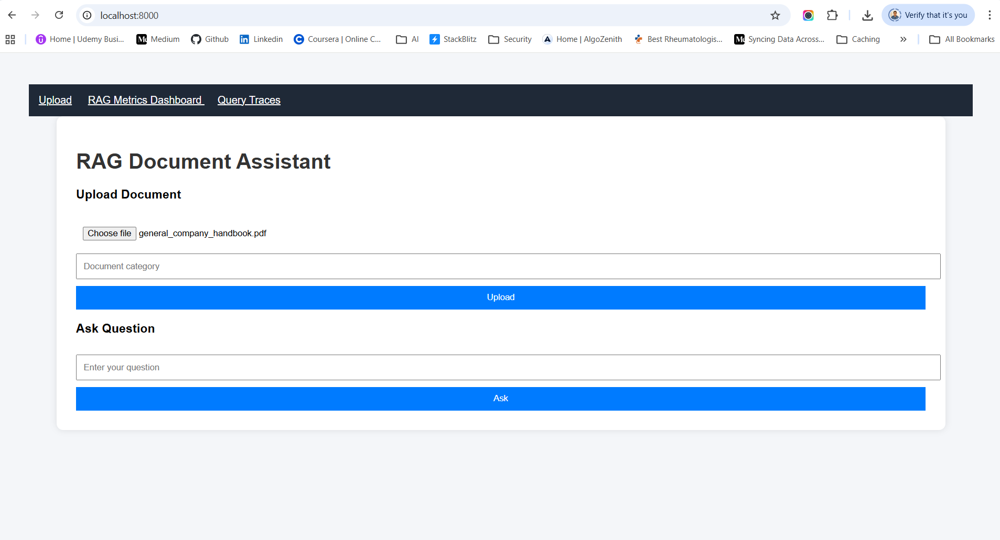

# RAG Based Code Review Agent

RAG evaluation measures how well a Retrieval-Augmented Generation system performs.  

This agent will:
- Clone a GitHub repo
- Load code files
- Chunk the code
- Create embeddings
- Store in Qdrant
- Retrieve relevant code
- Use LLM to review code

| Layer       | Tool                     |
| ----------- | ------------------------ |
| API         | FastAPI                  |
| Agent       | LangChain / Autogen      |
| LLM         | OpenAI / Ollama / Claude |
| Embedding   | Nomic / Ada-003          |
| Vector DB   | Qdrant                   |
| Repo access | GitHub API               |
| UI          | Streamlit / Jinja2       |

Project structure:
```
app/
│
├── loaders/
│   └── github_loader.py
│
├── rag/
│   ├── embedder.py
│   ├── retriever.py
│   └── vector_store.py
│
├── agents/
│   └── reviewer_agent.py
│
├── api/
│   └── main.py
```

## Run Application
1. Install Docker & Run Docker Desktop first
2. Inside application folder (Rag-LLM-Evaluation), open gitbash or cmd to run the command following command. requirements.txt file should be on the same path.
```
docker compose down -v
docker compose build --no-cache
docker compose up
```


> The docker compose down command stops and removes the containers, networks, and the default network that were created by docker compose up.
> Restart your containers: docker compose restart

3. From your project root:
open new gitbash or cmd to run the command following command.
```
docker exec -it ollama ollama pull phi3
docker exec -it ollama ollama pull nomic-embed-text
```
Wait until both models download completely.


You can verify:
```
docker exec -it ollama ollama list
```

You should see something like:
```
llama3
nomic-embed-text
```

So 👉 AFTER containers are running, not before docker compose build. 

🧠 Why?  
🔹 docker compose build 
   -  Builds the Docker image
   -  Does NOT start the container
   -  Ollama service is not running yet

So if you try to pull before container is running → ❌ it won’t work.

4. 🌐 Open FastAPI UI
```
http://localhost:8000
```


Fast API
```
http://localhost:8000/docs
```

Upload:
- PDF
- DOCX
- CSV

It will store embeddings into Qdrant using Ollama.

Check Container Logs. Run in CMD
```
docker compose logs -f
```

5. Test flow:
   -  Upload a PDF / DOCX / CSV
   -  Submit a question
   -  Confirm answer is retrieved from document




Health check:
```
http://localhost:8000/health
```
6. 📊 Live RAG Monitoring Dashboard
```
http://localhost:8000/dashboard
```


7. 📜 RAG Query Traces
```
http://localhost:8000/traces
```


| Section             | Purpose                       |
| ------------------- | ----------------------------- |
| Question            | user input                    |
| Answer              | generated output              |
| Metrics             | 10 RAG evaluation scores      |
| Heatmap             | which chunk influenced answer |
| Latency             | response time                 |
| Token usage         | LLM cost                      |
| Hallucination score | safety check                  |

8. Ollama

Test:
```
curl http://localhost:11434/api/tags
```

9. Use Qdrant Web UI for viewing Vector Database
If your docker-compose.yml exposes port 6333, open:
```
http://localhost:6333/dashboard
```


> after run "docker compose build", one default rag_collection will be created. Don't delete it. If you upload the document, the existing rag_collection will be updated otherwise you will get 500 internet server error.

**📦 Collection: rag_collection**
```
Status: 🟢 Green
```
That means:
   -  Collection created successfully
   -  Vector indexing active
   -  No errors

**You’re seeing a stored point inside**
Qdrant → rag_collection

Let me explain exactly what each part means.

```
Point: 0081db12-7b4c-4f8b-8b12-d293331b2dc3
Payload:
{
  "page_content": "identity. 3. Respect privacy Never include persona…"
  "metadata": {}
}
Vectors:
Default vector
Length: 768
```

🧠 1️⃣ Point ID : 0081db12-7b4c-4f8b-8b12-d293331b2dc3  

This is a UUID generated automatically. Each document chunk gets:
   -  Unique ID
   -  One vector
   -  One payload

Think of it like:
```
1 chunk = 1 row in vector DB
```

## ⭐ Requirements

If you build a RAG-based GitHub Code Review Agent, the requirements.txt should include packages for:

1️⃣ GitHub repo access
2️⃣ Document loading & chunking
3️⃣ Embeddings
4️⃣ Vector database
5️⃣ LLM interaction
6️⃣ Agent orchestration (optional)
7️⃣ API layer (optional)

**📦 requirements.txt (RAG GitHub Code Review Agent)**
```
# Core LangChain framework
langchain==0.2.14
langchain-community==0.2.12
langchain-core==0.2.38

# Ollama LLM + Embeddings
langchain-ollama==0.1.3
ollama==0.3.3

# Vector Database
qdrant-client==1.11.0

# Tokenizer / text utilities
tiktoken==0.7.0

# Document processing
pypdf==4.3.1

# GitHub repository access
gitpython==3.1.43
PyGithub==2.4.0

# Agent orchestration (optional)
langgraph==0.2.16

# Web API
fastapi==0.114.0
uvicorn==0.30.6

# Data processing
numpy==1.26.4
pandas==2.2.2

# Environment variables
python-dotenv==1.0.1

# Logging
loguru==0.7.2
```

| Package               | Purpose                       |
| --------------------- | ----------------------------- |
| `gitpython`           | Clone GitHub repo             |
| `PyGithub`            | GitHub API (PR comments etc.) |
| `langchain`           | RAG pipeline                  |
| `langchain-community` | loaders & integrations        |
| `langchain-openai`    | OpenAI models                 |
| `langchain-ollama`    | local LLM                     |
| `qdrant-client`       | vector database               |
| `tiktoken`            | token counting                |
| `langgraph`           | multi-agent workflows         |
| `fastapi`             | API service                   |
| `uvicorn`             | run FastAPI                   |


## 🏗️ Final Architecture
```
GitHub Repo
     │
     ▼
GitPython Clone
     │
     ▼
Code Loader
     │
     ▼
Code Chunking
     │
     ▼
Ollama Embeddings (nomic-embed-text)
     │
     ▼
Qdrant Vector DB
     │
     ▼
Retriever
     │
     ▼
LLM Reviewer (Phi3 LLM using Ollama)
     │
     ▼
Code Review Report / Code Review Agent
```


## 🐳 Deployment Architecture (Docker)
```
┌────────────────────────────────────────┐
│              Docker Host               │
│                                        │
│  ┌───────────────┐                     │
│  │  app container │  FastAPI           │
│  └───────────────┘                     │
│         │                              │
│         │ internal docker network      │
│         ▼                              │
│  ┌───────────────┐                     │
│  │ qdrant        │                     │
│  └───────────────┘                     │
│         │                              │
│         ▼                              │
│  ┌───────────────┐                     │
│  │ ollama        │                     │
│  └───────────────┘                     │
└────────────────────────────────────────┘
```

**🏛️ Architecture Summary (Professional Description)**

My system is:

> A Local AI system that can read documents, answer questions, and evaluate how good the answers are.

You could say:
   -  Presentation Layer: Jinja2 UI
   -  Application Layer: FastAPI
   -  Retrieval Layer: LangChain RAG pipeline
   -  Data Layer: Qdrant vector database
   -  AI Layer: Ollama 
      - Embedding Model : nomic-embed-text
      - LLM Model : phi3(used) / llama3.2 / gemma
   -  Infrastructure Layer: Docker Compose
      Services typically include:
      - fastapi
      - qdrant
      - ollama