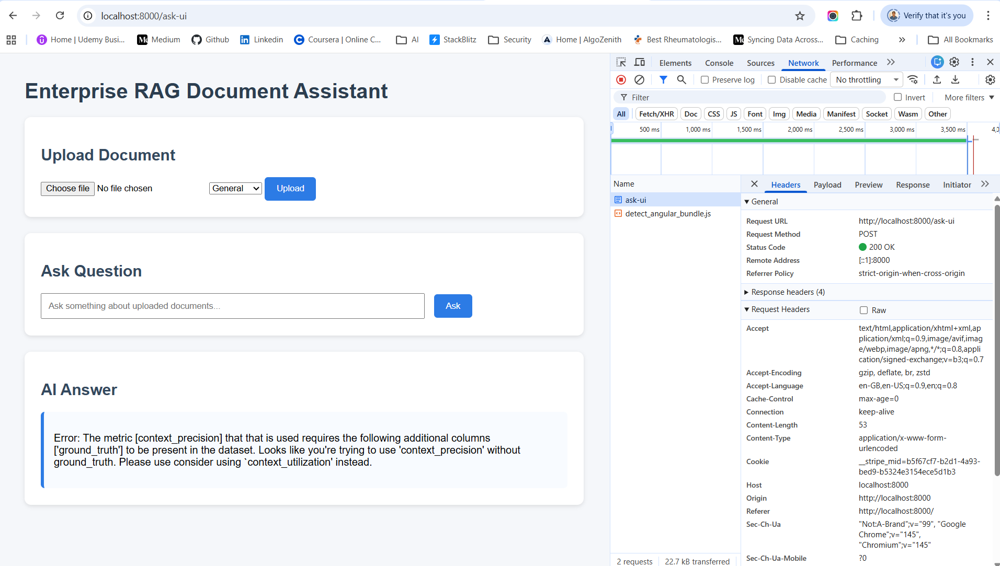

# Ground Truth ERROR


> Error: The metric [context_precision] that that is used requires the following additional columns ['ground_truth'] to be present in the dataset. Looks like you're trying to use 'context_precision' without ground_truth. Please use consider using `context_utilization' instead.

The error is happening because RAGAS metric context_precision requires a ground truth answer, but your system is a live RAG application, not an offline evaluation dataset.

So RAGAS is expecting something like:
```
question
ground_truth
answer
contexts
```

But your dataset only contains:
```
question
answer
contexts
```
That is why you see this error.

### 1. Why context_precision is failing in your application ?

The metric context_precision needs a ground truth answer.

**Your dataset currently looks like this:**

| question                                   | contexts       | answer           |
| ------------------------------------------ | -------------- | ---------------- |
| What are the company office working hours? | retrieved docs | generated answer |


**But context_precision requires this:**

| question                                   | contexts       | answer           | ground_truth             |
| ------------------------------------------ | -------------- | ---------------- | ------------------------ |
| What are the company office working hours? | retrieved docs | generated answer | Office hours are 9AM–6PM |

So the error says:
```
metric requires column ground_truth
```
because it needs to compare:
```
retrieved context vs correct answer
```
Without ground_truth, the metric cannot judge if the retrieved documents were correct.

### 2. What "Ground Truth" actually means

Ground truth = the correct answer written by humans

Example dataset for evaluation:
```
dataset = {
    "question": ["What are the company office working hours?"],
    "answer": ["The office works from 9 AM to 6 PM."],
    "contexts": [["The company office operates between 9 AM and 6 PM on weekdays."]],
    "ground_truth": ["The office working hours are 9 AM to 6 PM."]
}
```

Now RAGAS can compare:
```
Ground Truth → correct answer
Retrieved Context → document
```
and measure precision.

### 3. Why your LIVE RAG app cannot use context_precision

Your architecture likely looks like this:
```
User Question
↓
Embedding
↓
Vector DB (probably Qdrant)
↓
Retrieved Context
↓
LLM answer
```
In live systems, you do not have ground truth answers for every user question.

Therefore context_precision cannot run.

### 4. What context_utilization does instead

context_utilization does NOT require ground truth.

It checks:
```
Did the LLM actually use the retrieved context while answering?
```
Example:

Context:
```
Office hours: 9AM to 6PM
```
LLM answer:
```
The office works from 9AM to 6PM.
```
Utilization score = high

If LLM answers something unrelated:
```
Office works 24 hours
```
Utilization score = low

So it evaluates how much the LLM used the context.

### 5. Difference between the two metrics
| Metric              | Requires Ground Truth | Purpose                              | Used In            |
| ------------------- | --------------------- | ------------------------------------ | ------------------ |
| context_precision   | ✅ Yes                 | Checks if retrieved docs are correct | Offline evaluation |
| context_utilization | ❌ No                  | Checks if LLM used retrieved context | Live RAG apps      |

### 6. Which one is more accurate?

Both measure different things.

**For production RAG systems**

Best metrics:   
```
context_utilization
faithfulness
answer_relevancy
```

**For benchmark testing**  

Best metrics:   
```
context_precision
context_recall
answer_correctness
```

### 7. Recommended setup for your application

Since you're building a FastAPI + LangChain + Qdrant RAG system, use:
```
metrics = [
    context_utilization,
    faithfulness,
    answer_relevancy
]
```

Do NOT use:
```
context_precision
context_recall
```
unless you build an evaluation dataset with ground truth.

### 8. Real industry practice

In production RAG systems companies use:
| Phase                 | Metrics                   |
| --------------------- | ------------------------- |
| Development           | context_precision, recall |
| Production monitoring | faithfulness, utilization |
| User feedback         | thumbs up/down            |

### 9. Simple analogy

Think of it like this:

**context_precision**
```
Did we retrieve the correct textbook pages?
```

**context_utilization**
```
Did the student actually use those pages to answer?
```

## ✅ Correct Metrics for Live RAG Systems

For interactive RAG apps (like your FastAPI UI), you should use:

| Metric              | Needs ground truth?  |
| ------------------- | -------------------- |
| faithfulness        | ❌                   |
| answer_relevancy    | ❌                   |
| context_utilization | ❌                   |
| context_precision   | ✅                   |

So replace: 
```
context_precision
```
with:
```
context_utilization
```

### ✅ Fix in Your main.py

Change this section.

Current (causing error)
```
from ragas.metrics import faithfulness, answer_relevancy, context_precision
```

Replace with
```
from ragas.metrics import faithfulness, answer_relevancy, context_utilization
```

Update evaluation function
```
def evaluate_rag(question, answer, contexts):

    data = {
        "question": [question],
        "answer": [answer],
        "contexts": [contexts],
    }

    dataset = Dataset.from_dict(data)

    result = evaluate(
        dataset,
        metrics=[
            faithfulness,
            answer_relevancy,
            context_utilization
        ],
    )

    return result
```

### ⭐ What These Metrics Mean
**Faithfulness**

Checks if the answer is grounded in retrieved documents.

Example hallucination:

Document says:
```
Office hours: 9 AM – 6 PM
```
LLM says:
```
Office hours are 8 AM – 5 PM
```
Faithfulness ↓

**Answer Relevancy**

Checks if the answer matches the question intent.

Example:

Question:
```
What are office hours?
```
Answer:
```
Employees get 20 leaves per year
```
Relevancy ↓

**Context Utilization**

Checks if the LLM actually used retrieved documents.

Sometimes LLM ignores context.

Example:

Retriever returns policy document   
LLM answers from training data instead

Context utilization ↓