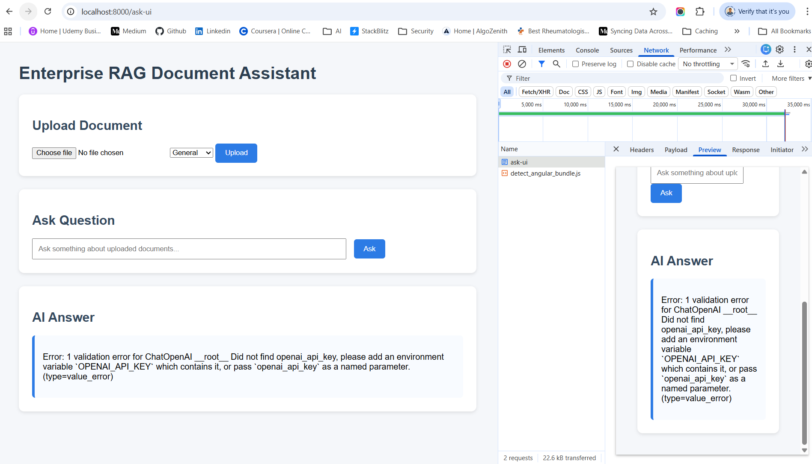
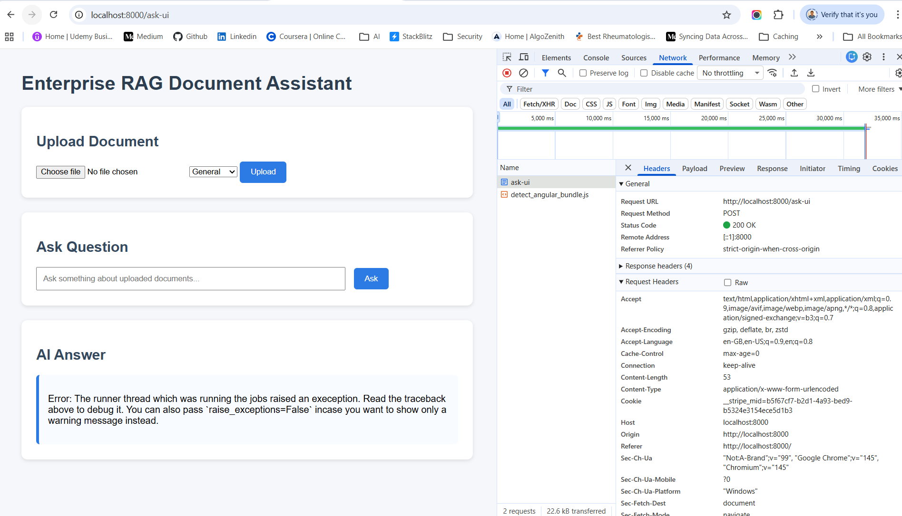

# OPENAI_API_KEY Error



> Error: 1 validation error for ChatOpenAI __root__ Did not find openai_api_key, please add an environment variable OPENAI_API_KEY which contains it, or pass openai_api_key as a named parameter. (type=value_error)

This error is not coming from your RAG pipeline. It happens because Ragas internally tries to use OpenAI models via LangChain if you don't explicitly configure an LLM.

Your app uses Ollama (phi3), but RAGAS by default expects OpenAI API for evaluation.

So it throws:
```
Did not find openai_api_key
```

## ✅ Solution (Use Ollama with RAGAS)

You must explicitly tell RAGAS to use your Ollama LLM instead of OpenAI.

Modify your evaluate_rag() function.

### 1️⃣ Import Required Wrappers

Add these imports at the top of your file:
```
from ragas.llms import LangchainLLMWrapper
from ragas.embeddings import LangchainEmbeddingsWrapper
```

### 2️⃣ Wrap Your Existing Ollama Models

You already created:
```
llm = OllamaLLM(model="phi3")
embeddings = OllamaEmbeddings(model="nomic-embed-text")
```
Wrap them for RAGAS.

### 3️⃣ Update evaluate_rag() Function

Modify like this:
```
def evaluate_rag(question, answer, contexts):

    # Ensure contexts format
    contexts_for_eval = [contexts]

    data = {
        "question": [question],
        "answer": [answer],
        "contexts": contexts_for_eval
    }

    dataset = Dataset.from_dict(data)

    # Wrap Ollama models for RAGAS
    ragas_llm = LangchainLLMWrapper(llm)
    ragas_embeddings = LangchainEmbeddingsWrapper(embeddings)

    result = evaluate(
        dataset,
        metrics=[
            faithfulness,
            answer_relevancy,
            context_utilization
        ],
        llm=ragas_llm,
        embeddings=ragas_embeddings
    )

    return result
```

### 4️⃣ Why This Fix Works

Now RAGAS will use:

| Component  | Model              |
| ---------- | ------------------ |
| LLM        | `phi3` via Ollama  |
| Embeddings | `nomic-embed-text` |
| Vector DB  | **Qdrant**         |

## ⚠️ One More Important Thing

**Your phi3 model is small, so RAGAS evaluation quality may be weaker.**

Companies usually evaluate with stronger models like:
- GPT-4
- Claude
- Llama-3-70B

But for development phi3 is fine.

## Important Note About Ollama + RAGAS



Some RAGAS metrics require a strong LLM.

Small models like:
```
phi3
```
sometimes fail evaluation prompts.

Recommended models for evaluation in Ollama:
```
llama3
mistral
mixtral
```

Example:
```
llm = OllamaLLM(
    model="llama3",
    base_url=OLLAMA_BASE_URL
)
```