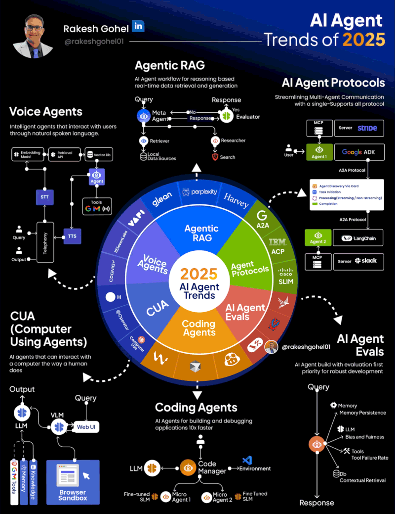

# AI Agents

In 2025, AI Agents evolved faster than most people realize.

Here are 6 trends that defined this year of agents...

If you're building AI systems in 2025, these are the patterns you need to master to dominate 2026.

## 📌 Here are the 6 AI Agent Trends that shaped 2025:

### 1\ Voice Agents

- Intelligent agents that interact with users through natural spoken language
- Enable hands-free query input and audio output via STT/TTS pipelines
- Combine embedding models, retrieval APIs, and vector databases for contextual responses

Use cases: Voice-activated customer support and conversational AI assistants

### 2\ Agentic RAG

- AI agent workflows combining reasoning with real-time data retrieval and generation
- Meta-agents coordinate retrievers, researchers, and evaluators for dynamic, accurate responses
- Powers platforms like Glean AI, Perplexity, and Harvey with sophisticated multi-agent RAG systems

Use cases: Enterprise knowledge retrieval, legal research automation, and intelligent document Q&A systems

### 3\ AI Agent Protocols

- Streamlined multi-agent communication with universal, standardized protocols
- MCP, A2A (Agent-to-Agent), ACP, and SLIM enable seamless agent-to-agent and agent-to-tool interaction
- Support discovery, task initiation, processing modes, and compilation across distributed systems

Use cases: Multi-agent coordination platforms, cross-platform agent integration, and distributed AI workflows

### 4\ Computer Using Agents (CUA)

- AI agents that interact with computers exactly the way humans do
- Use VLMs (Vision Language Models) and LLMs to control browsers, click elements, and execute complex tasks autonomously
- Navigate web UIs, interact with applications, and perform multi-step workflows without human intervention

Use cases: Automated testing and QA, web scraping and data collection, and RPA (Robotic Process Automation)

### 5\ Coding Agents

- AI agents for building, debugging, and deploying applications 10x faster
- Code managers orchestrate multiple micro-agents with fine-tuned SLMs for specialized development tasks
- Accelerate software development cycles from ideation to production deployment

Use cases: Automated code generation and refactoring, bug detection and fixing, and CI/CD pipeline automation

### 6\ AI Agent Evals

- Evaluation-first development approach for building robust, reliable agent systems
- Track critical metrics: memory persistence, LLM bias and fairness, tool failure rates, and contextual retrieval accuracy
- Essential for production-grade agents that require consistent performance and reliability

Use cases: Agent performance benchmarking, production monitoring and debugging, and quality assurance for AI systems
