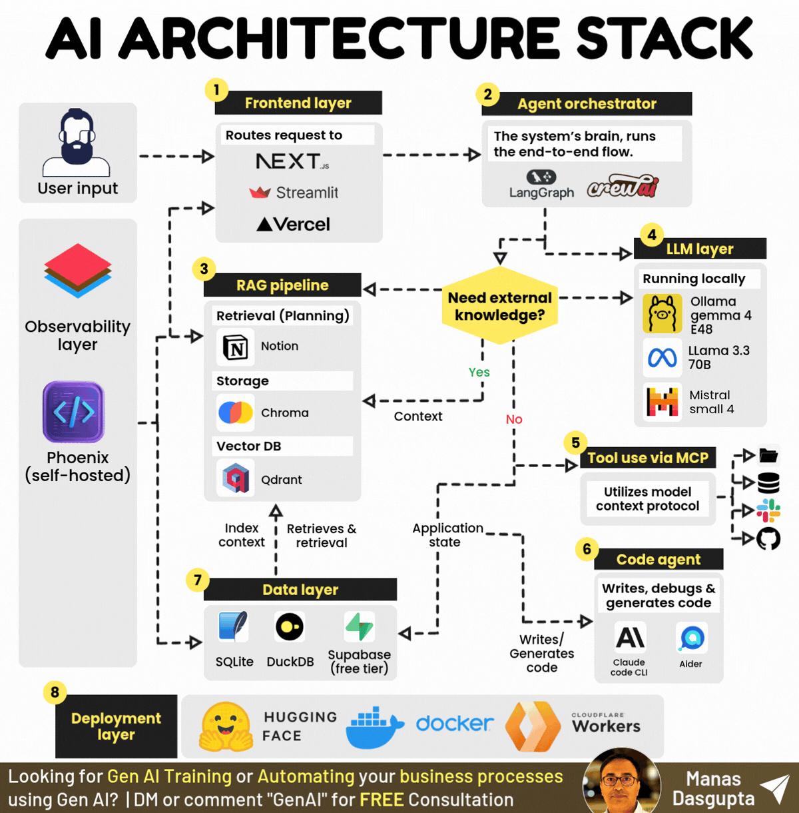

# AI Architechture Stack

You do not need money to build serious AI systems.

You need the right architecture.

Here are the 8 layers of a production-ready AI stack that costs $0:

𝟏. 𝐅𝐫𝐨𝐧𝐭𝐞𝐧𝐝 𝐋𝐚𝐲𝐞𝐫: Routes user input to the right part of your system. Next.js, Streamlit, and Vercel free tier handle this without a dollar spent.

𝟐. 𝐀𝐠𝐞𝐧𝐭 𝐎𝐫𝐜𝐡𝐞𝐬𝐭𝐫𝐚𝐭𝐨𝐫: The brain of the system. Runs end-to-end data flow and agent coordination using LangGraph or CrewAI.

𝟑. 𝐑𝐀𝐆 𝐏𝐢𝐩𝐞𝐥𝐢𝐧𝐞: Retrieves external knowledge when the agent needs context. Notion for planning, Chroma for storage, Qdrant locally for vector search.

𝟒. 𝐋𝐋𝐌 𝐋𝐚𝐲𝐞𝐫: Runs models locally at zero cost. Gemma 4 E4B, Llama 3.3 70B, and Mistral Small 4 via Ollama. No API bills.

𝟓. 𝐓𝐨𝐨𝐥 𝐔𝐬𝐞 𝐕𝐢𝐚 𝐌𝐂𝐏: Connects your agent to GitHub, Slack, databases, and file systems through Model Context Protocol. This is what makes agents actually act.

𝟔. 𝐂𝐨𝐝𝐞 𝐀𝐠𝐞𝐧𝐭: Writes, debugs, and generates code autonomously. Claude Code CLI and Aider handle this layer without manual intervention.

𝟕. 𝐃𝐚𝐭𝐚 𝐋𝐚𝐲𝐞𝐫: Stores and queries application state. SQLite, DuckDB, and Supabase free tier cover structured data needs end to end.

𝟖. 𝐃𝐞𝐩𝐥𝐨𝐲𝐦𝐞𝐧𝐭 𝐋𝐚𝐲𝐞𝐫: Ships your system to production at no cost. Docker for containerization, Cloudflare Workers for edge, Hugging Face for model hosting.

The biggest myth in AI is that you need a big budget to build real systems.

