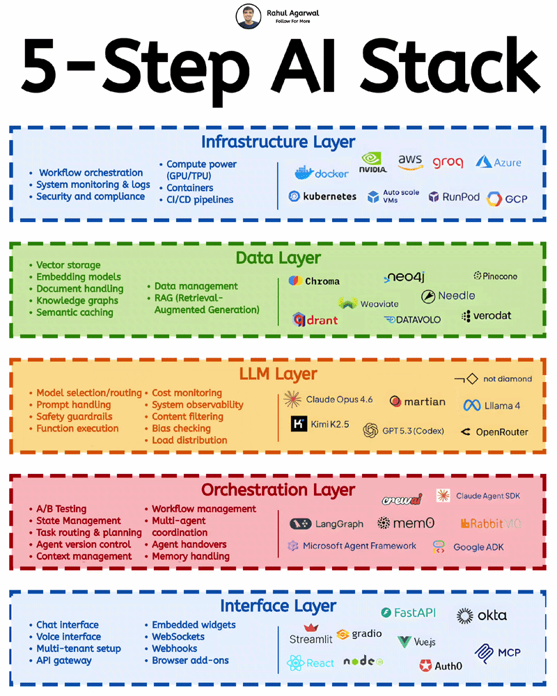

# Every AI system must have these 5 layers.

I've explained each layer with examples.

### 1. 𝗗𝗮𝘁𝗮
This layer manages how data is stored, processed, and retrieved for AI systems.

• Vector databases → Store embeddings for search
• Embedding models → Convert text into vectors
• Document processing → Parse and structure documents
• Knowledge graphs → Connect entities and relationships
• RAG systems → Retrieve external context for LLM
• Semantic caching → Cache responses for faster reuse

𝗘𝘅𝗮𝗺𝗽𝗹𝗲𝘀: Pinecone, Qdrant, Chroma, Neo4j etc.

### 2. 𝗟𝗟𝗠
This is the core intelligence layer responsible for understanding and generating outputs.

• Model selection/routing → Choose best model dynamically
• Prompt handling → Structure and optimize inputs
• Safety guardrails → Prevent harmful or unsafe outputs
• Function execution → Call tools and external APIs
• Cost monitoring → Track usage and spending
• Observability → Monitor model performance and behavior
• Content filtering → Remove unsafe or irrelevant outputs
• Bias checking → Detect and reduce biased outputs
• Load distribution → Balance traffic across models

𝗘𝘅𝗮𝗺𝗽𝗹𝗲𝘀: GPT-5.3 (Codex), Claude Opus 4.7 etc.

### 3. 𝗢𝗿𝗰𝗵𝗲𝘀𝘁𝗿𝗮𝘁𝗶𝗼𝗻
This layer manages workflows and coordinates multiple components and agents.

• A/B testing → Compare different system versions
• State management → Track session and workflow state
• Task routing & planning → Decide next action steps
• Agent version control → Manage agent updates and changes
• Context management → Maintain relevant conversation context
• Workflow management → Define multi-step execution flows
• Multi-agent coordination → Enable agents to collaborate
• Agent handovers → Transfer tasks between agents
• Memory handling → Store and retrieve past interactions

𝗘𝘅𝗮𝗺𝗽𝗹𝗲𝘀: LangGraph, CrewAI, Mem0, RabbitMQ etc.

### 4. 𝗜𝗻𝘁𝗲𝗿𝗳𝗮𝗰𝗲
This is the layer where users interact with the system.

• Chat interface → User interacts via text
• Voice interface → Speech-based user interaction
• Multi-tenant setup → Support multiple users/accounts
• API gateway → Manage and route API requests
• Embedded widgets → Integrate UI into other apps
• WebSockets → Real-time bidirectional communication
• Webhooks → Trigger actions via events
• Browser add-ons → Extend functionality in browsers

𝗘𝘅𝗮𝗺𝗽𝗹𝗲𝘀: React, Streamlit, Gradio, FastAPI, MCP etc.

### 5. 𝗜𝗻𝗳𝗿𝗮𝘀𝘁𝗿𝘂𝗰𝘁𝘂𝗿𝗲
This layer handles compute, deployment, scaling, and system reliability.

• Compute (GPU/TPU) → High-performance model processing
• Containers & orchestration → Manage app deployment at scale
• Monitoring, logging, security → Track system health and safety
• CI/CD pipelines → Automate build and deployment

𝗘𝘅𝗮𝗺𝗽𝗹𝗲𝘀: AWS, GCP, Docker, Kubernetes, RunPod etc.

If you need your AI systems to be reliable and scalable, each of these layers needs to be built right.