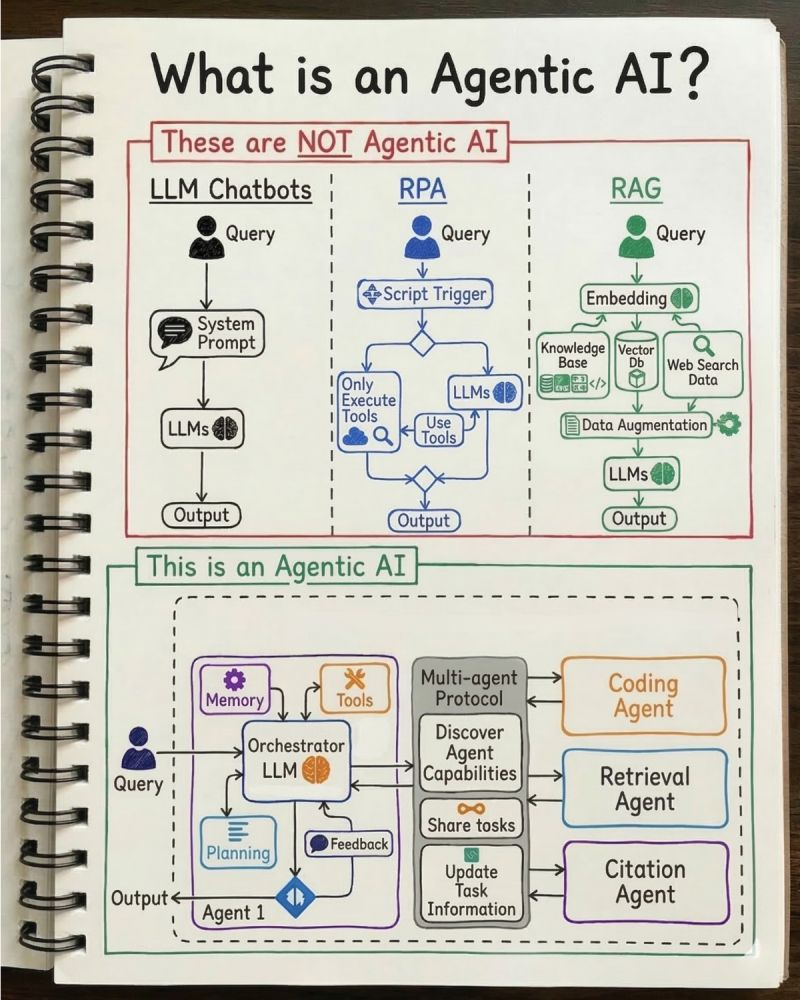

# Agentic AI

One small word is causing big confusion in AI programs: Agent.

Right now, many AI workflows are being labelled “agentic”. Even when they're not really.

Unfortunately, once leaders hear “agent”, they assume: autonomy, decision making and unpredictable behaviour.

And suddenly governance teams go into full risk mode.

So here’s the difference:

**▶️ LLM Chatbots**
- Input and get your response.
- Great for answering questions, summarising documents, and drafting text.
- Think customer support assistants, internal help bots, or writing copilots.
- They don’t take action in systems.

**▶️ RPA (Robotic Process Automation)**
- These are automation scripts, sometimes enhanced with AI in newer systems.
- They trigger tasks across systems.
- Great for finance processes, reconciliations, and repetitive back office work.
- There’s predefined logic rather than planning to reach a goal.

**▶️ RAG (Retrieval Augmented Generation)**
- These combine LLMs with company knowledge.
- The model retrieves information from a knowledge storebefore generating an answer.
- Great for internal knowledge assistants, policy questions and research support.
- The grounding in trusted data sources can lead to more accurate outputs. But they’re still not agentic because they don’t plan or act.

**🤖 Agentic AI**
Now we reach the real thing.

- Agents can plan steps to reach a goal, choose and use tools, coordinate with other agents and adapt based on feedback.
- They behave more like a problem solver than a responder.
- Best for complex, multi step work.

-Every pattern has value. But they require different governance, risk controls, and expectations.

If we call everything an agent, we create unnecessary fear and slow down adoption.

