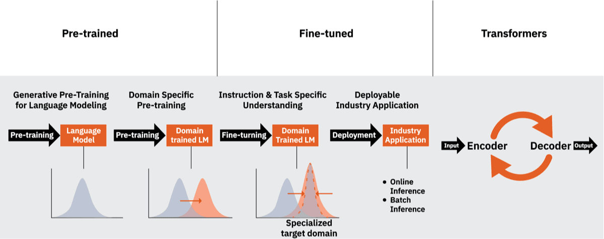

# LLM

Large language models (LLMs) are a type of AI system that works with language. An LLM aims to model language, that is, to create a simplified—but useful—digital representation. The "large" part of the term describes the trend toward training language models with more parameters. 

Typical examples of LLMs include OpenAI's GPT-4, Google's PaLM, and Meta's LLaMA. There is some ambiguity about whether to refer to specific products (such as OpenAI's ChatGPT or Google's Bard) as LLMs themselves or to say that they are powered by underlying LLMs.

As a term, LLM is often used by AI practitioners to refer to systems that work with language. GPT, or Generative Pre-trained Transformer, is one of these large language models.



  - Pre-trained : The model is initially trained on large amounts of text data.
  - Fine-tuned : The model is fine-tuned for specific generative tasks.
  - Transformer : A type of machine learning architecture used to process and analyze data.
  - Encoders and decoders : Encoders and decoders are components of the transformer architecture used to process and generate data sequences, such as text.

An encoder takes a sequence of input data, like a sentence, and converts it into a series of encoded representations. Each representation captures information about the original input data but at a different level of abstraction. The final encoded representation is typically a vector that summarizes the input sequence.

However, a decoder takes an encoded representation and uses it to generate a new sequence of data, like a translation of the original sentence into a different language. The decoder does this by predicting the next token in the sequence based on the encoded representation and the tokens generated so far.

Here's an example of how encoders and decoders might work together to translate a sentence from English to French:

Input sentence: "The cat sat on the mat."

Encoded representation: [0.2, 0.5, -0.1, 0.4, ...]

Target language: French

Decoder output: "Le chat s'est assis sur le tapis."

In this example, the encoder takes the English sentence as input and generates an encoded representation, which captures the meaning of the sentence in a lower-dimensional space. The decoder then uses this encoded representation to generate a new sequence of tokens in the target language, French. The final output is a translated sentence that captures the same meaning as the original sentence but in a different language.

## Foundation models

Foundation models are pretrained on massive amounts of data and can be fine-tuned for specific tasks. Foundation models can generate human-like language, perform question-answering tasks, and even generate code. They represent a significant breakthrough in the field of artificial intelligence and have the potential to revolutionize a wide range of industries, including healthcare, finance, and education.


Foundation models can be fine-tuned for a range of downstream tasks with a small amount of task-specific labeled training data, offering benefits such as:

- Less effort and reduced upfront costs for data acquisition and labeling : Using an out-of-the-box, existing foundation model as a starting point requires less labeled, task-specific training data than previous approaches, resulting in lower upfront costs for data acquisition and labeling.
- Faster deployment time : Built once, the same foundation model can be fine-tuned for downstream applications using a small amount of training data, decreasing time-to-value and increasing productivity.
- Better accuracy : Foundation models are the next revolution in deep learning – they are shown to be far better in various benchmarks than the previous generation of AI models.

## LLM APIs
Using API endpoints of large language models inside applications.

**Popular LLM Providers**
- OpenAI
- Anthropic
- Example Models

**OpenAI:**
- GPT-4
- GPT-4o

**Anthropic:**
- Claude

**Example API Call (Python)**
```
from openai import OpenAI

client = OpenAI()

response = client.chat.completions.create(
    model="gpt-4o-mini",
    messages=[{"role":"user","content":"Explain RAG"}]
)

print(response.choices[0].message.content)
```

**Real Use Cases**
- AI chatbots
- Document summarization
- AI coding assistants
- AI customer support

## LangChain
LangChain is a framework for building applications powered by LLMs.

It connects:
```
LLM + Tools + Memory + Data
```

**Core Components**
```
1️⃣ Prompts
2️⃣ Chains
3️⃣ Agents
4️⃣ Tools
5️⃣ Memory
6️⃣ Vector stores
```

**Example RAG Pipeline**
```
User Question
⬇
Embedding Model
⬇
Vector Database
⬇
Retriever
⬇
LLM Answer
```

**Example Code**
```
from langchain.chains import RetrievalQA
```

<details>

<summary><strong>From N-Grams to RNNs to Transformers: The Evolution of NLP</strong></summary>

## Four Core Language Modeling Techniques

**1️⃣ N-grams (Statistical Language Models)**

What it is:  
A probabilistic model that predicts the next word based on the previous N-1 words.

Example:
  -  Bigram (N=2): “I am” → predict next word based only on “am”
  -  Trigram (N=3): “I am going” → predict next word using “am going”

Limitations:
  -  Cannot remember long context
  -  Data sparsity problem
  -  Large memory required for bigger N

👉 Purely statistical, no deep learning involved.

**2️⃣ Recurrent Neural Networks (RNNs)**

What it is:  
A neural network designed for sequential data.

Key Idea:  
It processes words one by one and keeps a hidden state (memory).

Flow:  
Word → Hidden State → Next Word Prediction

Problem:
  -  Vanishing gradient problem
  -  Struggles with long-term dependencies
(For example: remembering a subject mentioned 20 words earlier)

**3️⃣ Long Short-Term Memory (LSTMs)**

What it is:  
A special type of RNN designed to solve long-term memory issues.

Improvement over RNN:
  -  Has gates (Input, Forget, Output gates)
  -  Can decide what to remember and what to forget

Why important?
  -  Better for long sentences
  -  Used in early NLP tasks like translation and speech recognition
Still sequential → slower training compared to modern models.

**4️⃣ Transformers (Modern Architecture)**

What it is:  
The foundation of modern LLMs like ChatGPT.

Key Innovation:  
Self-Attention mechanism

Instead of reading word-by-word like RNNs, Transformers:
  -  Look at the entire sentence at once
  -  Calculate relationships between all words in parallel

Advantages:
  -  Handles long context better
  -  Trains faster (parallel processing)
  -  Scales to billions of parameters

This architecture powers:
  -  Large Language Models (LLMs)
  -  Modern NLP systems
  -  Generative AI tools

| Model       | Type               | Memory   | Speed | Long Context |
| ----------- | ------------------ | -------- | ----- | ------------ |
| N-grams     | Statistical        | ❌ None   | Fast  | ❌ Poor       |
| RNN         | Neural             | ✅ Short  | Slow  | ❌ Weak       |
| LSTM        | Neural             | ✅ Better | Slow  | ⚠️ Moderate  |
| Transformer | Neural + Attention | ✅ Strong | Fast  | ✅ Excellent  |

</details>

<details>

<summary><strong>How LLMs Actually Generate Text</strong></summary>

# How LLMs Actually Generate Text

  -  English : https://www.youtube.com/watch?v=NKnZYvZA7w4
  -  Hindi : https://www.youtube.com/watch?v=K45s2PgywvI


</details>

<details>

<summary><strong>LLM Hyperparameters : Prompting vs Fine-Tuning</strong></summary>

## 🔁 Prompting vs Fine-Tuning Hyperparameters (Side-by-Side)
| Aspect        | Prompting Hyperparameters         | Fine-Tuning Hyperparameters         |
| ------------- | --------------------------------- | ----------------------------------- |
| When applied  | Inference time                    | Training time                       |
| Model weights | ❌ Not changed                     | ✅ Updated                           |
| Cost          | Low                               | High                                |
| Speed         | Instant                           | Slow (minutes–hours)                |
| Reversibility | Easy to change                    | Requires retraining                 |
| Typical use   | Control output style & randomness | Teach domain/task-specific behavior |

### ✅ Is it correct to say hyperparameters are of two types?  
✔️ Yes — conceptually  

You can classify hyperparameters into two categories in LLM systems:

1️⃣ Prompting (Inference-time) hyperparameters  
2️⃣ Fine-tuning (Training-time) hyperparameters  

**📌 Important clarification (interview gold):**  
Prompting hyperparameters are sometimes called generation parameters, but in practice they are treated as hyperparameters because they directly control model behavior.

So your statement is correct and acceptable, especially in system design and GenAI interviews.

## 🧠 1️⃣ Prompting Hyperparameters (Inference-Time)

These control how the model generates text for each request.

Common Prompting Hyperparameters
  -  Temperature → randomness
  -  Top-P (nucleus sampling) → probability mass
  -  Top-K → number of candidate tokens
  -  Max tokens → response length
  -  Frequency / presence penalty → repetition control
  -  System prompt / preamble → role, rules, tone
```
Example
{
  "temperature": 0.2,
  "top_p": 0.9,
  "system": "You are a financial analyst. Be precise."
}
```

Use cases
  -  Chatbots
  -  RAG pipelines
  -  API responses
  -  Dynamic behavior control

## 🧠 2️⃣ Fine-Tuning Hyperparameters (Training-Time)

These control how the model learns from data. we can further tune the LM towards a more specific and task oriented data set. For example, I want my LM to answer data related questions related to a health care so I can train it on a health care related data set. It will make sure that the LM is more suited to your task, and it is more better at generating content for that domain or task.

Common Fine-Tuning Hyperparameters
  -  Learning rate
  -  Batch size
  -  Number of epochs
  -  Optimizer (Adam, AdamW)
  -  Weight decay
  -  Warmup steps
  -  LoRA rank / alpha (PEFT)

Example
```
learning_rate: 2e-5
batch_size: 16
epochs: 3
lora_rank: 8
```

Use cases
  -  Domain adaptation (medical, legal, finance)
  -  Style consistency
  -  Structured output learning
  -  Reduced prompt complexity

## 🔥 Prompting vs Fine-Tuning — When to Use What?
| Scenario                          | Best Choice     |
| --------------------------------- | --------------- |
| Change tone or verbosity          | Prompting       |
| Reduce hallucinations             | Prompting + RAG |
| Enforce strict output format      | Prompting       |
| Teach domain knowledge            | Fine-tuning     |
| Reduce prompt length              | Fine-tuning     |
| Improve accuracy on specific task | Fine-tuning     |

## Prompting Hyperparameters
**1️⃣ Temperature – Controls Randomness**  

What it really does: It rescales token probabilities before sampling.

Low Temperature (0 – 0.3)
  -  Makes high-probability tokens even more dominant
  -  Output becomes deterministic
  -  Good for:
      -  Code generation
      -  SQL queries
      -  Production APIs
      -  RAG answers

Example:
```
The sky is → blue (almost always)
```

High Temperature (0.8 – 1.5)
  -  Flattens probability distribution
  -  Less likely tokens get more chance
  -  More creative
  -  Less predictable

Example:
```
The sky is → blue / endless / mysterious / crying
```

**2️⃣ top_k – Limits Number of Choices**  

What it does: Only keep the K most probable tokens, discard the rest.

Example probabilities:
```
blue      45%
visible   30%
clear     15%
bright     5%
vast       3%
other      2%
```
If:
```
top_k = 3
```
Only:
```
blue, visible, clear
```
are allowed.

If:
```
top_k = 1
```
→ Always choose the most likely token  
→ Fully deterministic  

**3️⃣ top_p (Nucleus Sampling) – Probability Mass Filtering**  

Instead of fixed number (like top_k), it keeps tokens until cumulative probability reaches P.

Example:

If:
```
top_p = 0.5
```

Keep tokens until cumulative > 50%
```
blue (45%)
visible (30%)
```
45 + 30 = 75% → stop here

If:
```
top_p = 0.9
```
Need enough tokens to reach 90% total probability.

This is more adaptive than top_k.

**4️⃣ min_p – Minimum Probability Cutoff**  

Removes tokens below a minimum probability threshold.

Example:
```
min_p = 0.05
```
Remove all tokens with <5% probability.

This prevents:
  -  Rare nonsense words
  -  Very unlikely hallucinations

**🏢 Enterprise Practical Settings**  

Since you build backend systems:

🔹 RAG System (Bank, Insurance PDFs)
```
temperature = 0.2
top_p = 0.9
top_k = 40
```
Low creativity, high factual accuracy.

🔹 Chatbot
```
temperature = 0.7
top_p = 0.95
top_k = 50
```
Balanced.

🔹 Code Generation
```
temperature = 0.1
top_k = 1
```
Almost deterministic.

</details>

<details>

<summary><strong>What is Quantization in LLM?</strong></summary>

Quantization = Reducing the precision of model weights
Instead of storing weights in:
  - FP32 (32-bit float) → very large
  - FP16 (16-bit float) → smaller
  - INT8 / INT4 (8-bit / 4-bit) → much smaller
  - We compress the model to reduce:

✅ RAM usage ✅ VRAM usage ✅ Disk size ✅ Inference latency

But slightly reduce accuracy.

Without quantization:
  - 7B model FP16 → ~14 GB RAM
  - 7B model Q4 → ~4–5 GB RAM

So quantization allows you to:
  - Run LLM on laptop 💻
  - Run multiple models
  - Deploy with Docker easily
  - Use in FastAPI backend efficiently

| Quant Type | Bits             | Quality   | RAM Usage | Speed     |
| ---------- | ---------------- | --------- | --------- | --------- |
| Q2_K       | 2-bit            | Low       | Very Low  | Fast      |
| Q4_0       | 4-bit            | Good      | Low       | Very Fast |
| Q4_K_M     | 4-bit (improved) | Very Good | Low       | Fast      |
| Q5_K_M     | 5-bit            | High      | Medium    | Medium    |
| Q8_0       | 8-bit            | Very High | Higher    | Slower    |

👉 For production + local dev → Q4_K_M is best balance.

Without Quantization (FP16)
  - High accuracy
  - Large memory
  - GPU required

With Q4
  - Slight accuracy drop
  - 60–75% memory reduction
  - Runs on CPU

Avoid Q2 if:
  - You need high reasoning accuracy
  - Doing math-heavy tasks
  - Doing code generation
  - Fine-tuning tasks

Use Q5 or Q8 for:
  - Code generation
  - Enterprise AI
  - Complex reasoning

</details>

<details>

<summary><strong>Ways an LLM Can Generate Answers</strong></summary>

# Ways an LLM Can Generate Answers
LLMs generate answers by predicting the most probable next tokens based on input prompt patterns, utilizing internal knowledge or provided context. Key methods include Retrieval-Augmented Generation (RAG) for external data, direct generation from training, chain-of-thought reasoning for complex queries, and fine-tuning for domain-specific accuracy. 


### 1️⃣ Pure Generation (Pretrained Knowledge)
**No external data**

How it works
  -  Uses only what the model learned during training
  -  No database, no retrieval

Flow
```
Prompt → LLM → Answer
```

Example
```
“What is polymorphism in OOP?”
```

✅ Fast  
❌ Knowledge may be outdated  
❌ No private/company data  

### 2️⃣ System Prompt / Instruction Conditioning
**Behavior control, not new knowledge**

How it works
  -  System prompt defines how the model should respond
  -  Still uses internal knowledge

Flow
```
System Instructions + User Question → LLM → Controlled Answer
```

Example
```
“Answer like a senior Angular architect in bullet points.”
```

✅ Controls tone, format, depth  
❌ Does not add new facts  

### 3️⃣ Few-Shot / In-Context Learning
**Learning from examples inside the prompt**

How it works
  -  You give examples
  -  Model follows the pattern

Flow
```
Examples + Question → LLM → Pattern-based Answer
```

Example
```
Q: 2+2 → A: 4
Q: 3+3 → A: 6
Q: 4+4 → ?
```

✅ Powerful without training  
❌ Limited by context length  

### 4️⃣ Tool / Function Calling
**LLM + external tools (but not RAG)**

How it works
  -  LLM decides to call a tool (API, DB query, calculator)
  -  Uses result to generate answer

Flow
```
Prompt → LLM → Tool Call → Result → LLM → Answer
```

Example
  -  Weather API
  -  SQL query
  -  Math calculator

✅ Real-time data  
❌ Requires engineering setup  

### 5️⃣ Fine-Tuned Models
**Model weights are changed**

How it works
  -  Model is trained further on domain-specific data
  -  Knowledge becomes “baked in”

Flow
```
Fine-Tuned LLM → Answer
```

Example
  -  Legal LLM
  -  Medical LLM
  -  Customer support LLM

✅ Consistent answers   
❌ Expensive  
❌ Hard to update knowledge  

### 6️⃣ Memory-Augmented Generation (Session / Long-Term Memory)
**Uses conversation or stored memory**

How it works
  -  Past interactions are injected into prompt
  -  Not retrieval search like RAG

Flow
```
Conversation Memory → LLM → Answer
```

Example
```
“Use the tech stack we discussed earlier.”
```

✅ Personalized  
❌ Context size limits  

### 7️⃣ Hybrid (Most Real Systems)
**Combination of multiple methods**

How it works
  -  System prompt
  -  Few-shot examples
  -  Tool calls
  -  RAG
  -  Memory

Flow
```
Instructions + Memory + Tools + (Optional RAG) → LLM → Answer
```

✅ Enterprise-grade  
✅ Most accurate  
❌ Complex  

| Method          | External Data | Changes Model?  | Common Use        |
| --------------- | ------------- | --------------- | ----------------- |
| Pure Generation | ❌           | ❌              | General Q&A       |
| System Prompt   | ❌           | ❌              | Control output    |
| Few-Shot        | ❌           | ❌              | Pattern learning  |
| Tool Calling    | ✅           | ❌              | Live data         |
| Fine-Tuning     | ❌           | ✅              | Domain expertise  |
| Memory          | ⚠️           | ❌              | Personalization   |
| RAG             | ✅           | ❌              | Private knowledge |

</details>


