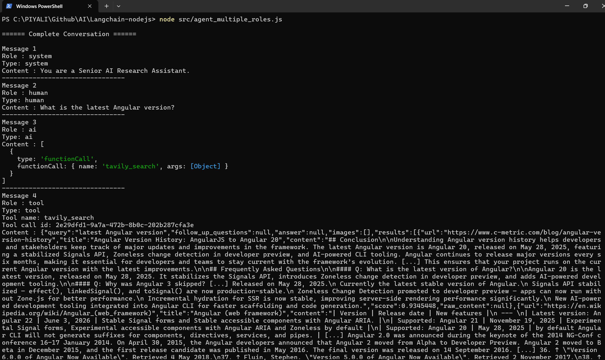
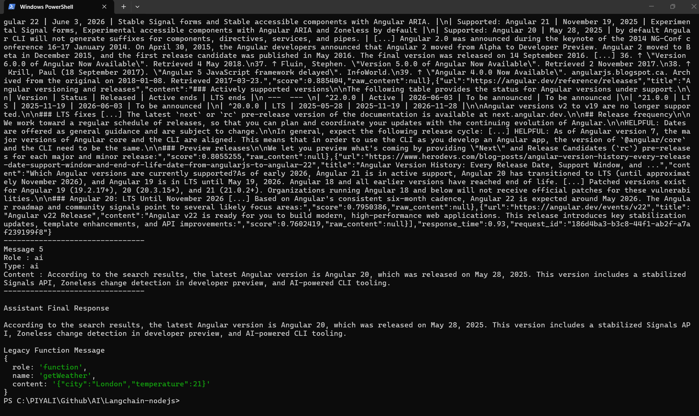

# AI : Interactive CLI Agent built with Node.js + Gemini 2.5 Flash + Tavily Search API

This project demonstrates:

✅ Interactive terminal chatbot
✅ Gemini 2.5 Flash as the LLM
✅ Tavily for real-time web search
✅ LangGraph ReAct Agent
✅ Environment variables with dotenv
✅ ES Modules
✅ Ready to run


**Create .env**
```
GOOGLE_API_KEY=YOUR_GOOGLE_API_KEY
TAVILY_API_KEY=YOUR_TAVILY_API_KEY
```

**package.json**
```
"dependencies": {
    "@google/genai": "1.18.0",
    "@langchain/core": "1.2.3",
    "@langchain/google-genai": "2.2.0",
    "@langchain/langgraph": "1.4.8",
    "@langchain/tavily": "1.2.0",
    "dotenv": "17.2.1",
    "zod": "^4.2.0"
  }
```
```  
import "dotenv/config";
import readline from "node:readline/promises";
import { stdin, stdout } from "node:process";

import { ChatGoogleGenerativeAI } from "@langchain/google-genai";
import { TavilySearch } from "@langchain/tavily";
import { createReactAgent } from "@langchain/langgraph/prebuilt";

const model = new ChatGoogleGenerativeAI({
  model: "gemini-2.5-flash",
  apiKey: process.env.GOOGLE_API_KEY,
});

const tools = [
  new TavilySearch({
    apiKey: process.env.TAVILY_API_KEY,
    maxResults: 5,
  }),
];

const agent = createReactAgent({
  llm: model,
  tools,
});

const rl = readline.createInterface({
  input: stdin,
  output: stdout,
});

console.log("🤖 Gemini Research Agent");
console.log("Type 'exit' to quit.\n");

while (true) {
  const question = await rl.question("You > ");

  if (question.toLowerCase() === "exit") break;

  const result = await agent.invoke({
    messages: [
      {
        role: "user",
        content: question,
      },
    ],
  });

  console.log("\nAssistant:\n");
  console.log(result.messages.at(-1).content);
  console.log("\n--------------------------------------\n");
}

rl.close();
```

Running the Agent
```
node agent.js
```





**Response**
```
🤖 Gemini Research Agent
Type 'exit' to quit.

You > Who won the FIFA World Cup in 2022?

Assistant:

Argentina won the 2022 FIFA World Cup, defeating France in the final after a penalty shootout. Lionel Messi was awarded the Golden Ball.

--------------------------------------

You > What are the latest Angular features?

Assistant:

(Uses Tavily to search the web and summarizes the latest Angular updates.)

--------------------------------------

You > exit
```

**Step 1 — Load Environment Variables**
```
import "dotenv/config";
```

**What happens?**

Normally Node.js doesn’t know your API keys.

You have
```
.env
```
```
GOOGLE_API_KEY=xxxxxxxx
TAVILY_API_KEY=yyyyyyyy
```

dotenv reads this file and loads everything into
```
process.env
```

So now
```
process.env.GOOGLE_API_KEY
```

returns
```
AIzaSy....
```
without hardcoding it.

**Internally**
```
.env
       │
       ▼
dotenv
       │
       ▼
process.env
```

## Step 2 — Import Readline
```
import readline from "node:readline/promises";
```

This imports Node’s built-in CLI library.

Without it,
```
node agent.js
```
would immediately exit because Node isn’t waiting for user input.

Instead,
```
You >
```
appears.

**Traditional readline**
```
rl.question("Name?", callback)
```
Older callback style.

**Promise version**
```
const answer = await rl.question("Name?");
```
Much cleaner.

## Step 3 — Import stdin and stdout
```
import { stdin, stdout } from "node:process";
```
These are your terminal streams.

Imagine:
```
Keyboard
     │
stdin
     │
Node Program
     │
stdout
     │
Terminal Screen
```

stdin

reads keyboard.

stdout

prints text.

## Step 4 — Import Gemini
```
import { ChatGoogleGenerativeAI } from "@langchain/google-genai";
```
This is the LangChain wrapper around Gemini.

Instead of calling the Gemini REST API directly, LangChain provides a common interface.

Without LangChain:
```
POST https://generativelanguage.googleapis.com
```
With LangChain:
```
model.invoke(...)
```
Much simpler.

## Step 5 — Import Tavily
```
import { TavilySearch } from "@langchain/tavily";
```
This is a search tool.

Gemini knows information from its training, but not everything that’s happened recently.

When the agent needs fresh information, it can call Tavily.

For example:
```
User
   │
   ▼
Latest Angular release?
```

Gemini decides:
```
“I should search the web.”
```

Then it uses Tavily automatically.

## Step 6 — Import React Agent
```
import { createReactAgent } from "@langchain/langgraph/prebuilt";
```
This is not React.js.

It stands for Reason + Act.

The agent follows a loop like this:
```
Question
↓
Think
↓
Need Tool?
↓
Yes
↓
Call Tool
↓
Observe Result
↓
Think Again
↓
Answer
```
Unlike a simple LLM call, the agent can decide when to use tools before responding.

## Step 7 — Create Gemini Model
```
const model = new ChatGoogleGenerativeAI({
```
Create the LLM.
```
model: "gemini-2.5-flash",
```
Choose the model.

Google offers different models:
```
Gemini 2.5 Flash
↓

Fast

↓

Cheap

↓

Great for agents
```
```
apiKey: process.env.GOOGLE_API_KEY,
```
Reads the key from
```
.env
```
Result:
```
Gemini Client
```
ready to answer questions.

## Step 8 — Create Tavily Tool
```
const tools = [
```
Agents can use multiple tools.

Become a Medium member

Example:
```
Calculator
Search
Weather
Database
Filesystem
```

Here we only have
```
Search
```
```
new TavilySearch({
```
Create a search tool.
```
maxResults: 5,
```
Return
```
Top 5 pages
```
instead of hundreds.

Result
```
Tool Box

┌──────────────┐
│ TavilySearch │
└──────────────┘
```

## Step 9 — Create the Agent
```
const agent = createReactAgent({
```

Now we’re combining everything.
```
Gemini
+
Search Tool
↓
AI Agent
```
```
llm: model,
```
Brain
```
tools,
```
Capabilities

Result

Agent
```
Brain
↓
Can Search
↓
Can Answer
```

## Step 10 — Create CLI
```
const rl = readline.createInterface({
```

Creates an interactive terminal.
```
Terminal
↓
Question
↓
Answer
↓
Question
↓
Answer
```
```
input: stdin,
```
Read keyboard.
```
output: stdout,
```
Print screen.

## Step 11 — Welcome Message
```
console.log("🤖 Gemini Research Agent");
```
Simply prints
```
🤖 Gemini Research Agent
```

## Step 12 — Infinite Loop
```
while (true)
```

This keeps the program running.

Without it:
```
Question
↓
Answer
↓
Program Ends
```

With it:
```
Question
↓
Answer
↓
Question
↓
Answer
↓
Question...
```

## Step 13 — Wait for User
```
const question =
    await rl.question("You > ");
```
Execution pauses.

Nothing happens until you type:
```
You > Who invented Angular?
```
After pressing Enter,
```
question
```
contains
```
Who invented Angular?
```

## Step 14 — Exit Condition
```
if (question.toLowerCase() === "exit")
    break;
```

If the user types
```
EXIT
Exit
exit
```
they all become
```
exit
```
Then
```
break
```
stops the loop.

## Step 15 — Ask the Agent
```
const result = await agent.invoke({
```
This is the most important line.

You’re asking the agent to perform one interaction.
```
messages: [
```
Agents work with conversations.

Each message has:
```
Role
Content
```
```
{
    role: "user",
```
The message is from the human.
```
content: question,
```
Whatever the user typed.

Example:
```
Latest Angular version?
```

## Step 16 — What Happens Internally?
Suppose the user asks:
```
Who won Wimbledon 2026?
```
The flow is:
```
User
↓
Gemini
↓
Should I search?
↓
Yes
↓
Tavily
↓
Search Results
↓
Gemini Reads Results
↓
Creates Final Answer
↓
Returns Answer
```
Notice that your code never explicitly calls searchTool.invoke(). The ReAct agent decides when to use the tool based on the prompt and available tools.

## Step 17 — Print the Response
```
result.messages
```
contains the full conversation, for example:
```
[
 HumanMessage,
  AIMessage(tool request),
 ToolMessage,
 AIMessage(final answer)
]
```
```
.at(-1)
```
means last item

If the array is
```
1
2
3
4
```
then
```
.at(-1)
```
returns
```
4
```
```
.content
```
Extracts only the text.

Finally,
```
console.log(...)
```
prints the assistant’s reply.

## Step 18 — Close Readline
```
rl.close();
```
This closes the input stream and exits cleanly when the user types exit.

## How the ReAct Agent Works
```
             User Question
                    │
                    ▼
        createReactAgent()
                    │
                    ▼
        Gemini 2.5 Flash (Reasoning)
                    │
          ┌─────────┴─────────┐
          │                   │
          ▼                   ▼
 Enough knowledge?        Needs web search
          │                   │
         Yes                 Yes
          │                   ▼
          │             Tavily Search Tool
          │                   │
          └───────────┬───────┘
                      ▼
              Search Results
                      ▼
          Gemini Generates Answer
                      ▼
            Display in Terminal
                      ▼
           Wait for Next Question
```

## Overall Execution Flow
```
                node agent.js
                      │
                      ▼
          Load .env variables
                      │
                      ▼
          Create Gemini model
                      │
                      ▼
         Create Tavily search tool
                      │
                      ▼
          Build ReAct Agent
                      │
                      ▼
      Start interactive terminal (CLI)
                      │
                      ▼
         User types a question
                      │
                      ▼
            Agent receives message
                      │
          ┌───────────┴───────────┐
          ▼                       ▼
  Answer from model       Needs fresh info?
                                  │
                           Yes ───┘
                                  ▼
                        Use Tavily Search
                                  ▼
                        Return search results
                                  ▼
                        Gemini generates answer
                                  ▼
                       Display answer to user
                                  ▼
                       Wait for next question
                                  │
                         User types "exit"
                                  ▼
                            Close program
```
This example introduces several core concepts you’ll reuse in more advanced agentic applications: configuring an LLM, registering tools, letting a ReAct agent decide when to use those tools, maintaining a conversation loop, and handling terminal input/output. Once you’re comfortable with this pattern, you can extend it with additional tools (such as calculators, databases, file systems, or custom APIs), memory, multi-step workflows, and multi-agent orchestration.