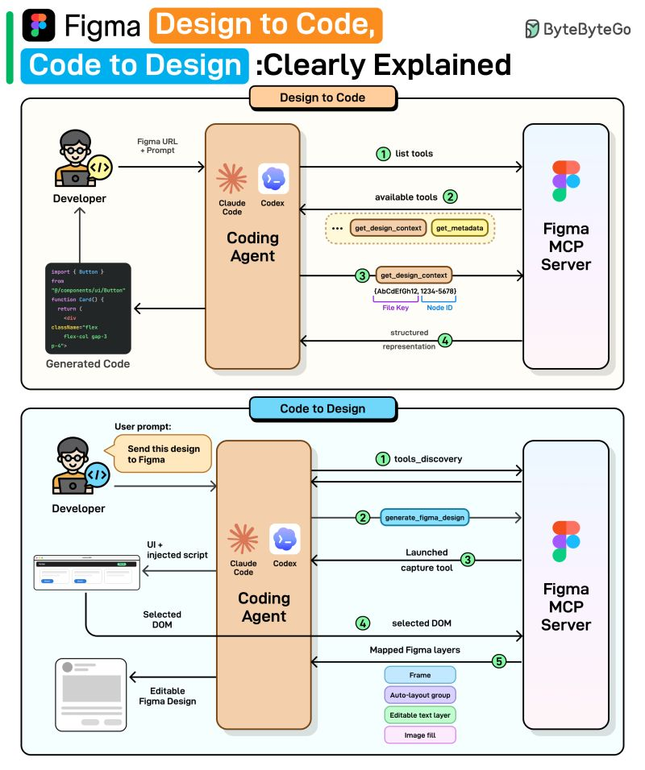

# Figma Design to Code, Code to Design

We spoke with the Figma team behind these releases to better understand the details and engineering challenges. This article covers how Figma’s design-to-code and code-to-design workflows actually work, starting with why the obvious approaches fail, how MCP solves them, and the engineering challenges that remain.

At the high level:

**Design to Code:**

- Step 1: Once the user provides a Figma link and prompt, the coding agent requests the list of available tools from Figma's MCP server. 
- Step 2: The server returns its tools: get_design_context, get_metadata, and more. 
- Step 3: The agent calls get_design_context with the file key and node ID parsed from the URL. 
- Step 4: The MCP server returns a structured representation including layout and styles. The agent then generates working code (React, Vue, Swift, etc.) using that structured context.

**Code to Design:**

- Step 1: Once the user provides the desired UI code, the agent discovers available tools from the MCP server. 
- Step 2: The agent calls generate_figma_design with the current UI code. 
- Step 3: The MCP tool opens the running UI in a browser and injects a capture script. 
- Step 4: The user selects the desired component, and the script sends the selected DOM data to the server. 
- Step 5: The server maps the DOM to native Figma layers: frames, auto-layout groups, and editable text layers. The result is fully editable Figma layers shown to the user.

