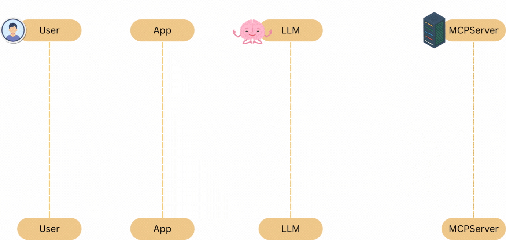

# MCP (Model Context Protocol)

MCP is a standard protocol that allows LLMs to interact with external tools, databases, and APIs.

It was introduced by Anthropic to make AI systems connect to real tools safely.

**What MCP Solves**

LLMs normally cannot directly access:
- databases
- APIs
- files
- external systems

MCP acts as a standard bridge.

Mastering the Model Context Protocol (MCP) involves a four-level path: understanding core concepts, using pre-built servers, building custom servers (Python/TypeScript), and deploying/securing them in production. Key steps include setting up the Claude Desktop app, utilizing the MCP Inspector for debugging, and mastering resources, prompts, and tools.



**MCP Architecture**
```
LLM
⬇
MCP Client
⬇
MCP Server
⬇
External Tools
```

**Example tools:**
- Google Drive
- Slack
- GitHub
- Databases

## Tutorials
1. https://modelcontextprotocol.io/docs/getting-started/intro
2. Model Context Protocol (MCP) Explained for Beginners: https://www.youtube.com/watch?v=E2DEHOEbzks
3. MCP Servers - Next Big Thing in AI : https://www.youtube.com/watch?v=vYelTr1uQmA
4. What are MCP servers | Explained in Hindi : https://www.youtube.com/watch?v=dZyQNy3-HjU
5. Simplest MCP Explanation | Need for Tools, MCP | Multi-Agent Stock Recommendation Project with Code : https://www.youtube.com/watch?v=NF2aRqIlYNE

## Youtube Tutorials
1. What are MCP servers | Explained in Hindi => https://www.youtube.com/watch?v=dZyQNy3-HjU
2. MCP Servers - Next Big Thing in AI => https://www.youtube.com/watch?v=vYelTr1uQmA
3. Model Context Protocol (MCP) Explained for Beginners: AI Flight Booking Demo! => https://www.youtube.com/watch?v=E2DEHOEbzks
4. A2A vs MCP: AI Agent Communication Explained => https://www.youtube.com/watch?v=BMDFPOyezH4

- What is MCP? Understand that MCP standardizes how AI models (clients) connect to external data and tools (servers).
- Core Architecture: Learn the roles of Host (e.g., Claude Desktop), Client, and Server, and how they communicate via JSON-RPC.
- Key Components: Understand Resources (data), Prompts (templates), and Tools (functions).
