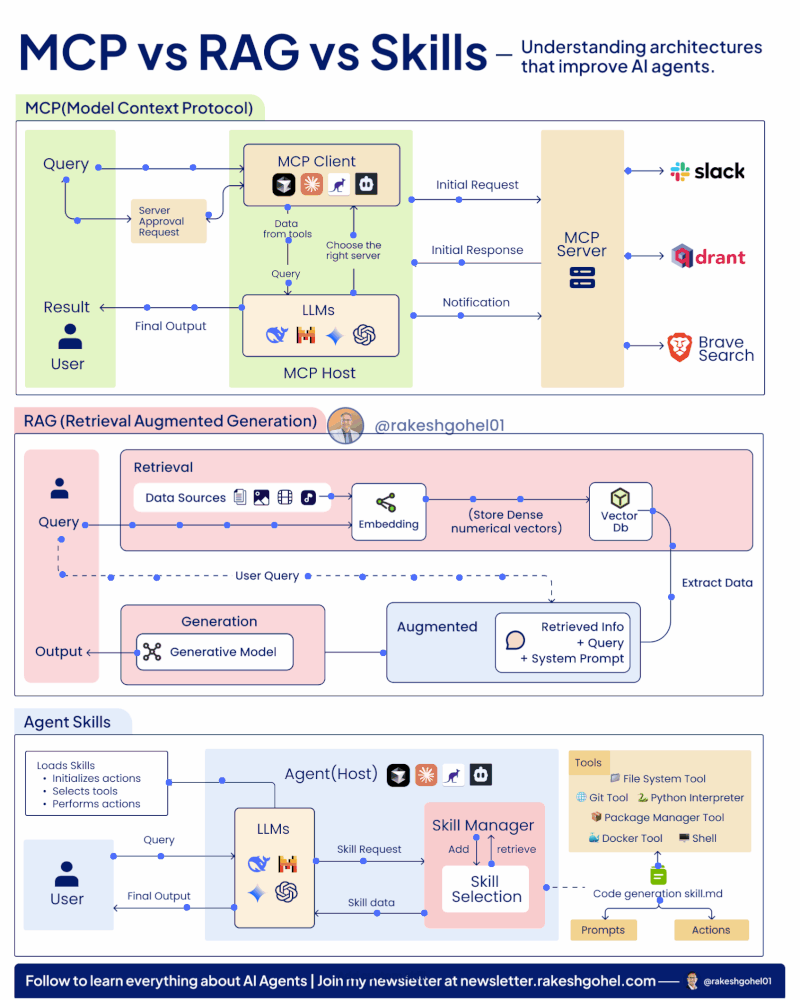

# MCP, RAG, and Agent Skills

## Every AI Agent struggles with 3 core problems:

- Connecting to external tools requires writing custom API code every time
- Answering accurately from knowledge it was never trained on
- Repeating the same instructions in prompts; wasting tokens on every single call

## MCP, RAG, and Skills were each built to solve exactly one of these problems.

### 📌 1\ MCP (Model Context Protocol)

MCP eliminates the need to write custom API integration code every time your agent needs to connect to an external tool.

How it works:

- User sends a query → MCP Client selects the right server
- LLM processes the request and routes it to the MCP Server
- Server (Slack, Qdrant, Brave Search) responds with the relevant data
- Final output is returned back to the user

Key insight: Without MCP, every new tool connection means new custom code. With MCP, your agent plugs into any server through one standardized protocol.

Use when: You want your agent to access external tools and services without rebuilding integrations from scratch each time.

### 📌 2\ RAG (Retrieval Augmented Generation)

RAG gives your agent memory-enabled retrieval, so it reasons over knowledge it was never trained on, instead of hallucinating answers.

How it works:

- Data sources are chunked → converted into embeddings
- Stored as dense vectors inside a Vector DB
- User query triggers a search → most relevant chunks are retrieved
- Retrieved info + query + system prompt → fed into the LLM → Output

Key insight: Without RAG, agents confidently make things up. With RAG, they retrieve first, then reason.

Use when: You want your agent to reason over large, dynamic knowledge bases with accuracy and context.

### 📌 3\ Agent Skills

Skills stop your agent from wasting tokens by repeating the same instructions in every single prompt.

How it works:

- User query → LLM sends a Skill Request to the Skill Manager
- Skill Manager retrieves the right skill using stored prompts and actions
- Tools like Git, Docker, Python Interpreter, and Shell are triggered
- Skill data flows back to the LLM → Final Output is delivered

Key insight: Without Skills, you bloat every prompt with repeated instructions. With Skills, your agent loads only what it needs, exactly when it needs it.

Use when: You want reusable, token-efficient actions your agent can execute without being re-instructed every time.
