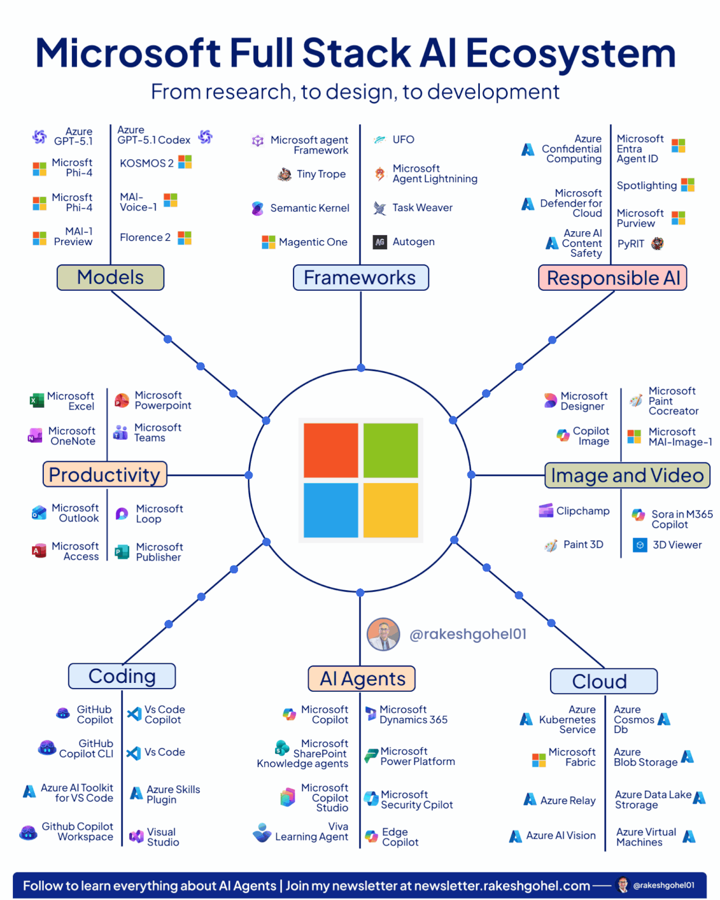

# Microsoft Fullstack AI Ecosystem

Microsoft is slowly owning the entire enterprise AI Agent market

And most people have only seen 10% of it, here's the rest...

Most people know Copilot. Maybe Azure. Maybe GitHub Copilot.

But Microsoft has quietly assembled one of the most complete full-stack AI ecosystems on the planet, from research models to responsible AI guardrails.

## Let me break down all 7 layers:

### 📌 Models

- Azure GPT-5.1, GPT-5.1 Codex, Microsoft Phi-4, MAI-1, KOSMOS-2, MAI-Voice-1, Florence 2
- The foundational intelligence layer powering every product above it

### 📌 Frameworks

- Microsoft Agent Framework, Semantic Kernel, Magentic One, Tiny Trope, Autogen, Task Weaver, UFO, Microsoft Agent Lightning
- The building blocks for designing and orchestrating AI Agents

### 📌 Responsible AI

- Azure Confidential Computing, Microsoft Defender for Cloud, Azure AI Content Safety, Microsoft Entra Agent ID, PyRIT, Microsoft Purview
- Safety and governance baked in, not bolted on

### 📌 Productivity

- Excel, PowerPoint, Teams, OneNote, Outlook, Loop, Access, Publisher
- Your daily workflow, now AI-augmented

### 📌 Image & Video

- Microsoft Designer, Copilot Image, MAI-Image-1, Clipchamp, Sora in M365 Copilot, Paint 3D
- End-to-end visual content creation inside the Microsoft stack

### 📌 Coding

- GitHub Copilot, VS Code Copilot, Azure AI Toolkit, Azure Skills Plugin, GitHub Copilot Workspace, Visual Studio
- From writing to deploying, AI-assisted at every step

### 📌 AI Agents

- Microsoft Copilot, SharePoint Knowledge Agents, Copilot Studio, Dynamics 365, Power Platform, Viva Learning Agent, Edge Copilot, Security Copilot
- The autonomous layer that ties the entire ecosystem together

And this is just the outer surface of the Microsoft Core offering.

If we start to dive deeper into Azure AI, the layer goes even deeper.

This just shows Microsoft's commitment on helping enterprises adopt agentic AI.

Not only do they make it very easy with no-code tools like Power Platform, 

but also allows you to customize it and build custom agents using their agent frameworks and tools.
