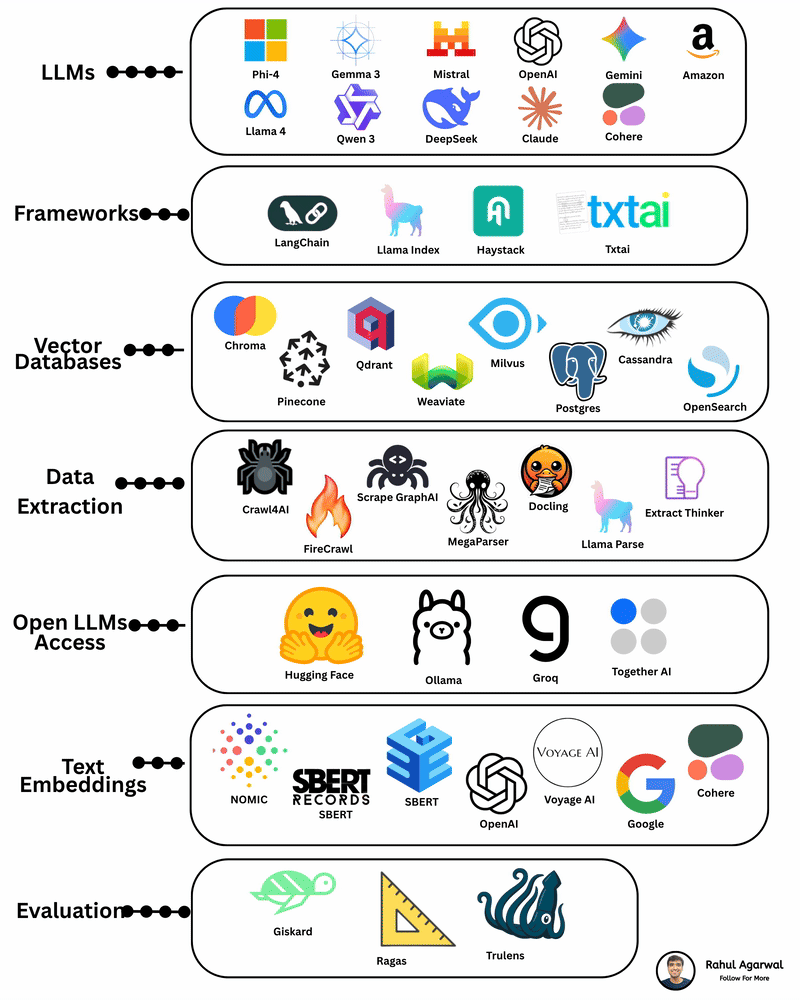

# AI
If you’re working in AI, Data Engineering, or LLM development, you’ve probably realized one thing — AI is no longer about a single model or framework.

 It’s an entire end-to-end ecosystem of tools that work together to build real, production-ready AI systems.

 Here’s a breakdown of each layer and why it matters 👇

 

**1. LLMs — The Brains of the System**

▪️ From OpenAI to DeepSeek, Gemini to Llama 4, Qwen to Cohere — enterprises now choose models based on cost, latency, accuracy, and licensing needs.
 ▪️ We’ve moved from “one best model” to model pluralism — use what fits your use case.

**2. Frameworks — The Glue That Makes Everything Work**

▪️ Frameworks like LangChain, LlamaIndex, Haystack, TxtAI provide orchestration, prompt management, agent workflows, retrieval logic, and tool dependencies.
▪️ These are becoming the middleware of AI systems.

**3. Vector Databases — The Memory Layer**

▪️ Technologies like Chroma, Pinecone, Qdrant, Weaviate, Milvus, Postgres pgvector, Cassandra, and OpenSearch serve as the semantic memory for AI applications.
 ▪️ They power RAG, similarity search, contextual retrieval, and long-term knowledge storage.
▪️ Without them, LLMs are powerful — but forgetful.

**4. Data Extraction — The Fuel That Feeds AI**

▪️ Tools like Firecrawl, Crawl4AI, Docling, MegaParser, GraphAI Scrapers, Llama Parse, Extract Thinker enable structured and unstructured data ingestion.
▪️ This is where real-world text, PDFs, webpages, and multimedia get transformed into machine-usable assets.

**5. Open LLM Access — The Gateways**

▪️ Platforms like Hugging Face, Ollama, Groq, Together AI democratize access to foundational models.
▪️ Whether you want fast inference (Groq), local execution (Ollama), or open-source models (Hugging Face) — these gateways make experimentation frictionless.

**6. Text Embeddings — The Language Encoder Layer**

▪️ Embeddings from Nomic, SBERT, OpenAI, Voyage AI, Cohere, Google are the backbone of search, clustering, retrieval, and similarity reasoning.
▪️ Every RAG system lives or dies by the quality of its embeddings.

**7. Evaluation — The Most Underrated Layer**

▪️ Tools like Giskard, Ragas, Trulens ensure AI systems behave reliably, safely, and consistently.
▪️ This is where hallucinations are caught, responses are scored, and ML observability becomes real.
▪️ Evaluation is no longer optional — it’s a must-have for any production AI application.

Building AI today is not about picking one model.
 It’s about assembling a modular AI architecture that includes:

 - ✔ LLM +
 - ✔ Retrieval +
 - ✔ Vector search +
 - ✔ Pipelines +
 - ✔ Evaluation +
 - ✔ Model access +
 - ✔ Observability