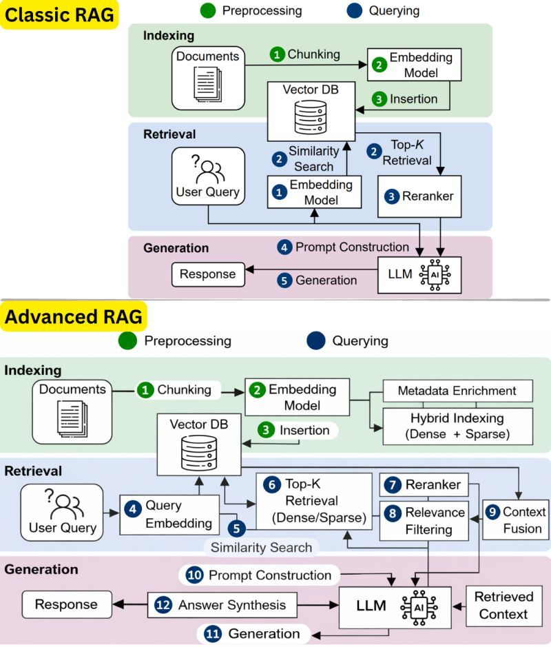

## Why Need Advance RAG ?

RAG doesn't work in 2026 if you are still using old techniques. Yes, many companies still fail at RAG - not because they are doing RAG wrong, but they are just stuck using outdated techniques. This is how it usually goes - most of the companies start with building a chatbot/chat app when they talk about adopting AI. This is where RAG becomes important, to connect your custom data through a database so your chat app can retrieve relevant documents. These days, RAG is not just limited to building chat app though. The RAG applications are boundless and its a good thing. So, RAG is till the base for whatever you build with LLMs and AI Agents. The only thing that has changed now is the RAG techniques. You can't use the same old RAG approach, you need to have some solid techniques and that is where advanced RAG comes in. With RAG, the was to augment our custom data through a database so the system can easily go and fetch relevant documents/chunks from the documents provided. The results are simple and most likely okay and this approach helped when the documents are well organized and small in number. When the documents are unorganized and the focus is more on retrieving not just accurate docs but also context, advanced RAG techniques like query decomposition, metadata enrichment, hybrid indexing, reranking, context fusion, etc come into the picture. These techniques help the RAG system to fetch & generate highly accurate and contextually relevant responses/answers. That's why advanced RAG is important. RAG isn't dead, no it can't be. Just use smart techniques.

🔹 1. Why “Classic RAG” is failing in 2026
-----------------------------------------------------------------
- Works fine for:
  - Small datasets
  - Clean, structured documents
- Fails when:
  - Data is messy, large, or unstructured
  - Context matters more than keyword similarity
- Problem:
👉 It retrieves relevant chunks, but not always the right context

🔹 2. What Classic RAG actually does
-----------------------------------------------------------------
**📦 Indexing Phase**
1. Chunk documents
2. Convert chunks → embeddings
3. Store in vector DB

**🔍 Retrieval Phase**
1. Convert user query → embedding
2. Similarity search (Top-K results)
3. Optional reranking

**🤖 Generation Phase**
1. Build prompt with retrieved chunks
2. LLM generates response

👉 Simple pipeline, but limited intelligence

🔹 3. Core limitations of Classic RAG
-----------------------------------------------------------------
- ❌ Only dense vector search (semantic only)
- ❌ No understanding of metadata (author, date, tags)
- ❌ No query understanding (just embedding)
- ❌ Weak ranking (Top-K ≠ best answers)
- ❌ No context merging (chunks stay isolated)

🔹 4. Why companies struggle with RAG
-----------------------------------------------------------------
- Treat it like:
👉 “Plug LLM + Vector DB = AI system”
- But ignore:
  - Retrieval quality
  - Context structuring
  - Data enrichment
👉 Result: hallucinations + irrelevant answers

🔹 5. What “Advanced RAG” changes
-----------------------------------------------------------------
Advanced RAG focuses on:
- 👉 Better retrieval + better context before generation

Not just:
- 👉 “LLM will fix everything”

🔹 6. Advanced RAG – Indexing Improvements
-----------------------------------------------------------------
- ✅ Metadata enrichment
   - Add tags, categories, timestamps
- ✅ Hybrid indexing
  -  Dense (semantic) + Sparse (keyword/BM25)
- ✅ Better chunking strategies
  -  Semantic chunking instead of fixed size
👉 Makes retrieval smarter from the start

🔹 7. Advanced RAG – Retrieval Improvements
-----------------------------------------------------------------
- ✅ Query embedding + query understanding
- ✅ Hybrid search
  -  Combines keyword + semantic search
- ✅ Top-K optimization
  -  Better candidate selection

🔹 8. Key Advanced Techniques (Important)
-----------------------------------------------------------------
**🔹 Query Decomposition**
- Break complex queries into smaller ones
👉 Improves recall

**🔹 Reranking**
- Re-score retrieved documents using a stronger model
👉 Improves precision

**🔹 Relevance Filtering**
- Remove noisy/irrelevant chunks
👉 Reduces hallucination

**🔹 Context Fusion**
- Merge multiple chunks into a coherent context
👉 Avoids fragmented answers

🔹 9. Advanced RAG – Generation Improvements
-----------------------------------------------------------------
- ✅ Better prompt construction
- ✅ Structured context injection
- ✅ Answer synthesis (combine multiple sources)

👉 Output becomes:
- More accurate
- More contextual
- Less hallucinated

🔹 10. Why Advanced RAG works better
-----------------------------------------------------------------
Because it fixes the real problem:

**👉 Retrieval quality > Model quality**

Even a powerful LLM fails if:
- Input context is poor

🔹 11. Key mindset shift
-----------------------------------------------------------------
**❌ Old thinking: “LLM will figure it out”**

**✅ New thinking: “Give LLM the best possible context”**

🔹 12. Final takeaway
-----------------------------------------------------------------
- RAG is not dead
- Basic RAG is outdated
- Advanced RAG is mandatory for production AI

👉 Success formula:

> Good Data + Smart Retrieval + Clean Context → Accurate AI
