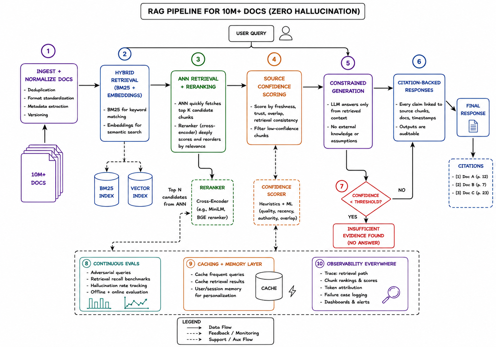

# RAG Pipeline with Zero Hallucinations

Most RAG systems fail for one reason:

They retrieve information… but they don’t control trust.

A production-grade RAG pipeline is not just “embeddings + LLM.” It’s a layered retrieval and verification system designed to minimize hallucinations at scale.

This architecture gets that right:

1. Clean and normalize documents before retrieval
2. Combine BM25 + embeddings for hybrid search
3. Rerank with cross-encoders for deeper relevance
4. Score source confidence before generation
5. Constrain the LLM to retrieved evidence only
6. Return citation-backed, auditable responses
7. Refuse to answer when confidence is low

That last point matters the most.

The smartest AI systems are not the ones that answer everything. They are the ones that know when NOT to answer.

What also stands out here:
 - Continuous evaluation loops
- Retrieval observability
- Token attribution and tracing
- Caching + memory optimization
- Confidence-aware generation

This is the shift happening in AI engineering right now:

> From “prompt engineering” → to reliable system design.

The future belongs to engineers who can build trustworthy AI pipelines, not just call APIs.

