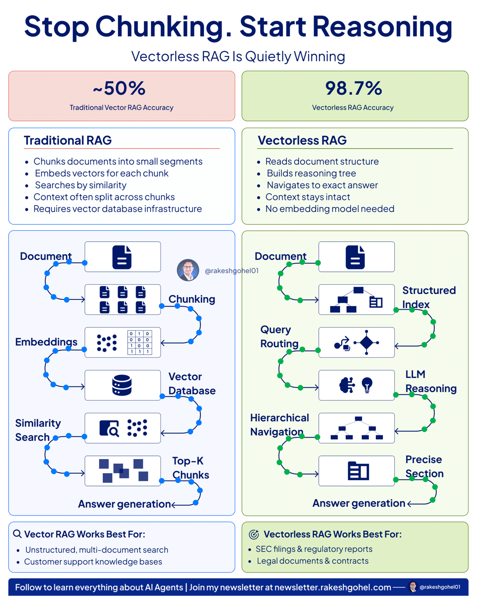

# Vectorless RAG

**Read the Tutorial**
[Tutorials/Vectorless_RAG/Vectorless RAG.pdf](https://github.com/piyalidas10/AI/blob/bd593d17d100d9cdf0de640118ca5c3d209b6634/Tutorials/Vectorless_RAG/Vectorless%20RAG.pdf)

## Tutorials
1. https://www.youtube.com/watch?v=f3zHina9MTo
2. https://medium.com/@visrow/what-is-pageindex-how-to-build-a-vectorless-rag-system-no-embeddings-no-vector-db-dc097fae3071

```
Traditional RAG = fast but imperfect
Vectorless RAG = smarter but slower
Future = combination of both
```

## What is RAG?
RAG stands for Retrieval-Augmented Generation. 

**Problem Statement:** You have a lot of documents (like PDFs), and a user wants to ask questions on them using AI.

**Naive Approach:**
- Take all documents
- Put them into an LLM along with the user query
- Generate an answer

**❌ Problems:**
1. Context Limit
  - LLMs have limited context window
  - You can’t input 1000+ pages
2. Hallucination
  - Too much data → model loses focus → generic answers
3. Cost
  - Tokens = money
  - Sending full documents every time is expensive

## ⚡Traditional RAG (Vector-based RAG)

To solve this, we use RAG pipeline with 2 phases:

**1️⃣ Indexing Phase**

Steps:
1. Chunking
  - Split document into small parts
  - Example:
    - Page-based
    - Paragraph-based
    - Fixed-size (e.g., 500 words)
2. Embedding
  - Convert each chunk into vectors (numbers)
3. Store in Vector DB
  - Examples:
    - Pinecone
    - Chroma
    - Weaviate
    - Qdrant

**2️⃣ Query Phase**

Steps:
1. User asks a query
2. Convert query → vector embedding
3. Perform vector similarity search
4. Retrieve top-K relevant chunks
5. Send those chunks + query to LLM
6. Generate final answer

## 🔴 Problems with Vector RAG
**1. Chunking Problem**
- Fixed chunk sizes break context
- Example:
  - Half information in one chunk
  - Half in another → meaning lost

**2. Semantic Breaks**
- A full story may span multiple paragraphs
- Chunking splits them incorrectly

**3. Cross-Reference Problem**
- Example: Legal documents
  - Page 4 references Page 578
  - Vector search may retrieve only one → incomplete context

**4. Query Dependency**
- Works well only if user query matches document keywords
- If user asks vaguely → bad retrieval

---

## 🚀 Vectorless RAG (Page Index)

This is a new approach where:  
❌ No embeddings  
❌ No vector DB  
❌ No chunking  

Instead, it uses: ✅ Reasoning-based retrieval

Instead of similarity search, we: 👉 Build a hierarchical structure (Tree / Table of Contents)

### Indexing Phase (Vectorless)
1. Input document
2. Use LLM to:
  - Identify structure
  - Detect:
    - Sections
    - Topics
    - Events
    - Characters
    - Transitions
3. Build a Tree (TOC)

Each node contains:
- Title
- Node ID (points to original doc)
- Summary
- Child nodes

👉 This is like a book index

### Example (Sholay Movie)

Tree structure:
- Root: Movie summary
- Level 1:
  - Life in Ramgarh
  - Gabbar intro
  - Recruitment of Jai & Veeru
- Level 2:
  - Events
  - Scenes
  - Characters

👉 No fixed chunk size — everything is semantic + reasoning-based

### Query Phase (Vectorless)

User asks:
```
👉 “Why did Thakur lose his arms?”
```

**What happens:**
1. LLM traverses the tree
2. Finds relevant nodes using summaries
3. Collects:
  - Relevant nodes
  - Their references (node IDs)
4. Fetches actual content
5. Generates answer

### Benefits of Vectorless RAG

✅ Better context understanding  
✅ Handles cross-references  
✅ No chunking issues  
✅ More human-like retrieval  

### 🔴 Trade-offs of Vectorless RAG

❗ Higher cost (reasoning models are expensive)  
❗ Slower (tree traversal + reasoning takes time)  

**👉 Trade-off:** Speed ⬇️ → Accuracy ⬆️

### Vectorless RAG works like humans:
```
👉 We don’t read entire books randomly
👉 We go to index → relevant chapter → specific section
```
And this approach forces LLMs to do the same.

---

## Key Difference
Vector RAG:
```
Query → Embedding → Similarity Search → Chunks → LLM
```
Vectorless RAG:
```
Query → Reasoning → Tree Traversal → Nodes → LLM
```

| Vector RAG        | Vectorless RAG        |
| ----------------- | --------------------- |
| Similarity search | Reasoning             |
| Embeddings        | No embeddings         |
| Chunking          | No chunking           |
| Vector DB         | Tree structure        |
| Keyword dependent | Context understanding |


**🔷 Vector RAG Architecture (Industry Standard)**
```
                ┌────────────────────────────┐
                │       Documents            │
                │ (PDF, Docs, HTML, etc.)   │
                └────────────┬──────────────┘
                             |
                             v
                     ┌──────────────┐
                     │  Chunking     │
                     │ (500 tokens)  │
                     └──────┬───────┘
                            |
                            v
                  ┌──────────────────┐
                  │ Embedding Model  │
                  │ (text → vector)  │
                  └──────┬───────────┘
                         |
                         v
              ┌────────────────────────┐
              │   Vector Database      │
              │ (Qdrant / Pinecone)   │
              └─────────┬─────────────┘
                        |
========================|================================
                        |
                USER QUERY FLOW
                        |
                        v
                ┌──────────────────┐
                │ User Query       │
                └──────┬───────────┘
                       |
                       v
             ┌──────────────────────┐
             │ Query Embedding      │
             └──────┬───────────────┘
                    |
                    v
        ┌──────────────────────────────┐
        │ Vector Similarity Search     │
        │ (Top-K Chunks Retrieval)     │
        └───────────┬──────────────────┘
                    |
                    v
           ┌──────────────────────┐
           │ Relevant Chunks      │
           └──────────┬───────────┘
                      |
                      v
             ┌──────────────────┐
             │ LLM (Generator)  │
             └──────────┬───────┘
                        |
                        v
                 ┌─────────────┐
                 │   Answer    │
                 └─────────────┘
```

🔴 Key Issues
- Chunking breaks context
- Keyword dependency
- Poor cross-reference handling

**🔷 Vectorless RAG (Page Index Architecture)**
```
                ┌────────────────────────────┐
                │        Documents           │
                │   (PDF, Legal, Books)     │
                └────────────┬──────────────┘
                             |
                             v
               ┌──────────────────────────────┐
               │  LLM Reasoning (Indexing)    │
               │  - Detect Sections           │
               │  - Detect Topics             │
               │  - Detect Events             │
               └────────────┬─────────────────┘
                            |
                            v
        ┌──────────────────────────────────────────┐
        │   Hierarchical TOC Tree (Page Index)     │
        │------------------------------------------│
        │ Root: Document Summary                   │
        │  ├── Section 1                           │
        │  │    ├── Subsection                     │
        │  │    └── Subsection                     │
        │  ├── Section 2                           │
        │  └── Section N                           │
        └──────────────┬───────────────────────────┘
                       |
=======================|================================
                       |
                 USER QUERY FLOW
                       |
                       v
                ┌──────────────────┐
                │ User Query       │
                └──────┬───────────┘
                       |
                       v
        ┌────────────────────────────────┐
        │ LLM Reasoning on Tree          │
        │ - Traverse hierarchy           │
        │ - Select relevant nodes        │
        └────────────┬───────────────────┘
                     |
                     v
       ┌───────────────────────────────┐
       │ Relevant Nodes (Summaries)    │
       └────────────┬──────────────────┘
                    |
                    v
     ┌────────────────────────────────────┐
     │ Fetch Original Content (via NodeID)│
     └────────────┬───────────────────────┘
                  |
                  v
          ┌──────────────────┐
          │ LLM Generation   │
          └──────────┬───────┘
                     |
                     v
               ┌─────────────┐
               │   Answer    │
               └─────────────┘
```

---

## 🏗️ Production Architecture (Advanced Insight)

Real systems often use Hybrid Approach:
```
            Query
              |
     ┌────────┴────────┐
     |                 |
Vector Search     Tree Reasoning
     |                 |
     └──────┬──────────┘
            v
      Reranking Layer
            |
            v
           LLM
```
👉 This is what companies are moving toward in 2025–2026

## PageIndex
PageIndex is a vectorless RAG architecture that retrieves information by reasoning over document structure instead of performing semantic search. Rather than treating a document as a flat pile of text, it treats it as a structured hierarchy — like a textbook with a table of contents.

PageIndex is a vectorless, reasoning-based Retrieval-Augmented Generation (RAG) approach that retrieves answers from long documents without using embeddings, chunking, or a vector database.

Instead of relying on semantic similarity search, PageIndex builds a hierarchical Table of Contents (TOC) tree from a document and uses a Large Language Model (LLM) to reason over that structure. The model first identifies the most relevant section using the document’s hierarchy, then navigates to that section to generate a precise, cited answer.

> Traditional RAG retrieves by similarity.
> PageIndex retrieves by reasoning over structure.

This makes it particularly effective for structured, long-form content such as financial reports, legal contracts, regulatory filings, policy documents, and academic papers.

**Why PageIndex Works?**  

PageIndex works because it separates two cognitive tasks:
1.	Navigation — Determine where the answer should exist.
2.	Extraction — Read only that section and generate the answer.

**This mirrors how humans read:**

When you want to know why something happened in a novel, you don’t skim every page randomly.
You go to the chapter where the relevant event occurred.
PageIndex forces the LLM to behave the same way.
```
Vector RAG:
Query → Find similar chunks

Vectorless RAG:
Query → Traverse tree → Reason → Select path
```

## Traditional RAG vs Vectorless RAG


