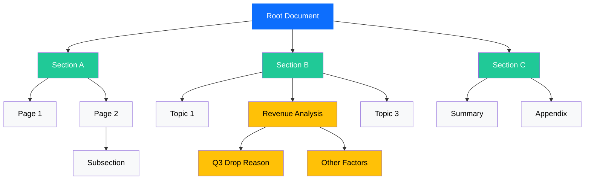
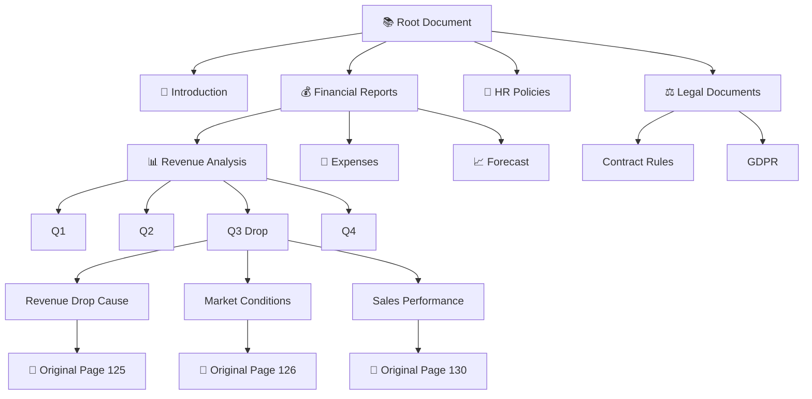

# Vectorless RAG (Tree-Based Retrieval Diagram)

## 🌳 Vectorless RAG (Tree-Based Retrieval Diagram)
```
                         [ROOT]
                  (Document Summary)
                           |
        -----------------------------------------
        |                   |                   |
   [Section A]        [Section B]        [Section C]
   (Intro)            (Main Topic)       (Conclusion)
        |                   |                   |
   -----------        -------------        ---------
   |         |        |     |     |        |       |
[A1]       [A2]     [B1]  [B2]  [B3]     [C1]    [C2]
(Page 1)  (Page 2)  (...) (...) (...)    (...)   (...)
              |
           --------
           |      |
         [A2.1] [A2.2]
```

## 🧠 🔍 How Query Flows in This Tree
Example Query:
```
👉 “Why did revenue drop in Q3?”
```

### 🔁 Step-by-step traversal:
```
1. Start at ROOT
   ↓
2. LLM reads summaries of:
   - Section A
   - Section B
   - Section C

   → Selects: Section B (most relevant)

   ↓
3. Go deeper into Section B
   - B1
   - B2
   - B3

   → Selects: B2 (Revenue Analysis)

   ↓
4. Go deeper:
   - B2.1
   - B2.2

   → Selects: B2.1 (Q3 drop reason)

   ↓
5. Fetch original content (pages)
   ↓
6. Generate final answer
```

### 🔷 Same Diagram with Flow Arrows (More Visual)
```
                         [ROOT]
                           |
                 (LLM starts here)
                           |
        -----------------------------------------
        |                   |                   |
   [Section A]        [Section B]        [Section C]
        |                  ⭐                  |
        |                  ↓                  |
   -----------        -------------        ---------
   |         |        |     |     |        |       |
[A1]       [A2]     [B1]  [B2]  [B3]     [C1]    [C2]
                          ⭐
                          ↓
                       --------
                       |      |
                    [B2.1]  [B2.2]
                       ⭐
                       ↓
                 🎯 FINAL ANSWER
```

👉 This is NOT search  
👉 This is guided navigation  

Vector RAG:
```
Query → Find similar chunks
```

Vectorless RAG:
```
Query → Traverse tree → Reason → Select path
```

### 🧩 Node Structure (What each circle contains)

Each node in tree:

Node:
- Title: "Revenue Analysis"
- Summary: "Explains Q3 drop"
- NodeID: points to actual document
- Children: [sub-nodes]

## 🔥 Why This Works Better
✅ Keeps full context
- No chunk splitting
✅ Handles relationships
- Parent ↔ Child links
✅ Multi-hop reasoning
- ROOT → Section → Subsection
✅ Human-like behavior
- Like reading index of a book

## 🧪 Mermaid Tree Diagram



## Even Better for Vectorless RAG

This version more closely matches how a Page Index Tree works.




