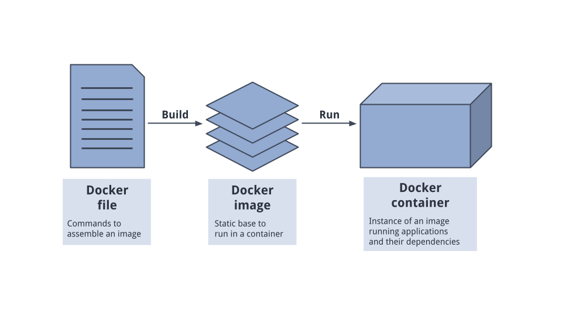

# Docker



- Youtube Tutorial : https://www.youtube.com/watch?v=GToyQTGDOS4&list=PLKnIA16_RmvZ41tjbKB2ZnwchfniNsMuQ&index=11
- Docker : https://www.docker.com/


Docker is a containerization platform that allows you to package an application along with its dependencies into a lightweight, portable unit called a container.

👉 Containers run consistently across environments:
    -   Developer machine
    -   Testing server
    -   Production cloud

## 🏗 Core Architectural Concept

**🖥 Virtual Machine**

Runs full OS inside hypervisor.

Hardware
  ↓
Hypervisor
  ↓
Guest OS
  ↓
App


Heavy, slow boot, high memory usage.

🐳 Docker Container

Shares host OS kernel.

Hardware
  ↓
Host OS
  ↓
Docker Engine
  ↓
Containers
     ├── App1
     ├── App2
     └── App3


Lightweight, fast startup.

## 🖼 What is a Docker Image?

A Docker Image is a read-only blueprint/template used to create containers.

Think of it like:
  - 📦 Class in OOP
  - 📀 ISO file
  - 📄 Blueprint of a building

It contains:
  - OS base (e.g., python:3.11-slim)
  - Dependencies
  - Application code
  - Environment variables
  - Startup command

```
docker build -t fastapi-app .
```
This creates an image.  
You can list images:
```
docker images
```

## 📦 What is a Docker Container?

A Docker Container is a running instance of an image.

Think of it like:
  - 🏃 Object created from class
  - 🏠 Actual building from blueprint
  - 💻 Running program

Created using:
```
docker run fastapi-app
```
List containers:
```
docker ps
```

## 🎯 One Image → Multiple Containers

Very important interview point.
```
                Docker Image
                    │
        ┌───────────┼───────────┐
        ▼           ▼           ▼
   Container 1  Container 2  Container 3
```

## Docker Commands

**1️⃣ docker commit** 

🔹 What is docker commit? 

> docker commit creates a new image from a running container. It captures the container’s current state and saves it as an image.
> docker commit is used to create a new Docker image from a modified container, but it is generally discouraged in production environments in favor of Dockerfile-based builds.

📌 Why It Exists
  - Normally, we build images using:
  - Dockerfile → docker build

But sometimes:
  - You manually install packages inside container
  - You debug something
  - You modify files interactively
  - Then you want to save that state.

🔹 Command
```
docker commit <container_id> new-image-name
```

Example:
```
docker commit 8d91ab23 my-modified-image
```

**2️⃣ docker save and docker load**

These are used to export and import images as files.

🔹 docker save  
Exports an image to a .tar file.
```
docker save -o myimage.tar fastapi-app
```

This creates:
```
myimage.tar
```

Use case:
  - Move image to another server without internet
  - Backup image
  - Air-gapped environments

🔹 docker load    
Imports image from tar file.
```
docker load -i myimage.tar
```
Now image is available locally.

> docker save and docker load allow transferring Docker images between systems without using a registry like Docker Hub.


# Docker Container Create
**Application Folder Structure**
```
Fast_API Folder
    │
    ├── Dockerfile
    ├── requirements.txt
    ├── main.py
    └── .dockerignore
```

**Docker Container creation diagram**
```
Dockerfile
     ↓
docker build
     ↓
Docker Image
     ↓
docker run
     ↓
Docker Container
```

**Create Dockerfile inside Fast_API folder**
```
# ===============================
# Base Image
# ===============================
FROM python:3.11-slim

# ===============================
# Environment Variables
# ===============================
ENV PYTHONDONTWRITEBYTECODE=1
ENV PYTHONUNBUFFERED=1

# ===============================
# Set Working Directory
# ===============================
WORKDIR /app

# ===============================
# Copy Requirements
# ===============================
COPY requirements.txt .

# ===============================
# Install Dependencies
# ===============================
RUN pip install --no-cache-dir -r requirements.txt

# ===============================
# Copy Project Files
# ===============================
COPY . .

# ===============================
# Expose Port
# ===============================
EXPOSE 8000

# ===============================
# Start FastAPI App
# ===============================
CMD ["uvicorn", "main:app", "--host", "0.0.0.0", "--port", "8000"]
```

**Add .dockerignore**
```
myenv
__pycache__
.git
.gitignore
imgs
*.pyc
```
Do NOT include:
    -   myenv/
    -   __pycache__/
    -   .git/
    -   imgs/ (if not needed)


# Docker Container RUN
Download the application from github repo
```
https://github.com/piyalidas10/AI/tree/main/Fast_API
```

**Inside Fast_API folder, run the bellow command**
```
docker build -t fastapi-enterprise .
```
⚠ The . is important (current folder context).

**▶ Run Container**  
```
docker run -p 8000:8000 fastapi-enterprise
```

**🌐 Test**

Open in browser:
```
http://localhost:8000
```

Swagger:
```
http://localhost:8000/docs
```

Test with Postman:
```
POST http://localhost:8000/posts
```


## Can a Docker Container contains both Fast api and PostgreSQL database ? or we need to create Docker Composer ?

✅ Technically possible 
❌ Not recommended  
✅ Best practice → Use Docker Compose with separate containers  

Since you’re building enterprise-style FastAPI, you should definitely use:  
👉 Separate containers + Docker Compose

**🐳 Option 1: Single Docker Container (FastAPI + PostgreSQL Together)**

You can install both inside one container:
```
Container
 ├── FastAPI
 ├── Uvicorn
 └── PostgreSQL Server
```

How it would look:
```
Postman
   ↓
Docker Container
   ├── FastAPI App
   └── PostgreSQL DB
```

❌ Why This Is Bad Practice 
--------------------------------------------------- 
1. Docker principle = One process per container 
2. Hard to scale independently  
3. Hard to restart DB without killing API   
4. Not cloud-native 
5. Not production-friendly  
6. Docker containers are designed to run one main service.  

**✅ Option 2 (Recommended): Separate Containers Using Docker Compose**

This is industry standard.
```
Container 1 → FastAPI
Container 2 → PostgreSQL
```

Managed by: 👉 Docker Compose

**🚀 Why Separate Containers Is Best Practice**
| Feature          | Single Container  | Docker Compose   |
| ---------------- | ----------------- | ---------------- |
| Scalability      | ❌ No             | ✅ Yes          |
| Maintenance      | ❌ Hard           | ✅ Easy         |
| Restart DB only  | ❌ No             | ✅ Yes          |
| Production Ready | ❌ No             | ✅ Yes          |
| Cloud Deployable | ❌ Poor           | ✅ Excellent    |

**🔥 Real Industry Pattern**

In production:
    -   1 container → FastAPI
    -   1 container → PostgreSQL
    -   1 container → Redis (optional)
    -   1 container → Nginx (optional)
    -   All managed by Docker Compose or Kubernetes

## 🐳 Docker vs Virtual Machine (Deep Architecture)

> Virtual machines virtualize hardware and run a full OS per instance, whereas Docker containers virtualize at the OS level, sharing the host kernel, making them lightweight and faster to start.

**🔹 Virtual Machine Architecture**
```
Hardware
   ↓
Hypervisor (VMware, VirtualBox)
   ↓
Guest OS
   ↓
Application
```
Each VM has:
  - Full OS
  - Own kernel
  - Dedicated resources
Heavyweight.

**🔹 Docker Architecture**
```
Hardware
   ↓
Host OS
   ↓
Docker Engine
   ↓
Containers
```

Containers:
  - Share host kernel
  - Use namespaces
  - Use cgroups
  - No full OS per container
Lightweight.

| Feature        | Virtual Machine | Docker Container |
| -------------- | --------------- | ---------------- |
| OS             | Full OS per VM  | Shared OS kernel |
| Startup Time   | Minutes         | Seconds          |
| Size           | GBs             | MBs              |
| Isolation      | Strong          | Process-level    |
| Performance    | Slower          | Near-native      |
| Resource Usage | High            | Low              |
| Scaling        | Slow            | Fast             |

**🧠 Kernel Sharing Concept** 
VM:
```
VM1 → Linux Kernel
VM2 → Linux Kernel
VM3 → Linux Kernel
```

Docker:
```
Container1 → Shared Kernel
Container2 → Shared Kernel
Container3 → Shared Kernel
```
That’s why containers are lighter.

**🔒 Isolation Mechanism**

Docker uses:
  - Linux Namespaces (PID, Network, Mount)
  - Cgroups (CPU, Memory limits)
  - Union Filesystem (Layered FS)

VM uses:
  - Hardware virtualization

**🏗 Enterprise Architecture Example**  

VM-Based Deployment
```
VM1 → App
VM2 → DB
VM3 → Cache
```
High cost, heavy infra.

Container-Based Microservices
```
Node
 ├── Container (API)
 ├── Container (DB)
 ├── Container (Redis)
```
Scalable & cloud-native.

**🎯 When to Use VM Instead of Docker?**  
✔ Strong isolation required  
✔ Different OS kernels needed  
✔ Legacy monolithic apps 

**🎯 When to Use Docker?**  
✔ Microservices   
✔ CI/CD  
✔ DevOps pipelines   
✔ Cloud-native apps    
✔ Fast scaling 

## Docker Compose vs Docker Container

Docker Compose is a tool for managing multi-container applications, while the docker container command is used for managing individual containers. Docker Compose uses a single YAML configuration file to define how all the services of an application should work together, which simplifies running complex, multi-service applications. 

#### Docker Container

  ✔ Function: Manages individual containers, such as starting, stopping, or viewing the status of a single, running instance of a Docker image.  
  ✔ Usage: It uses direct command-line arguments (e.g., docker run, docker stop, docker network create) which can become complex and lengthy when managing multiple containers and their configurations.   
  ✔ Best For: Simple applications with a single service, quick testing of an individual image, or performing one-off administrative tasks.   

#### Docker Compose

  ✔ Function: Orchestrates an entire application stack consisting of multiple, interconnected services (e.g., a web application, a database, and a cache).   
  ✔ Usage: It uses a declarative configuration file (docker-compose.yml or compose.yml) where you define services, networks, and volumes. A single command, such as docker compose up, then creates and starts all the defined services and their dependencies automatically.    
  ✔ Best For: Multi-service applications, ensuring consistent development and CI/CD environments, managing dependencies between services, and simplifying the setup and tear-down of complex application environments.     
